# AI & Machine Learning — Unit 3
**BCA-V &nbsp;|&nbsp; BCA-75T-301 &nbsp;|&nbsp; Theory Exam Notes**

---

## Table of Contents

| # | Topic |
|---|---|
| 1 | [What is Machine Learning?](#1-what-is-machine-learning) |
| 2 | [Types of Machine Learning](#2-types-of-machine-learning) |
| 3 | [Foundations of ML](#3-foundations-of-ml) |
| 4 | [Supervised Learning Algorithms](#4-supervised-learning-algorithms) |
| 5 | [Neural Networks](#5-neural-networks) |
| 6 | [Advanced Neural Networks](#6-advanced-neural-networks) |
| 7 | [Key Challenges](#7-key-challenges-in-ml) |
| 8 | [Real-World Applications](#8-real-world-applications) |
| 9 | [Quick Revision](#9-quick-revision) |

---
---

## 1. What is Machine Learning?

> **Machine Learning (ML)** is a subset of **Artificial Intelligence (AI)** that enables systems to **learn from data**, recognize patterns, and make decisions — **without being explicitly programmed**.

### Traditional Programming vs Machine Learning

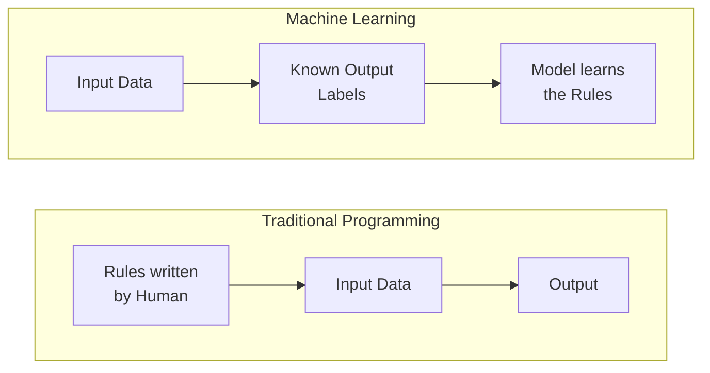

### Why ML Matters

| Purpose | Real Example |
|---|---|
| **Automation** | Spam email filtering |
| **Prediction** | Stock price forecasting |
| **Pattern Recognition** | Fraud detection in banking |
| **Personalization** | Netflix / YouTube recommendations |
| **Decision Support** | Medical diagnosis from scans |

---
---

## 2. Types of Machine Learning

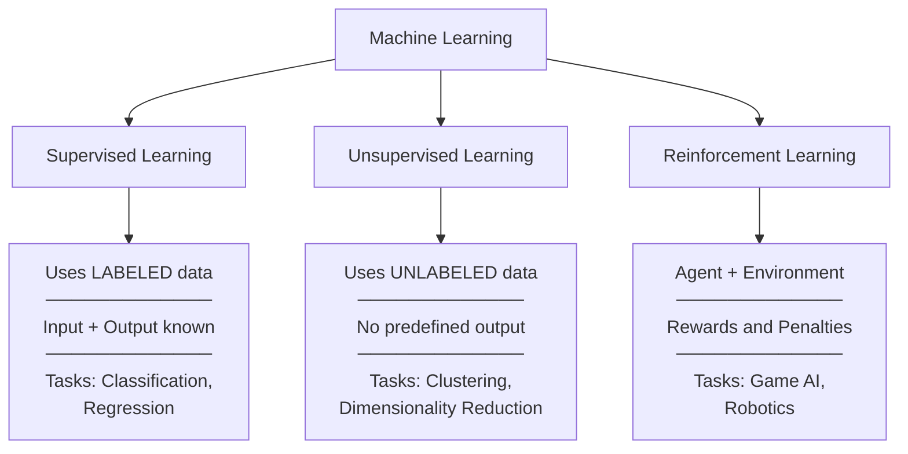

### 2.1 Supervised Learning
- Trains on **labeled data** — input is paired with a known correct output
- Learns a mapping: **f(X) → Y**
- **Classification** → discrete output (spam / not spam)
- **Regression** → continuous output (house price)
- **Examples:** Email spam detection, disease prediction, house price forecasting

### 2.2 Unsupervised Learning
- Trains on **unlabeled data** — no correct answer is given
- Discovers **hidden structures**, clusters, or patterns
- **Techniques:** K-Means Clustering, PCA, Association Rules
- **Examples:** Customer segmentation, market basket analysis

### 2.3 Reinforcement Learning
- An **agent** takes actions in an **environment**
- Receives **reward** (good action) or **penalty** (bad action)
- Learns the **optimal strategy** through trial and error
- **Examples:** Self-driving cars, Chess/Go AI, warehouse robots

### Comparison at a Glance

| | Supervised | Unsupervised | Reinforcement |
|---|:---:|:---:|:---:|
| **Data** | Labeled | Unlabeled | No fixed dataset |
| **Goal** | Predict output | Find patterns | Maximize reward |
| **Feedback** | Labels (direct) | None | Reward / Penalty |
| **Output** | Class or Value | Clusters / Groups | Policy / Action |
| **Example** | Spam filter | Customer groups | Game-playing AI |

---
---

## 3. Foundations of ML

> ML is built on **five core disciplines** that provide its mathematical and computational backbone.

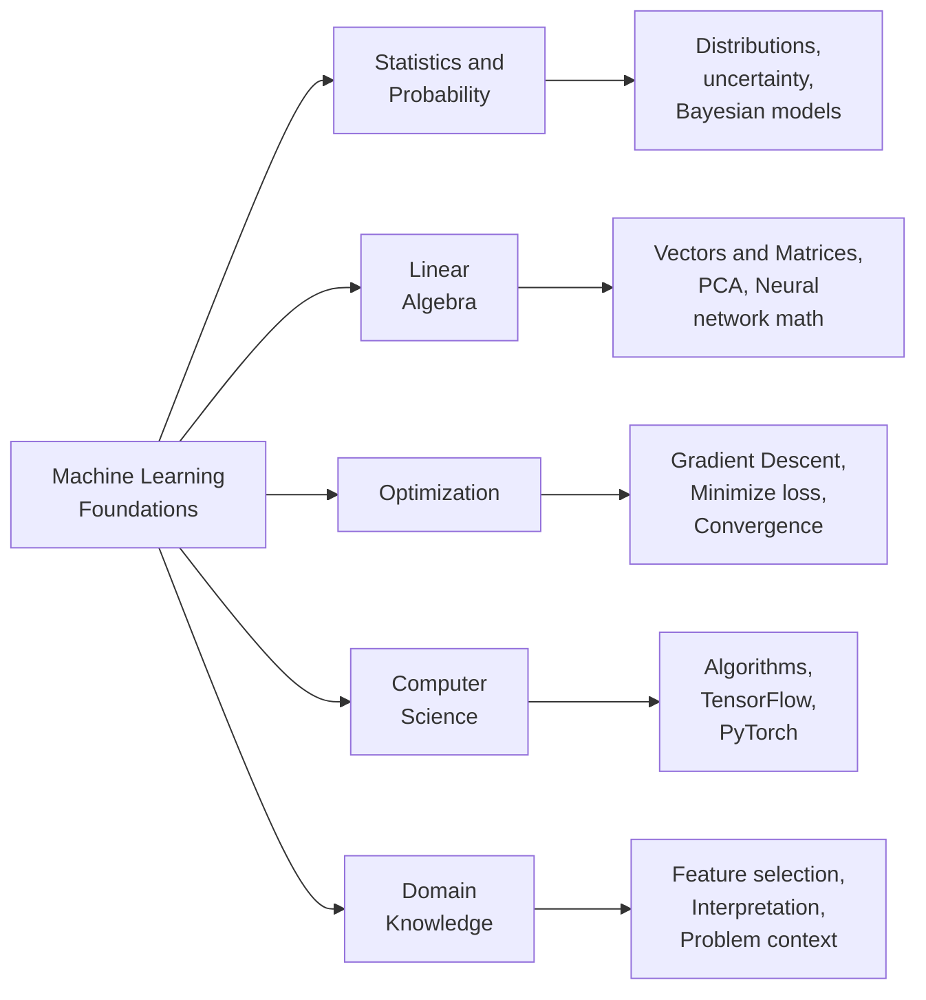

| Foundation | What it provides |
|---|---|
| **Statistics & Probability** | Analyzing data distributions, estimating uncertainty, Naïve Bayes |
| **Linear Algebra** | Representing data as vectors/matrices, neural network computations, PCA |
| **Optimization** | Gradient descent to minimize loss and improve accuracy |
| **Computer Science** | Efficient algorithms, data structures, ML frameworks |
| **Domain Knowledge** | Guides feature selection, model evaluation, problem interpretation |

---
---

## 4. Supervised Learning Algorithms

### Overall Workflow

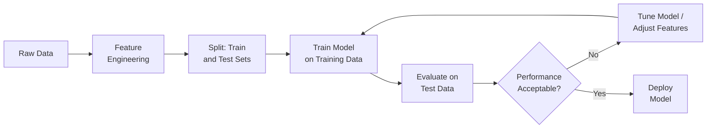

---

### 4.1 Decision Tree

> A **tree-structured model** where data is recursively split based on feature conditions.
> Each path from root to leaf = one decision rule.

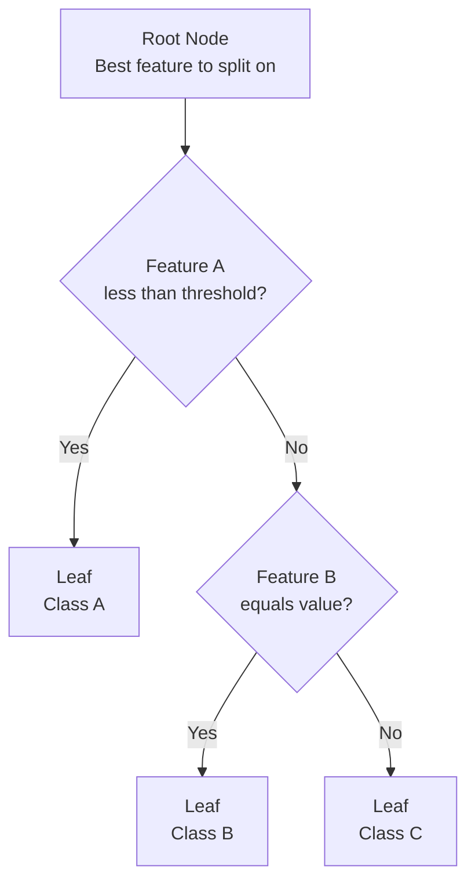

#### How a Decision Tree is Built

| Step | Action |
|---|---|
| **1. Select Feature** | Use **Information Gain**, **Gini Index**, or **Entropy** to find the best split |
| **2. Split Data** | Divide data at the node based on the chosen feature |
| **3. Repeat** | Recursively split each branch until stopping condition |
| **4. Stop** | Max depth reached or minimum samples per leaf hit |
| **5. Prune** | Remove branches that overfit the training data |

#### Key Vocabulary
- `Root Node` → Starting point; best overall feature
- `Internal Node` → A feature-based test/condition
- `Branch` → Outcome of a test (Yes / No)
- `Leaf Node` → Final prediction (class or value)
- `Pruning` → Cutting unnecessary branches to reduce overfitting

#### Pros & Cons

| Strengths | Weaknesses |
|---|---|
| Easy to visualize and explain | Easily overfits on noisy data |
| Handles numeric AND categorical data | Biased toward features with many levels |
| Minimal preprocessing required | Unstable — small data change = different tree |
| Captures non-linear relationships | **Fix:** Use Random Forest or Gradient Boosting |

> **Exam tip:** Overfitting in Decision Trees is fixed by **Pruning** or using **Ensemble Methods** (Random Forest).

---

### 4.2 Naïve Bayes Classifier

> A **probabilistic classifier** based on **Bayes' Theorem**.
> "Naïve" because it assumes all features are **conditionally independent** of each other.

#### Bayes' Theorem

$$P(C \mid X) = \frac{P(X \mid C) \cdot P(C)}{P(X)}$$

| Term | Name | Meaning |
|---|---|---|
| $P(C \mid X)$ | **Posterior** | Probability of class C given features X |
| $P(X \mid C)$ | **Likelihood** | Probability of seeing features X if class is C |
| $P(C)$ | **Prior** | Initial probability of class C (before data) |
| $P(X)$ | **Evidence** | Normalizing constant |

#### How It Works

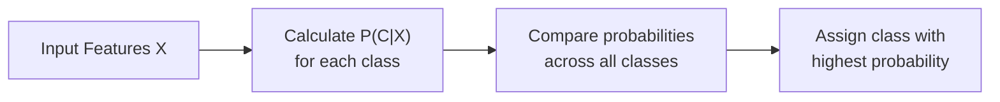

#### Pros & Cons

| Strengths | Weaknesses |
|---|---|
| Very fast and computationally cheap | Independence assumption rarely holds in real life |
| Works well with small datasets | Sensitive to correlated features |
| Scales to high-dimensional data | Needs smoothing to handle zero probabilities |
| Good baseline model | Less accurate than complex models |

> **Applications:** Spam detection · Sentiment analysis · Medical diagnosis · News categorization

---

### 4.3 Linear Regression

> Models the relationship between features and a **continuous output** by fitting a straight line.

#### The Equation

$$Y = \beta_0 + \beta_1X_1 + \beta_2X_2 + \cdots + \beta_nX_n + \epsilon$$

| Symbol | Meaning |
|---|---|
| $Y$ | Predicted output value |
| $X_1 \ldots X_n$ | Input features |
| $\beta_0$ | Intercept / bias |
| $\beta_1 \ldots \beta_n$ | Learned coefficients (weights) |
| $\epsilon$ | Error term (noise) |

- Coefficients are found using the **Least Squares Method** → minimizes sum of **squared errors** between predicted and actual values

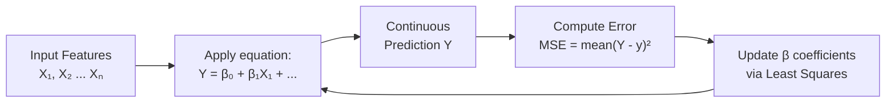

#### Pros & Cons

| Strengths | Weaknesses |
|---|---|
| Simple, fast, and interpretable | Fails on non-linear data |
| Shows feature influence clearly | Sensitive to outliers |
| Strong baseline for regression tasks | Assumes features are independent |

> **Applications:** House price prediction · Sales forecasting · Student performance analysis

---

### 4.4 Logistic Regression

> Used for **binary classification** — predicts the **probability** that an input belongs to class 1.
> Uses the **Sigmoid (logistic) function** to squash output to range **(0, 1)**.

#### Sigmoid Function

$$P(Y=1 \mid X) = \frac{1}{1 + e^{-(\beta_0 + \beta_1X_1 + \cdots + \beta_nX_n)}}$$

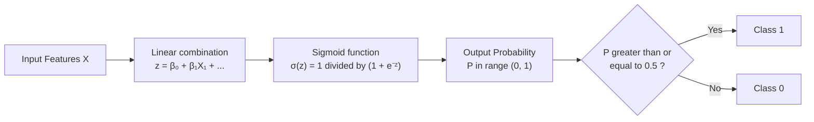

#### Pros & Cons

| Strengths | Weaknesses |
|---|---|
| Outputs a probability (interpretable) | Assumes a linear decision boundary |
| Efficient and widely used | Sensitive to multicollinearity |
| Extends to multiclass via Softmax | Needs feature scaling |

> **Applications:** Spam vs. not spam · Disease present/absent · Credit default yes/no

---

### 4.5 Bayesian Logistic Regression

> Extends standard logistic regression by treating model parameters as **probability distributions** instead of fixed values — capturing **uncertainty**.

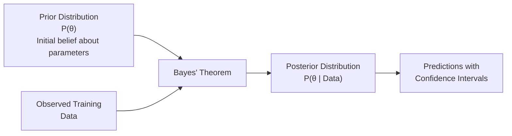

- Uses **MCMC** *(Markov Chain Monte Carlo)* to compute the posterior distribution

#### Standard vs Bayesian Logistic Regression

| | Standard | Bayesian |
|---|---|---|
| **Parameters** | Single fixed value | Full probability distribution |
| **Uncertainty** | Not captured | Explicitly quantified |
| **Output** | Point prediction | Distribution of predictions |
| **Small data** | Can be unreliable | More robust |
| **Prior knowledge** | Not used | Can incorporate it |

> **Applications:** Healthcare risk scoring · Financial decisions under uncertainty

---

### All Supervised Algorithms — One Table

| Algorithm | Task | Output | Core Idea | Key Weakness |
|---|---|---|---|---|
| **Decision Tree** | Classification / Regression | Class or value | Split by information gain | Overfits easily |
| **Naïve Bayes** | Classification | Class | Bayes + feature independence | Independence assumption |
| **Linear Regression** | Regression | Continuous number | Fit a line using Least Squares | Only linear relationships |
| **Logistic Regression** | Binary Classification | Probability 0–1 | Sigmoid on linear combination | Linear boundary only |
| **Bayesian Logistic Reg.** | Classification | Prob. distribution | Prior + Data = Posterior | Computationally heavy |

---
---

## 5. Neural Networks

> A **Neural Network** is a set of interconnected artificial **neurons** organized in layers — inspired by the human brain — capable of learning complex, non-linear patterns.

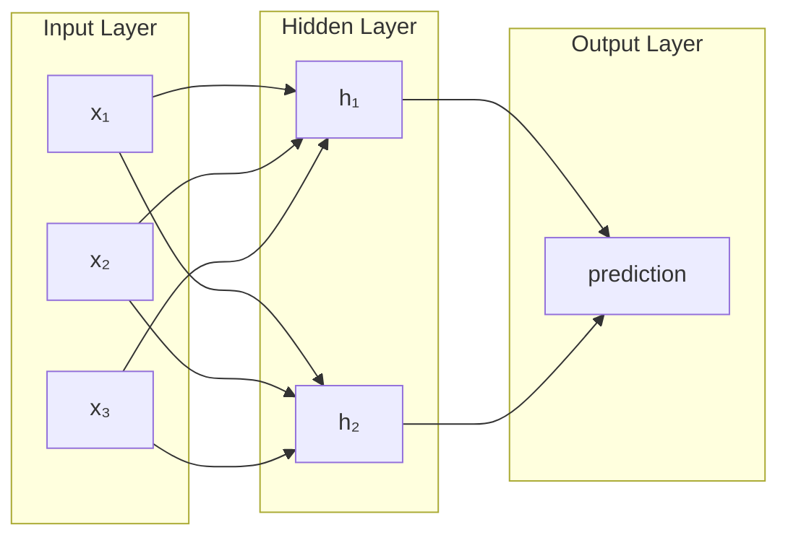

### Layers at a Glance

| Layer | Role |
|---|---|
| **Input Layer** | Receives raw input features (one node per feature) |
| **Hidden Layer(s)** | Extracts and transforms features; more layers = deeper learning |
| **Output Layer** | Produces the final prediction (class or value) |

---

### 5.1 Feed-Forward Neural Network (FFNN)

> The **simplest** form of neural network.
> Data flows **only forward** — input → hidden → output. **No cycles or loops.**

#### What Each Neuron Does

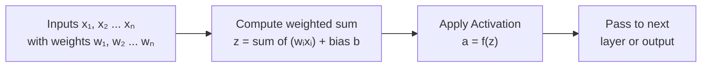

1. **Weighted Sum:** $z = w_1x_1 + w_2x_2 + \cdots + b$
2. **Activation:** $a = f(z)$ — adds non-linearity

> Used for: Classification · Regression · Pattern Recognition

---

### 5.2 Backpropagation

> The **training algorithm** for neural networks.
> Computes how much each weight contributed to the error, then adjusts all weights to reduce it.

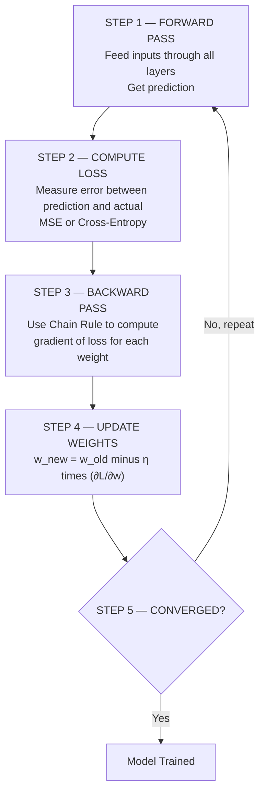

#### Step-by-Step Breakdown

| Step | Details |
|---|---|
| **Forward Pass** | Inputs flow layer by layer → prediction is generated |
| **Loss Calculation** | Error is measured using a loss function |
| **Backward Pass** | **Chain Rule** computes gradient of loss for every weight |
| **Weight Update** | $w_{new} = w_{old} - \eta \cdot \frac{\partial L}{\partial w}$ |
| **Epochs** | Repeat until the loss converges to a minimum |

#### Key Terms

| Term | Meaning |
|---|---|
| **Learning Rate (η)** | Controls step size — too high = unstable, too low = slow |
| **Epoch** | One complete pass through the entire training dataset |
| **Loss Function** | Measures the gap between predicted and actual values |
| **Gradient** | Direction and rate of steepest increase in loss |

#### Loss Functions

| Task | Loss Function | Formula |
|---|---|---|
| **Regression** | Mean Squared Error | $L = \frac{1}{N}\sum(y_{pred} - y_{true})^2$ |
| **Classification** | Cross-Entropy | $L = -\sum y \log(y_{pred})$ |

#### Backpropagation Problems & Fixes

| Problem | What Happens | Fix |
|---|---|---|
| **Vanishing Gradient** | Gradients shrink to near zero in early layers — slow or no learning | Use **ReLU**, proper weight initialization |
| **Exploding Gradient** | Gradients grow out of control — unstable training | **Gradient Clipping**, Batch Normalization |

---

### 5.3 Activation Functions

> Activation functions add **non-linearity** to the network.
> Without them, stacking layers is pointless — the whole network would behave as a single linear equation.

| Function | Formula | Output Range | When to Use |
|---|---|---|---|
| **Sigmoid** | $\frac{1}{1+e^{-z}}$ | (0, 1) | Binary output layer |
| **Tanh** | $\frac{e^z - e^{-z}}{e^z + e^{-z}}$ | (−1, 1) | Hidden layers (zero-centered) |
| **ReLU** | $\max(0, z)$ | [0, ∞) | Hidden layers — most popular |
| **Softmax** | $\frac{e^{z_i}}{\sum_j e^{z_j}}$ | (0,1), sums to 1 | Multi-class output layer |

> **ReLU** is preferred in hidden layers because it avoids the vanishing gradient problem that Sigmoid and Tanh suffer from at extreme values.

---

### 5.4 Regularization Techniques

> Regularization **controls model complexity** to prevent overfitting — where a model performs great on training data but fails on new data.

#### Overfitting vs Underfitting

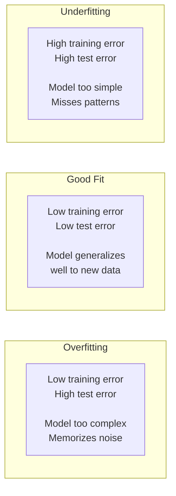

#### Regularization Methods

| Technique | How It Works | Best For |
|---|---|---|
| **L1 / Lasso** | Adds penalty on absolute weights → drives weak weights to 0 | Feature selection |
| **L2 / Ridge** | Adds penalty on squared weights → shrinks all weights | Smooth, stable models |
| **Dropout** | Randomly disables 20–50% of neurons each training step | Deep neural networks |
| **Early Stopping** | Halts training when validation loss stops decreasing | Any neural network |
| **Data Augmentation** | Generates new training samples via flipping, rotation, etc. | Image and audio models |
| **Batch Normalization** | Normalizes layer inputs each mini-batch — stable training | Deep networks |

---
---

## 6. Advanced Neural Networks

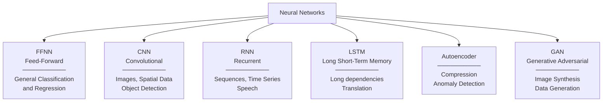

### CNN — Convolutional Neural Network

> Specialized for **spatial data** like images. Uses **filters** to extract features automatically.

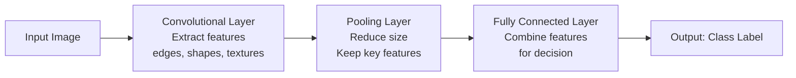

### RNN / LSTM — Recurrent Networks

> RNNs process **sequential data** by maintaining a **hidden state** that carries context across time steps.

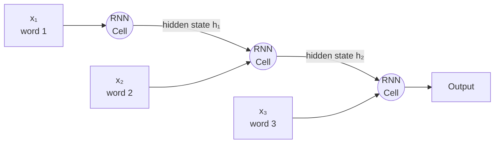

> **Problem:** RNNs suffer from **vanishing gradient** on long sequences.
> **Solution:** **LSTM** adds 3 gates — **Input gate**, **Forget gate**, **Output gate** — to control what to remember and what to discard.

### All Advanced Networks — Summary

| Network | Key Idea | Applications |
|---|---|---|
| **FFNN** | One-way flow, no memory | General classification, regression |
| **CNN** | Convolutional filters extract spatial features | Image recognition, medical scans, object detection |
| **RNN** | Hidden state for sequential memory | Speech, time series, text generation |
| **LSTM** | Gating mechanisms for long-term memory | Translation, sentiment analysis, stock prediction |
| **Autoencoder** | Compress input then reconstruct it | Denoising, anomaly detection, data compression |
| **GAN** | Generator vs Discriminator (adversarial game) | Image synthesis, data generation, deepfake detection |

---
---

## 7. Key Challenges in ML

| Challenge | What Goes Wrong | How to Fix It |
|---|---|---|
| **Overfitting** | Model memorizes training noise — fails on new data | Regularization · Dropout · Cross-validation |
| **Underfitting** | Model is too simple to learn anything useful | Add features · Use a more complex model |
| **Vanishing Gradient** | Early-layer weights stop updating in deep nets | ReLU · Batch Normalization · Residual connections |
| **Data Quality** | Biased / noisy data → unreliable model | Data cleaning · Balanced sampling |
| **Interpretability** | Deep models are "black boxes" — hard to explain | SHAP · LIME · Attention mechanisms |
| **Computational Cost** | Deep networks need expensive hardware | GPUs / TPUs · Efficient architectures |
| **Ethical Bias** | Model learns and amplifies societal biases | Fair training data · Ethical guidelines |

---
---

## 8. Real-World Applications

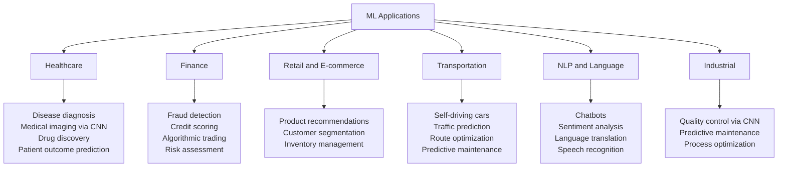

### Which Algorithm Goes Where?

| Domain | Task | Algorithm |
|---|---|---|
| Email | Spam detection | Naïve Bayes |
| Banking | Fraud detection | Neural Networks, Anomaly Detection |
| Real Estate | Price prediction | Linear Regression |
| Healthcare | Disease yes/no | Logistic Regression, Decision Tree |
| E-commerce | Product suggestions | Collaborative Filtering, Neural Networks |
| Computer Vision | Image classification | CNN |
| Language | Text and speech tasks | RNN / LSTM |
| Robotics / Games | Strategy learning | Reinforcement Learning |

---
---

## 9. Quick Revision

### Full ML Workflow

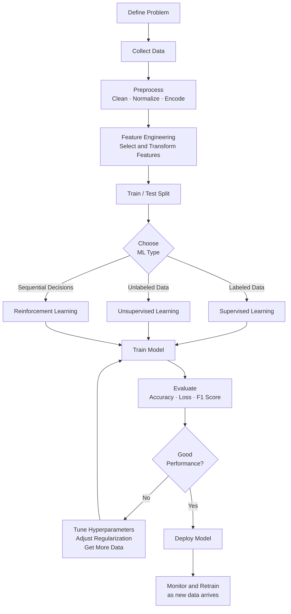

---

### ML Types — One-Liner Summary

| Type | One Line |
|---|---|
| **Supervised** | Learns from labeled data (input → known output) to predict |
| **Unsupervised** | Finds hidden patterns in unlabeled data |
| **Reinforcement** | Agent learns via rewards and penalties through trial and error |

---

### Algorithm Quick Reference

| Algorithm | Input | Output | Core Concept |
|---|---|---|---|
| **Decision Tree** | Labeled features | Class / Value | Split by Information Gain or Gini Index |
| **Naïve Bayes** | Features + Labels | Class | Bayes' Theorem + feature independence |
| **Linear Regression** | Continuous features | Continuous value | $Y = \beta_0 + \beta_1X + \epsilon$ |
| **Logistic Regression** | Features | Probability (0–1) | Sigmoid on linear combination |
| **Bayesian Logistic Reg.** | Features | Prob. distribution | Prior + Data → Posterior (MCMC) |
| **FFNN** | Any | Any | Weighted sum + Activation + Backprop |
| **CNN** | Images / spatial data | Class | Convolution + Pooling + Fully Connected |
| **RNN / LSTM** | Sequential data | Sequence output | Hidden state across time steps |

---

### Keywords Glossary — Exam Ready

| Keyword | Definition |
|---|---|
| **Generalization** | Model performs well on **unseen** (new) data |
| **Overfitting** | Model memorizes training data → fails on test data |
| **Underfitting** | Model is too simple → fails on both train and test data |
| **Feature** | An input variable used for making predictions |
| **Label** | The known correct output in supervised learning |
| **Epoch** | One full pass through the entire training dataset |
| **Learning Rate (η)** | Step size when updating weights in gradient descent |
| **Loss Function** | Measures how wrong the model's predictions are |
| **Gradient Descent** | Optimization that moves weights in direction of steepest loss decrease |
| **Backpropagation** | Algorithm to compute gradients and propagate error backward |
| **Activation Function** | Introduces non-linearity into a neural network |
| **ReLU** | $\max(0, z)$ — most common hidden layer activation |
| **Dropout** | Randomly disables neurons during training to reduce overfitting |
| **Pruning** | Removing unnecessary branches in a Decision Tree |
| **Prior / Posterior** | Bayesian terms: belief *before* / *after* observing data |
| **MCMC** | Algorithm for sampling from complex posterior distributions |
| **Vanishing Gradient** | Gradients become near-zero → early layers stop learning |
| **Gini Index / Entropy** | Measures of impurity used in Decision Tree splitting |
| **FFNN** | Feed-Forward Neural Network — simplest NN, no loops |
| **CNN** | Convolutional NN — designed for images and spatial data |
| **LSTM** | Long Short-Term Memory — RNN variant with gating for long sequences |

---

*BCA-V · Unit 3 · AI & Machine Learning · Exam Notes*
