# Unit 1

# ARTIFICIAL INTELLIGENCE & MACHINE LEARNING
## UNIT-I: Study Notes & Exam Questions

---

## 📚 SYLLABUS OVERVIEW
- Concept of Intelligence & AI
- AI Intelligent Agents
- Characteristics of AI
- Comparison: AI vs Machine Learning vs Deep Learning
- State Space Search
- Classical AI Problems (Water Jug, Missionary-Cannibal, Monkey-Banana)
- Applications of AI
- MYCIN Case Study

---

## 📝 PART A: CONCEPT NOTES

### 1. INTELLIGENCE

**Definition:**
Intelligence is the ability to learn, understand, adapt to new situations, and use knowledge to achieve desired outcomes.

**Key Components:**
- Problem solving
- Understanding abstract concepts
- Critical thinking and reasoning
- Planning and creativity

**Historical Note:**
Formal intelligence studies began in early 20th century with tests like:
- **Binet-Simon scale** (1905) - Alfred Binet & Theodore Simon
- **Stanford-Binet IQ test** - Lewis Terman adaptation
- **WAIS** (1939) - David Wechsler, first adult intelligence test

---

### 2. ARTIFICIAL INTELLIGENCE (AI)

**Definition:**
AI technology allows computers and machines to simulate human intelligence and problem-solving capabilities.

**Key Characteristics:**
1. Ability to rationalize and take actions to achieve specific goals
2. Automated learning from data without human assistance (Machine Learning)
3. Uses algorithms - simple for basic applications, complex for strong AI

**Historical Background:**
- AI research began in 1950s
- Used by US Department of Defense in 1960s to train computers to mimic human reasoning

**Types of AI (by Capability):**

1. **Narrow AI (Weak AI)**
   - Designed for specific tasks
   - Examples: Face recognition, chess playing
   - Limited to trained domain

2. **General AI (Strong AI)**
   - Theoretical form
   - Can perform any intellectual task humans can
   - Can learn, reason, and adapt across domains

3. **Superintelligence**
   - Speculative future form
   - Surpasses human intelligence in all domains
   - Could revolutionize all fields

---

### 3. AI INTELLIGENT AGENTS

**Definition:**
An AI agent is a software program that interacts with its environment, collects data, and performs self-determined tasks to meet predetermined goals.

**Key Principles:**
- **Rational Decision Making** - Makes decisions based on perceptions and data
- **Autonomous Operation** - Works without constant human intervention
- **Environmental Sensing** - Uses physical or software interfaces to perceive environment
- **Goal-Oriented Behavior** - Takes actions to achieve specific objectives

**Architecture Components:**

1. **Architecture** - Base platform (physical/software)
   - Physical: Actuators, sensors, motors, robotic arms
   - Software: APIs, databases, text prompts

2. **Agent Function** - How data is translated into actions
   - Information type, AI capabilities, knowledge base

3. **Agent Program** - Implementation of agent function
   - Development, training, and deployment

**How AI Agents Work:**
```
1. DETERMINE GOALS → Receive instructions, break into tasks
2. ACQUIRE INFORMATION → Access data, interact with systems
3. IMPLEMENT TASKS → Execute methodically, evaluate progress
```

**Benefits:**
- ✓ Improved productivity (automate repetitive tasks)
- ✓ Reduced costs (minimize errors and inefficiencies)
- ✓ Informed decision-making (analyze real-time data)
- ✓ Enhanced customer experience (personalization)

---

**TYPES OF AI AGENTS:**

| Type | Description | Example |
|------|-------------|---------|
| **Simple Reflex** | Acts on current perception only | Thermostat |
| **Model-Based** | Maintains internal world model | Self-driving car sensors |
| **Goal-Based** | Works to achieve specific goals | GPS navigation |
| **Utility-Based** | Maximizes success measure | Investment AI |
| **Learning Agents** | Improves through experience | AlphaGo |

**Practical Examples:**

**A. Chatbot (Virtual Assistant)**
- Perception: Voice/text input
- Action: Process using NLP
- Decision-Making: Fetch data, set reminders
- Learning: Improve from user interactions

**B. Self-Driving Car**
- Perception: Cameras, radar, LIDAR
- Action: Accelerate, brake, steer
- Decision-Making: Analyze traffic, obstacles
- Learning: Update from driving experiences

---

### 4. CHARACTERISTICS OF AI

**A. LEARNING**
- **Supervised Learning** - Trained on labeled data
- **Unsupervised Learning** - Pattern identification from unlabeled data
- **Reinforcement Learning** - Trial and error with rewards/penalties

**B. REASONING**
- Simulates logical thinking
- Makes decisions and draws conclusions
- Uses rule-based systems and inference engines
- Mimics human thought processes

**C. PROBLEM SOLVING**
- Analyzes complex problems
- Generates solutions through:
  - Search algorithms (A*, Dijkstra's)
  - Optimization techniques
  - Heuristic methods

**D. PERCEPTION**
- Interprets environment through sensors
- **Computer Vision** - Visual data processing
- **Natural Language Processing** - Text/speech processing

**E. LANGUAGE UNDERSTANDING (NLP)**
- Translation, sentiment analysis
- Summarization, conversation
- Examples: Siri, Alexa, Google Assistant

**F. ADAPTATION**
- Improves performance over time
- Evolves without human intervention
- Critical for robotics, autonomous vehicles

**G. AUTONOMY**
- Operates independently
- Plans and navigates without direct control
- Self-driving cars, robotic systems

**H. GENERALIZATION**
- Applies learned knowledge to new situations
- Transfers understanding across tasks
- Model adapts to unseen data

**I. CREATIVITY**
- Generates novel ideas and solutions
- **GANs** (Generative Adversarial Networks)
- Creates art, music, designs

**J. COLLABORATION**
- Works alongside humans
- Understands intentions
- Supports decision-making and creative work

---

### 5. THREE MAIN CHARACTERISTICS FRAMEWORK

**① FEATURE ENGINEERING**

**Purpose:** Identifies optimal attributes from datasets

**Key Techniques:**
- Reduces system entropy
- PCA (Principal Component Analysis)
- Gram-Schmidt orthogonalization
- Achieves feature independence (zero correlation)

**Process:**
- Convert raw observations to features
- Simplify data transformations
- Enhance model accuracy
- Improve performance

**② ARTIFICIAL NEURAL NETWORKS (ANN)**

**Structure:**
- Collection of connected nodes (artificial neurons)
- Signal transmission through connections
- Layers transform data using algorithms

**Types:**
1. **Feedforward (Acyclic)**
   - Signal travels one direction
   - Perceptrons, multi-layer perceptrons
   - Radial basis networks

2. **Recurrent**
   - Allows feedback loops
   - Has memory of previous inputs

**Network Optimization Techniques:**

| Technique | Description |
|-----------|-------------|
| **Pruning** | Removes redundant connections |
| **Quantization** | Uses fewer bits for values |
| **Low-rank factorization** | Compresses tensors |
| **Compact filters** | Reduces parameters |
| **Knowledge distillation** | Small model mimics large model |

**Applications:**
- Targeted marketing (pattern recognition)
- Finance (volatile data modeling)
- Fraud detection (rare events)
- Disease diagnosis

**③ DEEP LEARNING**

**Features:**
- Multiple hidden layers between input/output
- Automatic feature extraction and classification
- Uses parallel-computing GPUs/TPUs
- High performance for complex tasks

**Applications:**
- Autonomous vehicles (self-driving cars)
- Computer vision
- Speech recognition
- Social media personalization
- Image recognition

---

### 6. COMPARISON: AI vs ML vs DL

| Feature | AI | Machine Learning | Deep Learning |
|---------|----|--------------------|---------------|
| **Definition** | Broad field for intelligent machines | Enables learning from data | Multi-layer neural networks |
| **Focus** | Mimic human intelligence | Learn and improve over time | Emulate brain structure |
| **Techniques** | Heuristics, rule-based, NLP, robotics | Decision trees, SVM, random forests | CNN, RNN, multi-layer networks |
| **Data Need** | Structured/unstructured, not always essential | Large structured data | Massive labeled data |
| **Processing** | General hardware | More computational resources | High power, GPUs/TPUs |
| **Accuracy** | Limited by rules | Good for specific tasks | Very high for vision/NLP |
| **Interpretability** | High (rule-based) | Moderate (traceable) | Low ("black box") |
| **Training Time** | Generally faster | Moderate | Extensive |
| **Learning Type** | Rule-based/learning | Supervised/unsupervised/reinforcement | Primarily supervised |
| **Scalability** | Depends on approach | Scalable with data | Highly scalable |
| **Human Intervention** | High (constant tuning) | Moderate (feature engineering) | Low (auto learning) |
| **Examples** | Chatbots, chess AI | Email filtering, recommendations | Image classification, autonomous cars |

**Key Relationship:**
```
AI (Broad Field)
  ↓
Machine Learning (Subset of AI)
  ↓
Deep Learning (Subset of ML)
```

---

## 📝 PART B: STATE SPACE SEARCH

### 7. STATE SPACE SEARCH

**Definition:**
A framework that views problem-solving as navigating through a space of possible "states" to find a solution.

**Key Components:**

**① STATE SPACE**
- Collection of all possible configurations
- Each state = unique variable configuration
- Navigate from initial to goal state

**② ELEMENTS:**

| Element | Description |
|---------|-------------|
| **States** | Problem snapshots at given time |
| **Initial State** | Starting point |
| **Goal State** | Solution/target state |
| **Operators/Actions** | Change one state to another |
| **Cost** (optional) | Resource/time for transitions |
| **Path** | Sequence from initial to goal |

**③ PROBLEM DEFINITION REQUIRES:**
1. **Initial state** - Starting configuration
2. **Goal state** - Target configuration
3. **State transitions** - Movement rules
4. **Cost function** - (optional) For optimization

**④ SEARCH ALGORITHMS:**

**A. Uninformed (Blind) Search:**

| Algorithm | Description | Advantage | Disadvantage |
|-----------|-------------|-----------|--------------|
| **BFS** | Level by level exploration | Finds shortest path | Memory intensive |
| **DFS** | Deep dive then backtrack | Less memory | May miss short paths |

**B. Informed (Heuristic) Search:**

| Algorithm | Description |
|-----------|-------------|
| **A Algorithm*** | Uses heuristic to estimate cost |
| **Greedy Search** | Selects state closest to goal |

**⑤ STATE SPACE EXPLOSION:**

**Problem:** Number of states grows exponentially

**Solutions:**
- **Heuristics** - Guide search efficiently
- **Pruning** - Cut unlikely branches

**⑥ APPLICATIONS:**
- Pathfinding (maze, graph)
- Puzzles (Rubik's cube, 8-puzzle, Sudoku)
- Games (chess, tic-tac-toe)

**⑦ 8-PUZZLE EXAMPLE:**

```
Problem: 3x3 grid, 8 numbered tiles, 1 empty space
Goal: Arrange in order (1-2-3-4-5-6-7-8)

Initial State: Current tile arrangement
Goal State: 1-2-3-4-5-6-7-8
Operators: Move tile into empty space
Cost: Number of moves
```

---

## 📝 PART C: CLASSICAL AI PROBLEMS

### 8. WATER JUG PROBLEM

**Problem Statement:**
Measure specific water quantity using jugs without volume markings.

**Example Setup:**
- Jug 1: 10 liters
- Jug 2: 7 liters  
- **Goal:** Measure exactly 6 liters

**State Representation:** (x, y)
- x = water in jug 1
- y = water in jug 2

**Initial State:** (0, 0)  
**Goal State:** (6, y) where 0 ≤ y ≤ 7

**Operators (Actions):**

1. Fill jug 1: (x, y) → (10, y)
2. Fill jug 2: (x, y) → (x, 7)
3. Empty jug 1: (x, y) → (0, y)
4. Empty jug 2: (x, y) → (x, 0)
5. Pour jug 2 → jug 1: (x, y) → (min(10, x+y), max(0, y-(10-x)))
6. Pour jug 1 → jug 2: (x, y) → (max(0, x-(7-y)), min(7, x+y))
7. Pour all from jug 2 → jug 1
8. Pour all from jug 1 → jug 2

**Solution Path Example:**
```
(0, 0) → Fill jug 1 → (10, 0)
(10, 0) → Pour to jug 2 → (3, 7)
(3, 7) → Empty jug 2 → (3, 0)
(3, 0) → Pour to jug 2 → (0, 3)
(0, 3) → Fill jug 1 → (10, 3)
(10, 3) → Pour to jug 2 → (6, 7) ✓ GOAL REACHED
```

**Search Approaches:**

**BFS (Breadth-First Search):**
- Explores all actions level by level
- Finds shortest path
- More memory needed
- Guaranteed optimal solution

**DFS (Depth-First Search):**
- Dives deep then backtracks
- Less memory
- May find longer paths
- Uses pruning to avoid revisiting states

**Pruning:**
- Eliminates already-explored states
- Reduces computational resources
- Increases efficiency

**Real-World AI Parallels:**
- Route optimization (ride-sharing)
- Logistics planning (delivery routes)
- Medical diagnosis (pattern recognition)
- Fraud detection (anomaly spotting)

---

### 9. MISSIONARY-CANNIBAL PROBLEM

**Problem Statement:**
- 3 missionaries + 3 cannibals must cross a river
- 1 boat available (capacity: 2 people)
- **Constraint:** Cannibals cannot outnumber missionaries on either bank

**State Representation:** (ML, CL, MR, CR, B)
- ML = missionaries on left bank
- CL = cannibals on left bank
- MR = missionaries on right bank
- CR = cannibals on right bank
- B = boat position (0=left, 1=right)

**Initial State:** (3, 3, 0, 0, 0)  
**Goal State:** (0, 0, 3, 3, 1)

**Rules:**
1. Boat carries maximum 2 people
2. At least 1 person must be in boat
3. If cannibals > missionaries on any side → **missionaries eaten** (invalid state)
4. Any person can pilot the boat

**Solution Strategy:**
1. Move pairs strategically
2. Send one person back to maintain boat availability
3. Track states to ensure safety constraint met
4. Use state space search (BFS/DFS/A*)

**Example Solution Path:**
```
(3,3,0,0,0) → 2 cannibals cross → (3,1,0,2,1)
(3,1,0,2,1) → 1 cannibal returns → (3,2,0,1,0)
(3,2,0,1,0) → 2 cannibals cross → (3,0,0,3,1)
(3,0,0,3,1) → 1 cannibal returns → (3,1,0,2,0)
(3,1,0,2,0) → 2 missionaries cross → (1,1,2,2,1)
... continue until → (0,0,3,3,1) ✓
```

**AI Concepts Illustrated:**
- State-space search
- Constraint satisfaction
- Search algorithms (BFS, DFS, A*)
- Planning and optimization

**Educational Importance:**
- Teaches constraint handling
- Demonstrates state representation
- Shows search strategy importance

---

### 10. MONKEY & BANANA PROBLEM

**Components:**
- **Monkey** - Agent seeking goal
- **Banana** - Goal item (out of reach)
- **Box** - Tool to reach banana
- **Ground** - Initial position

**Scenario:**
- Monkey is on ground
- Banana hangs from ceiling (too high to reach)
- Box is on ground (can be used as platform)

**Actions Available:**
1. Move to box
2. Push box to desired location
3. Climb onto box
4. Grab banana

**Goal:** Obtain the banana

**Solution Steps:**
```
Initial State: Monkey on ground, box elsewhere, banana unreachable
   ↓
Step 1: Move to box
   ↓
Step 2: Push box under banana
   ↓
Step 3: Climb onto box
   ↓
Step 4: Grab banana
   ↓
GOAL ACHIEVED! ✓
```

**AI Concepts Demonstrated:**

1. **State Representation**
   - Position of monkey
   - Position of box
   - Position of banana
   - Monkey's status (on ground/on box)

2. **Actions and Effects**
   - Each action changes state
   - Moving box changes its position
   - Climbing changes monkey's position

3. **Planning and Search**
   - Sequence of actions to goal
   - Multiple possible paths
   - Optimal solution selection

4. **Goal Formulation**
   - Clear objective definition
   - Success criteria

**Significance:**
- Foundational for understanding state-space search
- Illustrates goal formulation
- Shows action-effect relationships
- Simple yet comprehensive example

---

### 11. BLOCK WORDS PROBLEM

**Definition:**
AI unintentionally avoids or filters certain words/phrases from output.

**Causes:**

1. **Training Data Bias**
   - Underrepresented words/phrases
   - Limited exposure to certain language

2. **Content Moderation**
   - Overly aggressive filters
   - Safety-focused restrictions

3. **Over-Correction**
   - Blocking contextually appropriate words
   - Too conservative approach

4. **Keyword Filters**
   - Lack context awareness
   - Blanket term blocking

5. **Ethical Trade-offs**
   - Balance between safety and expression
   - Political correctness concerns

**Impact:**
- Incomplete/biased responses
- Reduced creativity and diversity
- Limited expression
- User frustration
- Suppressed important conversations

**Examples:**
- Medical chatbot blocking "cancer" in health queries
- AI avoiding legitimate political discussions
- Over-filtering of historically important terms

**Mitigation Strategies:**

1. **Context-Aware Systems**
   - NLP techniques for understanding context
   - Differentiate appropriate vs inappropriate use

2. **Balanced Training Data**
   - Diverse, representative datasets
   - Multiple language styles and cultures

3. **Human-in-the-Loop**
   - Human oversight for moderation
   - Correct over-filtering

4. **Transparency & Customization**
   - User control over filtering
   - Clear filtering policies

**Importance:**
- Highlights AI ethics challenges
- Shows need for balanced approaches
- Demonstrates real-world AI limitations

---

## 📝 PART D: APPLICATIONS OF AI

### 12. CORE AI APPLICATIONS

**① NATURAL LANGUAGE PROCESSING (NLP)**
- Machine translation
- Spam filtering
- Sentiment analysis
- Chatbots and virtual assistants
- Text summarization

**② COMPUTER VISION**
- Self-driving cars
- Facial recognition
- Object detection
- Medical image analysis
- Quality control in manufacturing

**③ MACHINE LEARNING**
- Predictive analytics
- Fraud detection
- Recommendation systems
- Pattern recognition
- Customer behavior analysis

**④ ROBOTICS**
- Manufacturing automation
- Healthcare assistance
- Space exploration
- Warehouse navigation
- Surgical robots

---

### 13. INDUSTRY-SPECIFIC APPLICATIONS

**A. BUSINESS INTELLIGENCE**
- **Data Collection** - Structured & unstructured data
- **Pattern Analysis** - Identify trends and relationships
- **Data Visualization** - Create insights
- **Decision Support** - Data-driven recommendations

**B. HEALTHCARE**
- **Disease Diagnosis** 
  - Pattern identification in medical data
  - Early and accurate diagnosis
- **Treatment Development**
  - Drug discovery through data analysis
  - New therapy identification
- **Personalized Care**
  - Tailored treatment plans
  - Patient-specific recommendations
- **Medical Imaging**
  - X-ray, MRI, CT scan analysis
  - Abnormality detection

**C. EDUCATION**
- **Personalized Learning**
  - Adaptive content delivery
  - Individual pace adjustment
  - Targeted instruction
- **Student Engagement**
  - Interactive experiences
  - Real-time feedback
  - Gamification
- **Administrative Automation**
  - Grading papers
  - Scheduling classes
  - Resource management

**D. FINANCE**
- **Risk & Fraud Detection**
  - Anomaly identification
  - Suspicious activity monitoring
  - Money laundering detection
- **Personalized Recommendations**
  - Investment advice
  - Banking offers
  - Portfolio management
- **Document Processing**
  - Loan servicing
  - Contract analysis
  - Data extraction
- **Algorithmic Trading**
  - Market analysis
  - Automated transactions

**E. MANUFACTURING**
- **Improved Efficiency**
  - Automation of assembly
  - Process optimization
- **Increased Productivity**
  - Workflow optimization
  - Resource allocation
- **Quality Control**
  - Defect detection
  - Inspection automation
- **Predictive Maintenance**
  - Equipment monitoring
  - Failure prediction

**F. RETAIL**
- **Personalized Shopping**
  - Customer preference analysis
  - Tailored experiences
- **Product Recommendations**
  - AI-driven suggestions
  - Cross-selling opportunities
- **Inventory Management**
  - Stock optimization
  - Demand forecasting
- **Customer Behavior Analysis**
  - Purchase pattern recognition
  - Trend identification

**G. TRANSPORTATION**
- **Self-Driving Cars**
  - Autonomous navigation
  - Obstacle avoidance
- **Traffic Management**
  - Flow optimization
  - Congestion reduction
- **Route Optimization**
  - Fastest path calculation
  - Fuel efficiency

**H. ENERGY**
- **Energy Efficiency**
  - Consumption optimization
  - Smart grid management
- **Demand Prediction**
  - Load forecasting
  - Resource planning
- **Resource Optimization**
  - Distribution efficiency

**I. GOVERNMENT**
- **Public Safety**
  - Emergency response
  - Disaster management
- **Crime Detection & Prevention**
  - Pattern analysis
  - Predictive policing
- **Citizen Services**
  - Chatbots for queries
  - Service automation
- **Policy Making**
  - Data-driven decisions
  - Impact analysis

---

## 📝 PART E: MYCIN CASE STUDY

### 14. MYCIN EXPERT SYSTEM

**Overview:**
- Developed by Stanford University (early-mid 1970s)
- Expert system for medical diagnosis
- Assists physicians with infectious diseases
- Recommends antibiotic treatments

**Purpose:**
- Diagnose infectious diseases
- Recommend appropriate antibiotics (hence "-mycin" suffix)
- Emulate expert thinking in infectious disease field
- Provide decision support to physicians

---

**THREE SUB-SYSTEMS:**

### **① CONSULTATION SYSTEM**

**Function:** Determines possible organisms and suggests treatment

**A. Static Data Structures:**

**Parameter Properties:**
- **EXPECT** - Range of possible values
- **PROMPT** - English sentence to elicit response
- **LABDATA** - Can be known from lab data
- **LOOKAHEAD** - Lists rules mentioning parameter in premise
- **UPDATED-BY** - Lists rules mentioning parameter in action

**Rule Base:**
- **Structure:** Premise-action pairs
- **Premises:** Conjunctions/disjunctions of conditions
- **Conditions:** Evaluate to True/False with certainty factor
- **Certainty Factors (CF):** Degree of belief (0-1 scale)
  - Attached to information
  - Combined to form new certainty factors
  - Rule CFs + data CFs → conclusion CFs

**B. Dynamic Data Structures:**

Store evolving case information:
- Patient details and context
- Possible diagnoses
- Rules consulted during session
- Therapy recommendations

**C. Control Structure:**

**Process:**
1. Creates "patient context" with case information
2. Compiles list of therapies for context
3. Uses **BACKWARD CHAINING** mechanism
4. Reasons from goals back to data (goal-driven)

**Goal:** "Compile a list of therapies"

**Question Prompting:**
- Prompted by rule invocation
- Finds necessary data
- Avoids unnecessary questions

---

### **② EXPLANATION SYSTEM**

**Function:** Answers questions about reasoning process

**Capabilities:**

**A. HOW Questions**
- "How did you reach this conclusion?"
- Traces conclusion path
- Shows rules invoked
- Displays reasoning chain

**B. WHY Questions**
- "Why did you ask this question?"
- Explains question rationale
- Shows goal being pursued
- Links to rule requirements

**C. Timing**
- During consultation (interactive)
- After consultation (review)

**D. General Queries**
- "What would you prescribe for organism X?"
- Consults static data structures
- Provides general knowledge

**Mechanism:**
- Manipulates rule invocation records
- Tracks goals being achieved
- Records information being discovered
- Maintains reasoning trace

**Significance:**
- Early "explainable AI"
- Transparency in medical decisions
- Educational tool for learning
- Trust building with physicians

---

### **③ RULE ACQUISITION SYSTEM**

**Function:** Allows experts to manage knowledge base

**Features:**

**A. Rule Entry**
- Experts can enter new rules
- Edit existing rules
- Delete obsolete rules

**B. Automatic Updates**
- **LOOKAHEAD List:** 
  - Automatically updated
  - All parameters in premise added
- **UPDATED-BY List:**
  - Automatically updated
  - All parameters in action added

**C. Knowledge Base Maintenance**
- Keep system current
- Incorporate new medical knowledge
- Refine existing rules

**D. Format:**
- Premise-action structure
- IF (conditions) THEN (conclusions)
- Certainty factors attached

**Importance:**
- System can grow and improve
- Experts maintain control
- No programmer needed for updates
- Domain knowledge stays current

---

### **MYCIN WORKFLOW DIAGRAM**

```
┌─────────────────────────┐
│   Patient Data Input    │
│  (Symptoms, Lab Results)│
└───────────┬─────────────┘
            │
            ▼
┌─────────────────────────┐
│  Backward Chaining      │
│  (Goal-driven Reasoning)│
└───────────┬─────────────┘
            │
            ▼
┌─────────────────────────┐
│  Rule Consultation      │
│  (with Certainty Factors)│
└───────────┬─────────────┘
            │
            ▼
┌─────────────────────────┐
│  Organism Identification│
│  (with Confidence Levels)│
└───────────┬─────────────┘
            │
            ▼
┌─────────────────────────┐
│ Treatment Recommendation│
│  (Antibiotic Therapy)   │
└───────────┬─────────────┘
            │
            ▼
┌─────────────────────────┐
│  Explanation Available  │
│     (HOW/WHY)          │
└─────────────────────────┘
```

---

### **KEY INNOVATIONS**

1. **Certainty Factors**
   - Handle uncertain reasoning
   - Quantify degree of belief
   - Combine evidence mathematically

2. **Backward Chaining**
   - Goal-directed reasoning
   - Efficient question asking
   - Focus on relevant information

3. **Explanation Capability**
   - Transparent reasoning
   - Educational value
   - Trust building
   - Early "explainable AI"

4. **Knowledge Acquisition**
   - Expert-maintainable
   - No programming required
   - Continuous improvement

---

### **SIGNIFICANCE IN AI HISTORY**

1. **Pioneer Expert System**
   - One of first successful expert systems
   - Demonstrated AI in critical domains

2. **Medical AI Milestone**
   - Showed AI could work in healthcare
   - Performance comparable to experts
   - Inspired future medical AI systems

3. **Explainability Focus**
   - Set standard for explanation
   - Influenced modern XAI (Explainable AI)
   - Recognized importance of transparency

4. **Knowledge Engineering**
   - Demonstrated rule-based approaches
   - Showed value of domain expertise
   - Influenced expert system design

5. **Practical Impact**
   - Though not widely deployed clinically
   - Educational tool for medical students
   - Research platform for AI techniques

---

## 📝 PART F: EXAM-FOCUSED Q&A

### SHORT ANSWER QUESTIONS (2-5 marks)

**Q1. What is Intelligence?**

**Answer:** Intelligence is the ability to learn, understand, adapt to new situations, and use knowledge to achieve desired outcomes. It includes problem solving, understanding abstract concepts, critical thinking, reasoning, planning, and creativity. Formal studies began in early 20th century with tests like Binet-Simon scale (1905), Stanford-Binet IQ test, and WAIS (1939).

---

**Q2. Define Artificial Intelligence.**

**Answer:** Artificial Intelligence (AI) is technology that allows computers and machines to simulate human intelligence and problem-solving capabilities. It enables machines to rationalize and take actions to achieve specific goals, with ability to learn from data without explicit programming. AI research began in 1950s and was used by US Department of Defense in 1960s.

---

**Q3. What are AI Agents?**

**Answer:** AI agents are software programs that interact with their environment, collect data, and perform self-determined tasks to meet predetermined goals. They are rational agents that make decisions based on perceptions and data to produce optimal performance. They sense environment through physical or software interfaces and operate autonomously.

---

**Q4. List and explain types of AI Agents.**

**Answer:**
1. **Simple Reflex Agents** - Act on current perception only (e.g., thermostat)
2. **Model-Based Agents** - Maintain internal world model (e.g., self-driving car)
3. **Goal-Based Agents** - Work to achieve specific goals (e.g., GPS navigation)
4. **Utility-Based Agents** - Maximize success measure (e.g., investment AI)
5. **Learning Agents** - Improve through experience (e.g., AlphaGo)

---

**Q5. What are the components of AI Agent Architecture?**

**Answer:**
1. **Architecture** - Base platform (physical: actuators, sensors; software: APIs, databases)
2. **Agent Function** - How data is translated into actions
3. **Agent Program** - Implementation involving development, training, and deployment

---

**Q6. What is State Space Search?**

**Answer:** State space search is a framework that views problem-solving as navigating through a space of possible states to find a solution. It includes initial state (starting point), goal state (solution), operators (actions changing states), and search algorithms (BFS, DFS, A*) to find path from start to goal.

---

**Q7. Differentiate between BFS and DFS.**

**Answer:**
- **BFS (Breadth-First Search):**
  - Explores level by level
  - Guarantees shortest path
  - More memory intensive
  - Optimal for shortest solution

- **DFS (Depth-First Search):**
  - Dives deep then backtracks
  - May miss shorter solutions
  - Less memory usage
  - Faster if solution is deep

---

**Q8. What is the Water Jug Problem?**

**Answer:** The Water Jug Problem is a classic puzzle to measure specific water quantity using jugs without markings. Example: Using 10-liter and 7-liter jugs to measure exactly 6 liters. It illustrates state space search where each water configuration is a state, and filling/emptying/pouring are operators. Solved using BFS or DFS with pruning.

---

**Q9. State the Missionary-Cannibal Problem constraint.**

**Answer:** 3 missionaries and 3 cannibals must cross river using one boat (capacity 2 people). **Constraint:** Cannibals cannot outnumber missionaries on either bank, otherwise missionaries get eaten. Must find sequence of boat trips that gets everyone across safely while maintaining this constraint at all times.

---

**Q10. Explain the Monkey & Banana Problem.**

**Answer:** Monkey wants to reach banana hanging from ceiling but it's too high. A box on ground can be used. Solution: Monkey moves to box → pushes box under banana → climbs box → grabs banana. Demonstrates state representation, action-effect relationships, planning, and goal formulation in AI.

---

**Q11. List three main characteristics of AI.**

**Answer:**
1. **Feature Engineering** - Optimal attribute selection from datasets using PCA, achieving feature independence
2. **Artificial Neural Networks** - Connected nodes processing through feedforward or recurrent structures
3. **Deep Learning** - Multi-layer automatic feature extraction with high performance for complex tasks

---

**Q12. Name AI applications in Healthcare.**

**Answer:**
1. **Disease Diagnosis** - Pattern analysis in medical data for early detection
2. **Treatment Development** - Drug discovery and new therapy identification
3. **Personalized Care** - Tailored treatment plans based on patient data
4. **Medical Image Analysis** - X-ray, MRI, CT scan interpretation for abnormality detection

---

**Q13. What is MYCIN? List its sub-systems.**

**Answer:** MYCIN is an expert system developed by Stanford University (1970s) to assist physicians in diagnosing infectious diseases and recommending antibiotic treatments.

**Three Sub-systems:**
1. **Consultation System** - Determines organisms and suggests treatment
2. **Explanation System** - Answers HOW and WHY questions
3. **Rule Acquisition System** - Allows experts to manage knowledge base

---

**Q14. What are Certainty Factors in MYCIN?**

**Answer:** Certainty Factors (CF) are numerical values (0-1 scale) representing degree of belief attached to information in MYCIN. They quantify uncertainty in medical diagnosis. When rules are applied, CFs from rules combine with CFs from data to produce new certainty factors for conclusions, allowing system to reason under uncertainty.

---

**Q15. Differentiate AI, Machine Learning, and Deep Learning.**

**Answer:**
- **AI** - Broad field creating intelligent machines using heuristics, rules, NLP
- **Machine Learning** - Subset of AI enabling learning from data using algorithms like decision trees, SVM
- **Deep Learning** - Subset of ML using multi-layer neural networks for complex patterns

**Relationship:** AI ⊃ ML ⊃ DL

---

### LONG ANSWER QUESTIONS (10 marks)

**Q1. Explain AI Intelligent Agents in detail with examples. (10 marks)**

**Answer Structure:**

**Introduction:**
An AI intelligent agent is a computer system that perceives its environment, takes action to achieve objectives, and improves through learning.

**Key Principles:**
- Rational decision making based on perceptions and data
- Autonomous operation without constant human intervention
- Environmental sensing through physical/software interfaces
- Goal-oriented behavior

**Architecture Components:**
1. **Architecture** - Base platform
   - Physical: actuators, sensors, motors, robotic arms
   - Software: APIs, databases, text prompts

2. **Agent Function** - Data translation to actions
   - Information type, AI capabilities, knowledge base

3. **Agent Program** - Implementation
   - Development, training, deployment

**Working Mechanism:**
1. **Determine Goals** - Receive instructions, break into actionable tasks
2. **Acquire Information** - Access data sources, interact with systems
3. **Implement Tasks** - Execute methodically, evaluate progress

**Types with Examples:**

| Type | Description | Example |
|------|-------------|---------|
| Simple Reflex | Current perception only | Thermostat (activates heater when cold) |
| Model-Based | Internal world model | Self-driving car (road/traffic model) |
| Goal-Based | Achieve specific goals | GPS navigation (find route) |
| Utility-Based | Maximize utility | Financial AI (maximize profit, minimize risk) |
| Learning | Improve through experience | AlphaGo (learned by playing millions of games) |

**Practical Example 1: Chatbot**
- **Perception:** Voice/text input
- **Action:** NLP processing
- **Decision-Making:** Fetch weather, set reminders
- **Learning:** Improve from user interactions

**Practical Example 2: Self-Driving Car**
- **Perception:** Cameras, radar, LIDAR data
- **Action:** Accelerate, brake, steer
- **Decision-Making:** Analyze traffic, obstacles
- **Learning:** Update from driving experiences

**Benefits:**
- Improved productivity (automate repetitive tasks)
- Reduced costs (minimize errors)
- Informed decision-making (real-time data analysis)
- Enhanced customer experience (personalization)

**Conclusion:**
AI intelligent agents are core to modern applications, from simple reactive systems to sophisticated autonomous agents, making decisions and improving over time.

---

**Q2. Describe the Characteristics of AI in detail. (10 marks)**

**Answer Structure:**

**Introduction:**
AI refers to simulation of human intelligence in machines programmed to think, learn, and perform tasks requiring human cognitive abilities.

**Ten Key Characteristics:**

**1. LEARNING**
- **Supervised Learning:** Trained on labeled data (input-output known)
- **Unsupervised Learning:** Pattern identification from unlabeled data
- **Reinforcement Learning:** Trial and error with rewards/penalties
- Allows AI to improve without explicit programming

**2. REASONING**
- Simulates logical thinking processes
- Makes decisions, draws conclusions, infers information
- Uses rule-based systems and inference engines
- Example: Expert systems in medical diagnosis

**3. PROBLEM SOLVING**
- Analyzes complex problems
- Generates solutions through:
  - Search algorithms (A*, Dijkstra's)
  - Optimization techniques
  - Heuristic methods
- Evaluates multiple possibilities toward goals

**4. PERCEPTION**
- Senses and interprets environment
- **Computer Vision:** Identify/interpret visual content
- **NLP:** Understand human language
- Examples: Self-driving cars, facial recognition

**5. LANGUAGE UNDERSTANDING**
- Understand and generate human language (NLP)
- Translation, sentiment analysis, summarization
- Conversational interactions
- Examples: Siri, Alexa, Google Assistant

**6. ADAPTATION**
- Adapts to new data/situations
- Improves performance over time
- Evolves without human intervention
- Critical for robotics, autonomous vehicles

**7. AUTONOMY**
- Operates independently to achieve goals
- No direct human intervention
- Self-driving cars, robotic systems
- Plans, navigates, interacts effectively

**8. GENERALIZATION**
- Applies learned knowledge to new tasks
- Transfers understanding across domains
- Model recognizes unseen objects
- Adapts to related but distinct tasks

**9. CREATIVITY**
- Generates new ideas, designs, solutions
- Explores possibilities humans may not consider
- **GANs:** Create realistic images
- Outputs in art, music, design

**10. COLLABORATION**
- Works alongside humans
- Understands human intentions
- Supports decision-making, problem-solving
- Improves efficiency and accuracy

**Levels of AI:**

1. **Narrow AI (Weak AI)**
   - Specific tasks (face recognition, chess)
   - Limited to trained domain

2. **General AI (Strong AI)**
   - Theoretical: any intellectual task
   - Learn, reason, adapt widely

3. **Superintelligence**
   - Speculative: surpasses human intelligence
   - Could revolutionize all fields

**Conclusion:**
Each characteristic essential for intelligent systems capable of performing tasks with increasing complexity and autonomy, bringing AI closer to mimicking human-like intelligence.

---

**Q3. Give detailed comparison between AI, Machine Learning, and Deep Learning. (10 marks)**

**Answer Structure:**

**Introduction:**
AI, Machine Learning, and Deep Learning represent progressively specialized subsets of intelligent systems technology.

**Relationship:**
```
AI (Broad Field)
  ↓ contains
Machine Learning (Subset of AI)
  ↓ contains
Deep Learning (Subset of ML)
```

**Detailed Comparison Table:**

| Feature | AI | Machine Learning | Deep Learning |
|---------|----|--------------------|---------------|
| **Definition** | Broad field creating intelligent machines | Enables learning from data without explicit programming | Multi-layer neural networks modeling complex patterns |
| **Focus** | Mimic human intelligence and decision making | Learn from data and improve over time | Emulate human brain structure and functions |
| **Techniques** | Heuristics, rule-based, NLP, robotics | Decision trees, random forests, SVM | CNN, RNN, multi-layered neural networks |
| **Data Requirements** | Structured/unstructured, not always essential | Large amounts of structured data | Massive amounts of labeled data |
| **Processing Power** | General computing hardware | More computational resources than basic AI | High power, GPUs/TPUs required |
| **Accuracy** | Limited by predefined rules and heuristics | Generally accurate for specific tasks | Very high accuracy, especially image/NLP |
| **Interpretability** | High - rule-based decisions transparent | Moderate - decision paths traceable | Low - "black box" neural networks |
| **Training Time** | Faster than ML/DL | Moderate, depends on algorithm | Extensive due to complex models |
| **Learning Type** | Rule-based or learning-based | Supervised, unsupervised, reinforcement | Primarily supervised, also reinforcement |
| **Scalability** | Depends on approach | Scalable with large datasets | Highly scalable but resource-intensive |
| **Human Intervention** | High - continuous tuning required | Moderate - feature engineering needed | Low - automatic feature learning |

**Examples:**

**AI Applications:**
- Chatbots and expert systems
- Game playing AI (chess, Go)
- Autonomous systems (rule-based)

**Machine Learning Applications:**
- Email spam filtering
- Recommendation systems (Netflix, Amazon)
- Predictive maintenance
- Customer segmentation

**Deep Learning Applications:**
- Image classification and object detection
- Speech recognition (voice assistants)
- Natural language processing (translation)
- Autonomous driving (Tesla, Waymo)

**Key Distinctions:**

**Data Handling:**
- AI: May not require learning from data
- ML: Requires learning from structured data
- DL: Requires massive labeled datasets

**Feature Engineering:**
- AI: Manual feature definition
- ML: Manual feature extraction needed
- DL: Automatic feature extraction

**Complexity:**
- AI: Simple to complex rules
- ML: Statistical models
- DL: Deep neural architectures

**Conclusion:**
AI is the broad umbrella encompassing all intelligent systems. Machine Learning is a subset focusing on learning from data. Deep Learning is a specialized subset of ML using neural networks to automatically learn complex patterns. Each has specific use cases, with trade-offs between interpretability, accuracy, and computational requirements.

---

**Q4. Explain State Space Search with problem-solving approach. (10 marks)**

**Answer Structure:**

**Introduction:**
State space search is a powerful framework in AI used to represent and solve complex problems by viewing problem-solving as navigating through a space of possible "states."

**1. STATE SPACE CONCEPT**

**Definition:**
Collection of all possible configurations (states) of a problem.

**Key Elements:**
- **State:** Snapshot of problem at particular time
  - Example: Chess board positions
- **Initial State:** Starting point
  - Example: Chess starting position
- **Goal State:** Final state solving problem
  - Example: Checkmate position

**2. PROBLEM AS STATE SPACE SEARCH**

Finding sequence of actions/transitions from initial state to goal state.

**Elements Involved:**

| Element | Description | Example (Chess) |
|---------|-------------|-----------------|
| States | Different configurations | Board positions |
| Operators | Actions changing states | Legal moves |
| Cost | Resources for transitions | Time per move |
| Path | Sequence from initial to goal | Game moves sequence |

**3. PROBLEM DEFINITION**

**Requirements:**
1. **Initial State** - Starting point (puzzle configuration)
2. **Goal State** - Target configuration (solved puzzle)
3. **State Transitions** - Rules for state changes (swap pieces)
4. **Cost Function** - (Optional) For optimal path

**4. TYPES OF PROBLEMS**

**a) Pathfinding Problems**
- Shortest path in maze/graph
- Each point = state
- Movement = operator

**b) Combinatorial Puzzles**
- Rubik's Cube, 8-puzzle, Sudoku
- Each configuration = state
- Allowed moves = operators

**c) Games**
- Chess, tic-tac-toe
- Board configuration = state
- Legal moves = operators

**5. SEARCH ALGORITHMS**

**A. Uninformed (Blind) Search:**

**Breadth-First Search (BFS):**
- Explores level by level
- Considers all transitions before going deeper
- **Advantage:** Finds shortest path
- **Disadvantage:** Memory intensive

**Depth-First Search (DFS):**
- Dives deep along path
- Backtracks at dead-end
- **Advantage:** Less memory
- **Disadvantage:** May miss shortest path

**B. Informed (Heuristic) Search:**

**A* Algorithm:**
- Uses heuristic function
- Estimates cost to reach goal
- More efficient in large state spaces

**Greedy Search:**
- Selects next state closest to goal
- Fast but not always optimal

**6. STATE SPACE EXPLOSION**

**Challenge:**
Number of states grows exponentially with problem complexity.

**Example:** Chess has enormous possible states.

**Solutions:**

**a) Heuristics**
- Rules of thumb
- Guide search efficiently toward goal
- Reduce exploration

**b) Pruning**
- Alpha-beta pruning in game trees
- Cut branches unlikely to lead to goal
- Save computational resources

**7. 8-PUZZLE EXAMPLE**

**Problem Setup:**
- 3×3 grid
- 8 numbered tiles + 1 empty space
- Move tiles into empty space

**State Space Definition:**
- **Initial State:** Current tile arrangement
- **Goal State:** Target arrangement (1-2-3-4-5-6-7-8)
- **Operators:** Move tile into empty space (4 directions)
- **Cost:** Number of moves

**Solution Approach:**
Apply A* algorithm with heuristic:
- Manhattan distance
- Misplaced tiles count

Find shortest sequence to goal state.

**8. APPLICATIONS**

| Domain | Application | State Representation |
|--------|-------------|---------------------|
| Navigation | Pathfinding | Map positions |
| Puzzles | Solving algorithms | Configuration |
| Games | Strategy | Board/game state |
| Robotics | Motion planning | Robot positions |
| Scheduling | Resource allocation | Task assignments |

**Conclusion:**
State space search is foundational to solving wide variety of AI problems. By defining states, transitions, and goals, then using appropriate search algorithms, we can systematically explore solutions from puzzles and games to real-world optimization and decision-making problems. Efficiency depends on choosing right search strategy and applying techniques like heuristics and pruning.

---

**Q5. What is Water Jug Problem? Explain solution approach in detail. (10 marks)**

**Answer Structure:**

**Introduction:**
Water Jug Problem is a classic puzzle in artificial intelligence and mathematics demonstrating state space search and problem-solving algorithms.

**PROBLEM STATEMENT**

**Setup:**
Measure specific quantity of water using two or more jugs with different capacities, none having volume markings.

**Example:**
- Jug 1: 10 liters capacity
- Jug 2: 7 liters capacity
- **Goal:** Measure exactly 6 liters

**Challenge:**
Find sequence of actions (filling, emptying, pouring) leading to desired measurement.

**STATE REPRESENTATION**

**Notation:** (x, y)
- x = amount of water in Jug 1 (10-liter)
- y = amount of water in Jug 2 (7-liter)

**Initial State:** (0, 0) - Both jugs empty

**Goal State:** (6, y) where 0 ≤ y ≤ 7

**OPERATORS (ACTIONS)**

Eight possible operators:

1. **Fill Jug 1:** (x, y) → (10, y) if x < 10
2. **Fill Jug 2:** (x, y) → (x, 7) if y < 7
3. **Empty Jug 1:** (x, y) → (0, y) if x > 0
4. **Empty Jug 2:** (x, y) → (x, 0) if y > 0
5. **Pour Jug 2 → Jug 1:** Until Jug 1 full or Jug 2 empty
6. **Pour Jug 1 → Jug 2:** Until Jug 2 full or Jug 1 empty
7. **Pour all from Jug 2 → Jug 1:** If sum ≤ 10
8. **Pour all from Jug 1 → Jug 2:** If sum ≤ 7

**SOLUTION PATH EXAMPLE**

```
Step-by-Step Solution:

1. (0, 0) → Fill Jug 1 → (10, 0)
2. (10, 0) → Pour Jug 1 to Jug 2 → (3, 7)
   [Poured 7 liters, leaving 3 in Jug 1]
3. (3, 7) → Empty Jug 2 → (3, 0)
4. (3, 0) → Pour Jug 1 to Jug 2 → (0, 3)
5. (0, 3) → Fill Jug 1 → (10, 3)
6. (10, 3) → Pour Jug 1 to Jug 2 → (6, 7)
   [Poured 4 liters to fill Jug 2, leaving 6]

GOAL REACHED: (6, 7) ✓
Exactly 6 liters in Jug 1!
```

**SEARCH ALGORITHMS**

**1. BREADTH-FIRST SEARCH (BFS)**

**Approach:**
- Explores all actions level by level
- Expands outward systematically
- Considers every possibility

**Process:**
```
Level 0: (0, 0)
Level 1: (10, 0), (0, 7)
Level 2: All states reachable in 2 moves
...continue until goal found
```

**Advantages:**
- Finds shortest path guaranteed
- Optimal solution
- Complete algorithm

**Disadvantages:**
- Memory intensive
- Stores all nodes at current level

**Example in Water Jug:**
Starting from (0, 0), BFS explores all possible fills/pours at each level until finding (6, 7).

**2. DEPTH-FIRST SEARCH (DFS)**

**Approach:**
- Dives deep along one path
- Backtracks when stuck
- Explores depth-first

**Process:**
```
(0,0) → (10,0) → (3,7) → (3,0) → ...
If stuck, backtrack and try alternative
```

**Advantages:**
- Less memory usage
- Can find solutions quickly if on right path

**Disadvantages:**
- May miss shorter solutions
- Can explore suboptimal paths deeply

**3. PRUNING TECHNIQUE**

**Purpose:**
Optimize search by eliminating redundant states.

**Method:**
- Track visited states
- Don't revisit explored configurations
- Significantly reduces state space

**Example:**
If (10, 0) already explored, algorithm skips it in future, saving computational resources.

**Benefits:**
- Enhances efficiency
- Reduces time and memory
- Focuses on new paths

**AI TRAINING GROUND CONCEPTS**

**1. State Representation**
- Quantifying problem state: (x, y)
- Basis for analyzing actions and outcomes
- Example: (3, 7) shows 3 liters in Jug 1, 7 in Jug 2

**2. Action Selection**
- AI selects best action based on current state
- Evaluates all possible operators
- Example: From (3, 7) can fill Jug 1 → (10, 7), empty Jug 2 → (3, 0), etc.

**3. Goal Evaluation**
- Continuously checks if goal met
- Guides search toward solution
- Example: Check if current state = (6, y)

**REAL-WORLD AI PARALLELS**

**1. Route Optimization**
- Ride-sharing apps find fastest routes
- Similar to exploring action sequences efficiently
- Saves time and fuel

**2. Logistics Planning**
- Delivery route optimization
- Each step calculated like jug fills
- Minimizes costs, ensures timeliness

**3. Robotics Navigation**
- Warehouse robots navigate obstacles
- Careful movement like precise pouring
- Pathfinding algorithms

**4. Medical Diagnosis**
- Detect abnormalities through pattern recognition
- Similar to identifying successful sequences
- Accurate and quick diagnoses

**5. Fraud Detection**
- Monitor transactions for anomalies
- Like spotting deviations in jug patterns
- Flag unusual activity

**SOLVABILITY CONDITION**

For Water Jug Problem to have solution:
**Target volume must be multiple of GCD(capacity1, capacity2)**

Example: GCD(10, 7) = 1
Therefore, any integer from 0 to 10 can be measured.

**Conclusion:**
Water Jug Problem serves as fundamental exercise in AI problem-solving, illustrating state space search, search algorithms (BFS, DFS), pruning, and principles widely applicable to route optimization, robotics, logistics, and beyond. It demonstrates how AI systematically navigates complex problem spaces to find optimal solutions.

---

**Q6. Explain Monkey & Banana Problem in detail. (10 marks)**

**Answer Structure:**

**Introduction:**
Monkey & Banana Problem is a classic example in AI and robotics illustrating concepts of problem-solving, planning, goal achievement, and state-space representation.

**PROBLEM DESCRIPTION**

**Components:**

1. **Monkey** - Agent needing to achieve goal
2. **Banana** - Goal item monkey wants
3. **Box** - Object for reaching banana
4. **Ground/Room** - Environment

**Scenario:**
- Monkey initially on ground
- Banana hanging from ceiling (too high to reach directly)
- Box on ground (can be used to climb)

**Goal:** Monkey must obtain banana

**ACTIONS AVAILABLE**

Four possible actions:

1. **Move to Box**
   - Monkey walks to box location
   - Changes monkey's position

2. **Push Box**
   - Push box to desired location
   - Typically under banana
   - Changes box position

3. **Climb Box**
   - Monkey climbs onto box
   - Changes monkey's vertical position

4. **Grab Banana**
   - Once on box and under banana
   - Achieve goal

**STATE REPRESENTATION**

**State Components:**

| Component | Possible Values | Description |
|-----------|----------------|-------------|
| Monkey Position | Ground, On Box, Near Box | Where monkey is |
| Box Position | Location X, Location Y, Under Banana | Where box is |
| Banana Position | High Up (constant) | Out of reach |
| Monkey Has Banana | True, False | Goal state indicator |

**Initial State Example:**
```
Monkey: On ground at position A
Box: On ground at position B
Banana: Hanging at position C
Has Banana: False
```

**Goal State:**
```
Monkey: On box
Box: Under banana (position C)
Banana: Position C
Has Banana: True
```

**SOLUTION STEPS**

**Step-by-Step Plan:**

```
INITIAL STATE:
├─ Monkey at Position A (ground)
├─ Box at Position B (ground)
└─ Banana at Position C (ceiling)

STEP 1: Move to Box
├─ Action: Walk from A to B
└─ Result: Monkey at Position B (near box)

STEP 2: Push Box under Banana
├─ Action: Push box from B to C
└─ Result: Monkey at C, Box at C (under banana)

STEP 3: Climb Box
├─ Action: Climb onto box
└─ Result: Monkey on box at C

STEP 4: Grab Banana
├─ Action: Reach and grab
└─ GOAL ACHIEVED: Monkey has banana! ✓
```

**AI CONCEPTS ILLUSTRATED**

**1. STATE REPRESENTATION**

**Definition:** Representing problem configuration

**In Monkey-Banana:**
- Position variables (monkey, box, banana)
- Status variables (on ground, on box)
- Goal variable (has banana)

**Importance:** Foundation for search and planning

**2. ACTIONS AND EFFECTS**

**Action-Effect Pairs:**

| Action | Effect on State |
|--------|----------------|
| Move to box | Monkey position changes |
| Push box | Box position changes, monkey follows |
| Climb box | Monkey's vertical position changes |
| Grab banana | Has_banana = True |

**Preconditions:**
- Can only push box if near it
- Can only climb if box is there
- Can only grab if on box under banana

**3. PLANNING AND SEARCH**

**Planning Process:**
1. Identify goal state
2. Determine current state
3. Find action sequence bridging gap
4. Consider preconditions and effects

**Search Space:**
- All possible state configurations
- All possible action sequences
- Navigate to find solution path

**4. GOAL FORMULATION**

**Clear Objective:**
- Primary goal: Obtain banana
- Sub-goals:
  - Get to box
  - Position box correctly
  - Achieve height advantage

**Goal-Directed Reasoning:**
- Backward chaining from goal
- "To get banana, must be on box"
- "To be on box, box must be under banana"
- "To move box, must be near box"

**5. CONSTRAINT SATISFACTION**

**Constraints:**
- Monkey can't reach banana from ground
- Must use box as tool
- Box must be positioned correctly
- Actions must follow logical sequence

**SEARCH ALGORITHMS APPLICATION**

**Forward Search:**
- Start from initial state
- Apply actions forward
- Check if goal reached

**Backward Search:**
- Start from goal
- Work backwards
- Determine what actions needed

**Heuristics:**
- Distance of box from under banana
- Distance of monkey from box
- Number of actions remaining

**IMPORTANCE IN AI EDUCATION**

**1. Foundational Understanding**
- Introduces state-space concepts simply
- Clear action-effect relationships
- Visible planning requirements

**2. Planning Concepts**
- Goal decomposition
- Sub-goal identification
- Sequential action planning

**3. Problem-Solving Skills**
- Tool use representation
- Multi-step solution design
- Logical reasoning

**4. Scalability to Complex Problems**
- Same principles apply to:
  - Robot task planning
  - Automated manufacturing
  - Game playing
  - Resource allocation

**EXTENSIONS AND VARIATIONS**

**Multiple Boxes:**
- Choose appropriate box
- Decision-making complexity

**Multiple Bananas:**
- Optimize collection order
- Multi-goal planning

**Obstacles:**
- Path planning around barriers
- Constraint satisfaction

**Moving Banana:**
- Dynamic environment
- Real-time replanning

**REAL-WORLD ANALOGS**

| Scenario | Monkey-Banana Analogy |
|----------|----------------------|
| Robot assembly | Tool selection and use |
| Warehouse automation | Resource positioning and use |
| Construction planning | Equipment placement and sequencing |
| Emergency response | Resource deployment for goals |

**Conclusion:**
Monkey & Banana Problem is elegant, simple yet comprehensive example in AI. It effectively demonstrates state representation, action-effect relationships, planning, goal formulation, and constraint satisfaction. Despite simplicity, principles illustrated are fundamental to complex real-world AI applications in robotics, automated planning, resource management, and intelligent agent design. It serves as perfect introductory problem for understanding how AI systems navigate from initial state to goal state through logical action sequences.

---

**Q7. Describe Applications of AI across different industries. (10 marks)**

**Answer Structure:**

**Introduction:**
Artificial intelligence applications are software programs using AI techniques to perform tasks ranging from simple repetitive operations to complex cognitive activities requiring human-like intelligence. AI is transforming numerous industries.

**CORE AI APPLICATION AREAS**

**1. NATURAL LANGUAGE PROCESSING (NLP)**

**Applications:**
- Machine translation (Google Translate)
- Spam filtering (email systems)
- Sentiment analysis (social media monitoring)
- Chatbots and virtual assistants
- Text summarization
- Speech recognition

**Impact:** Enables human-computer interaction in natural language

**2. COMPUTER VISION**

**Applications:**
- Self-driving cars (object detection, lane recognition)
- Facial recognition (security systems)
- Object detection (manufacturing quality control)
- Medical image analysis (X-ray, MRI interpretation)

**Impact:** Allows machines to "see" and interpret visual world

**3. MACHINE LEARNING**

**Applications:**
- Predictive analytics (business forecasting)
- Fraud detection (banking, insurance)
- Recommendation systems (Netflix, Amazon)
- Pattern recognition
- Customer behavior analysis

**Impact:** Enables data-driven decision-making

**4. ROBOTICS**

**Applications:**
- Manufacturing automation
- Healthcare assistance (surgical robots)
- Space exploration
- Warehouse navigation
- Agricultural automation

**Impact:** Physical automation of tasks

**INDUSTRY-SPECIFIC APPLICATIONS**

**A. BUSINESS INTELLIGENCE**

**1. Data Collection**
- Collect from multiple sources
- Handle structured data (databases)
- Handle unstructured data (documents, images, videos)

**2. Data Analysis**
- Identify patterns, trends, relationships
- Real-time analytics
- Predictive modeling

**3. Data Visualization**
- Create intuitive dashboards
- Make complex data understandable
- Support executive decisions

**4. Decision Support**
- Insights and recommendations
- Data-driven strategies
- Risk assessment

**Benefits:** Improved decision-making, increased productivity, reduced costs

---

**B. HEALTHCARE**

**1. Disease Diagnosis**
- Analyze patient data
- Identify disease patterns
- Earlier and more accurate diagnosis
- Example: Detecting cancer in medical images

**2. Treatment Development**
- Analyze large patient datasets
- Identify new patterns for drug development
- Accelerate therapy discovery
- Personalized medicine

**3. Personalized Care**
- Analyze individual patient data
- Develop tailored treatment plans
- Match therapy to patient needs
- Improve outcomes

**4. Medical Imaging**
- X-ray, MRI, CT scan analysis
- Detect abnormalities
- Assist radiologists
- Reduce diagnosis time

**Benefits:** Improved patient outcomes, cost reduction, efficiency

---

**C. EDUCATION**

**1. Personalized Learning**
- Create customized learning experiences
- Track individual student progress
- Identify areas needing support
- Provide targeted instruction
- Adaptive content delivery

**2. Student Engagement**
- Interactive learning experiences
- Real-time feedback and support
- Gamification elements
- Maintain interest and motivation

**3. Administrative Automation**
- Automate grading papers
- Schedule classes efficiently
- Manage resources
- Free teachers to focus on teaching

**Benefits:** Better learning outcomes, teacher efficiency, student satisfaction

---

**D. FINANCE**

**1. Risk and Fraud Detection**
- Detect suspicious activity faster
- Money laundering identification
- Real-time transaction monitoring
- Pattern-based anomaly detection

**2. Personalized Recommendations**
- Investment advice based on risk profile
- Customized banking offers
- Portfolio management
- Financial planning

**3. Document Processing**
- Extract structured/unstructured data
- Analyze, search, store information
- Loan servicing automation
- Contract analysis

**4. Algorithmic Trading**
- High-frequency trading
- Market trend analysis
- Automated buy/sell decisions

**Benefits:** Reduced fraud, better customer service, efficiency

---

**E. MANUFACTURING**

**1. Improved Efficiency**
- Automate assembly tasks
- Robotic automation
- Process optimization
- Reduce production time

**2. Increased Productivity**
- Optimize production processes
- Resource allocation
- Workflow management
- Minimize waste

**3. Quality Control**
- Defect detection
- Automated inspection
- Real-time monitoring
- Reduce errors

**4. Predictive Maintenance**
- Monitor equipment health
- Predict failures before occurrence
- Schedule maintenance efficiently
- Reduce downtime

**Benefits:** Cost reduction, higher quality, less downtime

---

**F. RETAIL**

**1. Personalized Shopping**
- Analyze customer preferences
- Tailor shopping experiences
- Product customization
- Targeted marketing

**2. Product Recommendations**
- AI-driven suggestions
- Collaborative filtering
- Cross-selling opportunities
- Increase sales

**3. Inventory Management**
- Demand forecasting
- Stock optimization
- Reduce overstock/understock
- Supply chain efficiency

**4. Customer Behavior Analysis**
- Purchase pattern recognition
- Trend identification
- Market segmentation
- Customer lifetime value prediction

**Benefits:** Increased sales, customer satisfaction, optimized inventory

---

**G. TRANSPORTATION**

**1. Self-Driving Cars**
- Autonomous navigation
- Obstacle detection and avoidance
- Real-time decision making
- Examples: Tesla, Waymo

**2. Traffic Management**
- Flow optimization
- Congestion reduction
- Smart traffic lights
- Incident detection

**3. Route Optimization**
- Fastest path calculation
- Fuel efficiency
- Real-time rerouting
- Examples: Google Maps, Uber

**Benefits:** Safety improvement, time savings, environmental benefits

---

**H. ENERGY**

**1. Energy Efficiency**
- Consumption optimization
- Smart grid management
- Load balancing
- Waste reduction

**2. Demand Prediction**
- Load forecasting
- Peak demand management
- Resource planning
- Price optimization

**3. Resource Optimization**
- Distribution efficiency
- Renewable integration
- Storage management

**Benefits:** Cost savings, sustainability, reliability

---

**I. GOVERNMENT**

**1. Public Safety**
- Emergency response optimization
- Disaster management
- Surveillance and security
- Resource allocation

**2. Crime Detection & Prevention**
- Pattern analysis
- Predictive policing
- Evidence analysis
- Case management

**3. Citizen Services**
- Chatbots for queries
- Service automation
- Document processing
- 24/7 availability

**4. Policy Making**
- Data-driven decisions
- Impact analysis
- Scenario modeling
- Resource planning

**Benefits:** Improved services, cost efficiency, better governance

---

**EMERGING APPLICATIONS**

**1. Agriculture**
- Crop monitoring
- Yield prediction
- Pest detection
- Automated farming

**2. Entertainment**
- Content recommendation
- Game AI
- Personalized streaming
- Content creation

**3. Legal**
- Document review
- Contract analysis
- Legal research
- Case prediction

**Conclusion:**
AI applications span virtually every industry, from healthcare diagnosis to financial fraud detection, from personalized education to autonomous vehicles. As AI technology continues developing, we can expect even more innovative and groundbreaking applications transforming how we live and work. The key benefits across all industries include improved efficiency, better decision-making, cost reduction, and enhanced user experiences.

---

**Q8. Explain the MYCIN Case Study in detail. (10 marks)**

**Answer Structure:**

**Introduction:**
MYCIN is a pioneering expert system developed by Stanford University in early-to-mid 1970s designed to assist physicians in diagnosis of infectious diseases and recommendation of antibiotic treatments.

**OVERVIEW**

**Name Origin:**
"MYCIN" comes from antibiotic suffix "-mycin" (erythromycin, streptomycin), reflecting its medical focus.

**Purpose:**
- Diagnose infectious diseases
- Recommend appropriate antibiotic treatments
- Emulate expert thinking in infectious disease field
- Provide decision support to physicians

**Historical Significance:**
- One of first successful expert systems
- Demonstrated AI viability in critical domains
- Pioneer in medical AI applications
- Influenced future expert system design

---

**THREE SUB-SYSTEMS**

### **SUB-SYSTEM 1: CONSULTATION SYSTEM**

**Function:** Works out possible organisms and suggests treatment

**A. STATIC DATA STRUCTURES**

**Parameter Properties:**

| Property | Description |
|----------|-------------|
| **EXPECT** | Range of possible values for parameter |
| **PROMPT** | English sentence to elicit response from user |
| **LABDATA** | Can be known for certain from laboratory data |
| **LOOKAHEAD** | Lists rules mentioning parameter in premise |
| **UPDATED-BY** | Lists rules mentioning parameter in action/conclusion |

**Example Parameter:** FEVER
- EXPECT: Yes/No or Temperature value
- PROMPT: "Does the patient have a fever?"
- LABDATA: Temperature reading
- LOOKAHEAD: Rules checking if patient is febrile
- UPDATED-BY: Rules that might conclude fever

**B. RULE BASE**

**Structure:** Premise-Action Pairs

**Format:**
```
IF [Premises/Conditions]
THEN [Actions/Conclusions]
WITH CERTAINTY FACTOR
```

**Premises:**
- Conjunctions (AND) of conditions
- Disjunctions (OR) of conditions
- Evaluate to True/False

**Example Rule:**
```
IF:
1. Patient has fever
2. AND recent surgery
3. AND wound shows redness
THEN:
1. Infection is likely (CF: 0.7)
2. Consider Staphylococcus as organism (CF: 0.6)
```

**Certainty Factors (CF):**

**Definition:** Degree of belief attached to information (0 to 1 scale)

**How They Work:**
- CF = 0: No confidence
- CF = 0.5: Uncertain
- CF = 1.0: Completely certain
- Negative CFs indicate disbelief

**Combination:**
- Rule CF + Data CF → Conclusion CF
- Multiple rules can affect same conclusion
- Mathematical combination formulas
- Handles uncertainty in medical reasoning

**C. DYNAMIC DATA STRUCTURES**

**Store Evolving Case Information:**
- Patient details and context
- Symptoms and test results
- Possible diagnoses with CFs
- Rules consulted during session
- Therapy recommendations
- Reasoning chains

**D. CONTROL STRUCTURE**

**Process Flow:**

1. **Create Patient Context**
   - Initialize case information
   - Set up data structures

2. **Compile Therapy List**
   - Overall goal of system
   - Determines organisms
   - Recommends treatments

3. **Use Backward Chaining**
   - Goal-driven reasoning
   - Reasons from goals back to data
   - Top-down approach

**Backward Chaining Process:**
```
Goal: "What antibiotic to prescribe?"
  ↓
Sub-goal: "What organism is causing infection?"
  ↓
Sub-goal: "What are infection site and symptoms?"
  ↓
Data Collection: Ask questions to gather needed info
```

**Question Prompting:**
- Prompted by rule invocation
- Only asks necessary questions
- Avoids unnecessary queries
- Efficient information gathering

---

### **SUB-SYSTEM 2: EXPLANATION SYSTEM**

**Function:** Answers questions about reasoning process

**Capabilities:**

**A. HOW Questions**

**User Asks:** "How did you conclude patient has Streptococcus infection?"

**System Response:**
```
I used RULE 052:
IF:
  1. Site of culture is blood
  2. Gram stain is grampos
  3. Morphology is coccus
  4. Growth conformation is chains
THEN:
  Organism is Streptococcus (CF: 0.8)

The certainty factor of 0.8 comes from:
- Rule certainty: 0.9
- Data certainties: All 1.0
- Combined: 0.8
```

**B. WHY Questions**

**User Asks:** "Why are you asking about fever?"

**System Response:**
```
I am trying to determine if:
  RULE 003 applies:
  
  IF patient has fever
  AND recent surgery
  THEN suspect post-operative infection (CF: 0.7)

This would help me:
- Identify infection site
- Narrow organism possibilities
- Recommend appropriate treatment
```

**C. Timing Options**

- **During Consultation:** Interactive questioning
  - User can ask WHY/HOW anytime
  - Understand system's reasoning in real-time
  
- **After Consultation:** Review session
  - Examine reasoning trace
  - Educational review
  - Quality assurance

**D. General Questions**

**User Asks:** "What would you prescribe for E. coli infection?"

**System Consults Static Database:**
```
For E. coli infections:
- First-line: Gentamicin or Tobramycin
- Alternative: Cephalosporins
- Consider antimicrobial susceptibility
- Dosage depends on: patient weight, renal function
```

**Mechanism:**

**How Explanation Works:**
1. **Record Keeping:**
   - Track all rules invoked
   - Record goals being pursued
   - Log data collected
   - Maintain reasoning chains

2. **Trace Manipulation:**
   - Can traverse reasoning tree
   - Show parent-child rule relationships
   - Display data flow

3. **Natural Language Generation:**
   - Convert rules to readable text
   - Explain technical concepts
   - User-friendly responses

**Significance of Explanation:**

**Benefits:**
- **Transparency:** Users understand decisions
- **Trust Building:** Physicians trust transparent systems
- **Education:** Teaches medical reasoning
- **Debugging:** Developers find knowledge base errors
- **Accountability:** Traceable decision path

**Innovation:**
- Early "Explainable AI" (XAI)
- Set standard for future systems
- Recognized importance of interpretability
- Critical for medical applications

---

### **SUB-SYSTEM 3: RULE ACQUISITION SYSTEM**

**Function:** Allows domain experts to manage knowledge base

**Capabilities:**

**A. Rule Entry**

**Process:**
1. Expert enters new rule in structured format
2. System parses rule
3. Validates syntax and logic
4. Adds to knowledge base

**Example Entry:**
```
NEW RULE 250:
IF:
  - Culture site is throat
  - Patient age < 5 years
  - Season is winter
THEN:
  - Consider viral infection (CF: 0.6)
  - Consider Streptococcus pyogenes (CF: 0.5)
```

**B. Rule Editing**

**Capabilities:**
- Modify existing rules
- Update certainty factors
- Refine conditions
- Correct errors

**C. Automatic Updates**

**LOOKAHEAD List Update:**
- When new rule added with parameter in premise
- System automatically adds rule to that parameter's LOOKAHEAD
- Ensures rule will be considered when needed

**UPDATED-BY List Update:**
- When new rule added with parameter in conclusion
- System automatically adds rule to that parameter's UPDATED-BY
- Tracks what can affect this parameter

**Example:**
```
New Rule added:
IF patient has cough
THEN suspect respiratory infection

System Automatically:
- Adds to "cough" LOOKAHEAD list
- Adds to "respiratory infection" UPDATED-BY list
```

**D. Knowledge Base Maintenance**

**Benefits:**
- Keep system current with medical knowledge
- Incorporate new research findings
- Refine based on experience
- Continuous improvement

**E. No Programming Required**

**Key Feature:**
- Domain experts (physicians) can update
- No need for programmer intervention
- Structured but accessible format
- Empowers medical professionals

---

**MYCIN WORKFLOW DIAGRAM**

```
┌─────────────────────────────────────┐
│     PATIENT DATA INPUT              │
│  (Symptoms, Lab Results, History)   │
└──────────────┬──────────────────────┘
               │
               ▼
┌─────────────────────────────────────┐
│   CREATE PATIENT CONTEXT            │
│   (Initialize Data Structures)      │
└──────────────┬──────────────────────┘
               │
               ▼
┌─────────────────────────────────────┐
│   BACKWARD CHAINING ENGINE          │
│   Goal: Compile list of therapies   │
└──────────────┬──────────────────────┘
               │
               ▼
┌─────────────────────────────────────┐
│   RULE CONSULTATION                 │
│   - Match premises with data        │
│   - Apply rules                     │
│   - Calculate certainty factors     │
│   - Prompt for needed information   │
└──────────────┬──────────────────────┘
               │
               ▼
┌─────────────────────────────────────┐
│   ORGANISM IDENTIFICATION           │
│   With Confidence Levels (CFs)      │
│   Example: E. coli (CF: 0.75)       │
└──────────────┬──────────────────────┘
               │
               ▼
┌─────────────────────────────────────┐
│   TREATMENT RECOMMENDATION          │
│   - Antibiotic selection            │
│   - Dosage calculation              │
│   - Duration recommendation         │
└──────────────┬──────────────────────┘
               │
               ▼
┌─────────────────────────────────────┐
│   EXPLANATION AVAILABLE             │
│   - Answer HOW questions            │
│   - Answer WHY questions            │
│   - Provide reasoning trace         │
│   - General knowledge queries       │
└─────────────────────────────────────┘
```

---

**KEY INNOVATIONS**

**1. Certainty Factors**

**Problem Solved:** Medical diagnosis involves uncertainty

**Solution:**
- Quantify degree of belief (0-1 scale)
- Combine evidence mathematically
- Handle conflicting information
- More intuitive than probability for doctors

**2. Backward Chaining**

**Advantages:**
- Goal-directed reasoning (efficient)
- Asks only relevant questions
- Focuses on necessary information
- Avoids exhaustive data collection

**3. Explanation Capability**

**Revolutionary Feature:**
- Transparent decision-making
- Medical professionals could verify reasoning
- Educational tool
- Built trust in AI recommendations
- Set standard for medical AI systems

**4. Knowledge Acquisition Tools**

**Empowerment:**
- Domain experts maintain knowledge
- No programming expertise required
- Continuous improvement possible
- Adaptable to new medical knowledge

---

**PERFORMANCE & EVALUATION**

**Clinical Performance:**
- Tested on 80 meningitis cases
- Performed as well as or better than infectious disease specialists
- Recommendations often more accurate than general physicians

**Limitations:**
- Never widely deployed clinically
- Legal and liability concerns
- Physician acceptance challenges
- Technology infrastructure limitations (1970s)

**Legacy:**
- Proof of concept for medical AI
- Educational impact significant
- Influenced expert system design
- Research platform for AI techniques

---

**SIGNIFICANCE IN AI HISTORY**

**1. Pioneer Expert System**
- Demonstrated knowledge-based systems work
- Showed AI could handle complex domains
- Inspired numerous other expert systems

**2. Medical AI Milestone**
- First significant AI system in healthcare
- Showed potential for AI-assisted diagnosis
- Influenced modern clinical decision support

**3. Explainability Standard**
- Established need for transparent AI
- Influenced modern XAI research
- Critical for medical applications

**4. Knowledge Engineering**
- Demonstrated capturing expert knowledge
- Showed value of rule-based reasoning
- Separation of knowledge and inference

**5. Research Impact**
- Platform for AI research
- Studied human reasoning processes
- Uncertainty handling techniques

---

**LESSONS FROM MYCIN**

**Technical Lessons:**
- Rule-based systems effective for some domains
- Explanation crucial for trust
- Knowledge acquisition tools important
- Uncertainty handling necessary

**Deployment Lessons:**
- Technical success ≠ clinical adoption
- User acceptance critical
- Integration challenges matter
- Legal/social factors important

**Modern Relevance:**
- Principles still applicable
- Explainability more important than ever
- Expert system concepts in modern AI
- Knowledge representation still relevant

**Conclusion:**
MYCIN stands as landmark achievement in AI history. Its three sub-systems—Consultation, Explanation, and Rule Acquisition—demonstrated sophisticated approach to medical diagnosis. Key innovations including certainty factors, backward chaining, and explanation capabilities influenced decades of AI research. Though never widely deployed clinically, MYCIN proved AI viability in complex, critical domains and set standards for transparency and knowledge-based reasoning that remain relevant today. It pioneered concepts of explainable AI and expert systems, making it essential case study for understanding AI's evolution and application in real-world domains.

---

## 🎯 EXAM PREPARATION STRATEGY

### DIAGRAM PRACTICE (IMPORTANT!)

**Must-Draw Diagrams:**

1. **AI Agent Architecture**
   - Three components: Architecture, Agent Function, Agent Program
   - Show flow from environment to agent

2. **Types of AI Agents Flowchart**
   - All 5 types with examples

3. **State Space Search Tree**
   - Initial state, operators, intermediate states, goal state
   - Show branching

4. **Water Jug State Transitions**
   - Key states: (0,0), (10,0), (3,7), (3,0), (0,3), (10,3), (6,7)
   - Show operators between states

5. **Missionary-Cannibal Solution Path**
   - Show safe states
   - Mark invalid states (cannibals outnumber)

6. **Monkey-Banana Steps**
   - 4 steps with diagrams
   - Show state changes

7. **AI vs ML vs DL Venn Diagram**
   - Show containment relationship

8. **MYCIN Architecture**
   - Three sub-systems
   - Show data flow

9. **MYCIN Workflow**
   - From patient data to treatment
   - Include explanation loop

10. **Neural Network Structure**
    - Input layer, hidden layers, output layer
    - Show connections

11. **BFS vs DFS Tree**
    - Same tree, different exploration order

12. **Backward Chaining Example**
    - Goal tree breaking down to sub-goals

---

### KEY TERMS GLOSSARY

**A**
- **Adaptation:** AI improving over time
- **Agent:** Software interacting with environment
- **Algorithm:** Step-by-step procedure
- **ANN (Artificial Neural Networks):** Connected node structures
- **Autonomy:** Independent operation
- **A Algorithm:*** Informed search using heuristics

**B**
- **Backward Chaining:** Goal-driven reasoning
- **BFS (Breadth-First Search):** Level-by-level exploration

**C**
- **Certainty Factor:** Degree of belief (0-1)
- **Computer Vision:** Visual data processing  
- **Constraint Satisfaction:** Meeting problem constraints

**D**
- **Deep Learning:** Multi-layer neural networks
- **DFS (Depth-First Search):** Depth-first exploration

**F**
- **Feature Engineering:** Attribute selection from data

**G**
- **Generalization:** Applying knowledge to new situations
- **Goal State:** Target configuration
- **GAN:** Generative Adversarial Network

**H**
- **Heuristic:** Rule of thumb for search guidance

**I**
- **Initial State:** Starting configuration
- **Informed Search:** Uses domain knowledge

**L**
- **Learning Agent:** Improves through experience

**M**
- **Machine Learning:** Learning from data
- **MYCIN:** Medical expert system

**N**
- **Narrow AI:** Task-specific AI
- **NLP (Natural Language Processing):** Language understanding
- **Neural Network:** Interconnected node structure

**O**
- **Operator:** State-changing action

**P**
- **Perception:** Environmental sensing
- **Pruning:** Eliminating unlikely paths

**R**
- **Reasoning:** Logical thinking simulation
- **Reinforcement Learning:** Learning through rewards

**S**
- **State:** Problem configuration snapshot
- **State Space:** All possible configurations
- **Supervised Learning:** Learning from labeled data

**U**
- **Uninformed Search:** No domain knowledge
- **Unsupervised Learning:** Learning from unlabeled data
- **Utility-Based Agent:** Maximizes utility function

---

### TOPIC WEIGHTAGE (Predicted)

| Topic | Expected Marks | Priority |
|-------|----------------|----------|
| AI Agents (types, architecture) | 10-15 | 🔴 HIGH |
| Characteristics of AI | 10 | 🔴 HIGH |
| AI vs ML vs DL Comparison | 5-10 | 🔴 HIGH |
| State Space Search | 10 | 🔴 HIGH |
| Water Jug Problem | 10 | 🔴 HIGH |
| Missionary-Cannibal | 5-10 | 🟡 MEDIUM |
| Monkey-Banana | 5-10 | 🟡 MEDIUM |
| Applications of AI | 10-15 | 🔴 HIGH |
| MYCIN Case Study | 10-15 | 🔴 HIGH |
| Block Words Problem | 5 | 🟢 LOW |

---

### ANSWER WRITING TIPS

**For Short Answers (2-5 marks):**
- ✓ Start with direct definition
- ✓ Use bullet points
- ✓ Give 1-2 examples
- ✓ Keep concise (100-150 words)

**For Long Answers (10 marks):**
- ✓ Introduction (2 marks)
- ✓ Main content with subheadings (6 marks)
- ✓ Examples/diagrams (1 mark)
- ✓ Conclusion (1 mark)
- ✓ Write 400-500 words
- ✓ Use tables where possible

**General Tips:**
- ✓ Underline key terms
- ✓ Number your points
- ✓ Leave margins
- ✓ Write neatly and clearly
- ✓ Draw diagrams in pencil first
- ✓ Label diagrams completely
- ✓ Manage time (1 mark = 1 minute)

---

### TIME MANAGEMENT

**For 3-Hour Exam:**

| Section | Time Allocation |
|---------|----------------|
| Reading questions | 10 minutes |
| Planning answers | 5 minutes |
| Short answers (5×5=25 marks) | 40 minutes |
| Long answers (3×10=30 marks) | 100 minutes |
| Revision | 25 minutes |

**Strategy:**
1. Read all questions first
2. Identify sure-shot questions
3. Attempt easiest first
4. Save time for high-mark questions
5. Leave space for diagrams
6. Review before submitting

---

### FINAL REVISION CHECKLIST

**Day Before Exam:**
- [ ] Review all definitions
- [ ] Memorize agent types with examples
- [ ] Practice comparison table (AI/ML/DL)
- [ ] Know all problem constraints
- [ ] Remember MYCIN's 3 systems
- [ ] List applications by industry
- [ ] Practice drawing all diagrams
- [ ] Review key terms

**Morning of Exam:**
- [ ] Quick glance at diagrams
- [ ] Review short answer list
- [ ] Read long answer structures
- [ ] Stay calm and confident

---

**📌 REMEMBER:**
- **Theory > Numericals** (Focus on concepts)
- **Diagrams = Easy Marks** (Practice drawing)
- **Examples Matter** (Real-world applications)
- **Structure Your Answers** (Headings, bullets)
- **Time Management** (Don't spend too long on one question)

---

## 🎓 ALL THE BEST FOR YOUR EXAM!

*"Success is where preparation and opportunity meet."*

---

**End of Study Material**
---
---
# Unit 3

# AI & Machine Learning — Unit 3
**BCA-V &nbsp;|&nbsp; BCA-75T-301 &nbsp;|&nbsp; Theory Exam Notes**

---

## Table of Contents

| # | Topic |
|---|---|
| 1 | [What is Machine Learning?](#1-what-is-machine-learning) |
| 2 | [Types of Machine Learning](#2-types-of-machine-learning) |
| 3 | [Foundations of ML](#3-foundations-of-ml) |
| 4 | [Supervised Learning Algorithms](#4-supervised-learning-algorithms) |
| 5 | [Neural Networks](#5-neural-networks) |
| 6 | [Advanced Neural Networks](#6-advanced-neural-networks) |
| 7 | [Key Challenges](#7-key-challenges-in-ml) |
| 8 | [Real-World Applications](#8-real-world-applications) |
| 9 | [Quick Revision](#9-quick-revision) |


---
---

## 1. What is Machine Learning?

> **Machine Learning (ML)** is a subset of **Artificial Intelligence (AI)** that enables systems to **learn from data**, recognize patterns, and make decisions — **without being explicitly programmed**.

### Traditional Programming vs Machine Learning

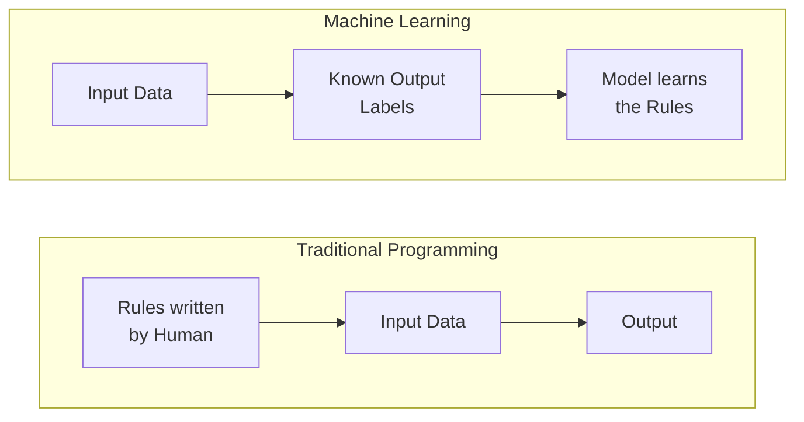

### Why ML Matters

| Purpose | Real Example |
|---|---|
| **Automation** | Spam email filtering |
| **Prediction** | Stock price forecasting |
| **Pattern Recognition** | Fraud detection in banking |
| **Personalization** | Netflix / YouTube recommendations |
| **Decision Support** | Medical diagnosis from scans |

---
---

## 2. Types of Machine Learning

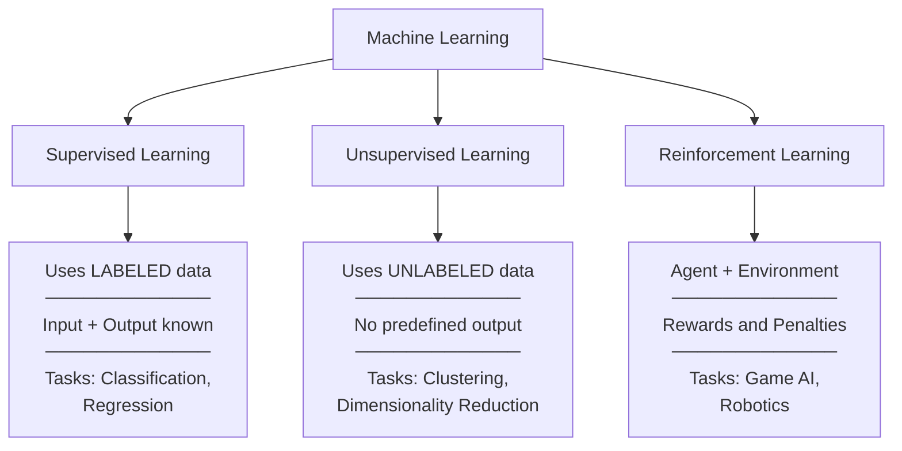

### 2.1 Supervised Learning
- Trains on **labeled data** — input is paired with a known correct output
- Learns a mapping: **f(X) → Y**
- **Classification** → discrete output (spam / not spam)
- **Regression** → continuous output (house price)
- **Examples:** Email spam detection, disease prediction, house price forecasting

### 2.2 Unsupervised Learning
- Trains on **unlabeled data** — no correct answer is given
- Discovers **hidden structures**, clusters, or patterns
- **Techniques:** K-Means Clustering, PCA, Association Rules
- **Examples:** Customer segmentation, market basket analysis

### 2.3 Reinforcement Learning
- An **agent** takes actions in an **environment**
- Receives **reward** (good action) or **penalty** (bad action)
- Learns the **optimal strategy** through trial and error
- **Examples:** Self-driving cars, Chess/Go AI, warehouse robots

### Comparison at a Glance

| | Supervised | Unsupervised | Reinforcement |
|---|:---:|:---:|:---:|
| **Data** | Labeled | Unlabeled | No fixed dataset |
| **Goal** | Predict output | Find patterns | Maximize reward |
| **Feedback** | Labels (direct) | None | Reward / Penalty |
| **Output** | Class or Value | Clusters / Groups | Policy / Action |
| **Example** | Spam filter | Customer groups | Game-playing AI |

---
---

## 3. Foundations of ML

> ML is built on **five core disciplines** that provide its mathematical and computational backbone.

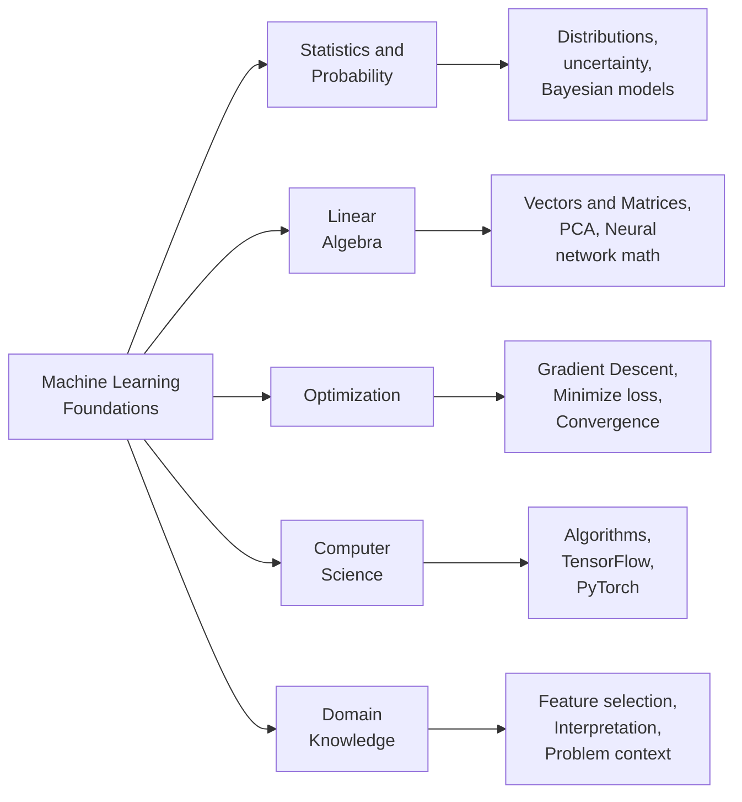

| Foundation | What it provides |
|---|---|
| **Statistics & Probability** | Analyzing data distributions, estimating uncertainty, Naïve Bayes |
| **Linear Algebra** | Representing data as vectors/matrices, neural network computations, PCA |
| **Optimization** | Gradient descent to minimize loss and improve accuracy |
| **Computer Science** | Efficient algorithms, data structures, ML frameworks |
| **Domain Knowledge** | Guides feature selection, model evaluation, problem interpretation |

---
---

## 4. Supervised Learning Algorithms

### Overall Workflow

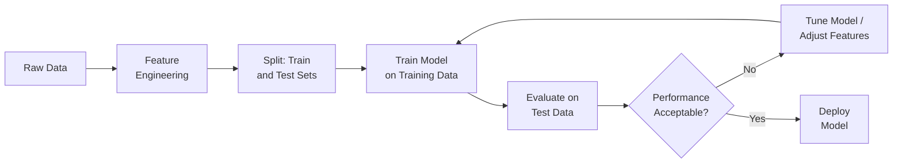

---

### 4.1 Decision Tree

> A **tree-structured model** where data is recursively split based on feature conditions.
> Each path from root to leaf = one decision rule.

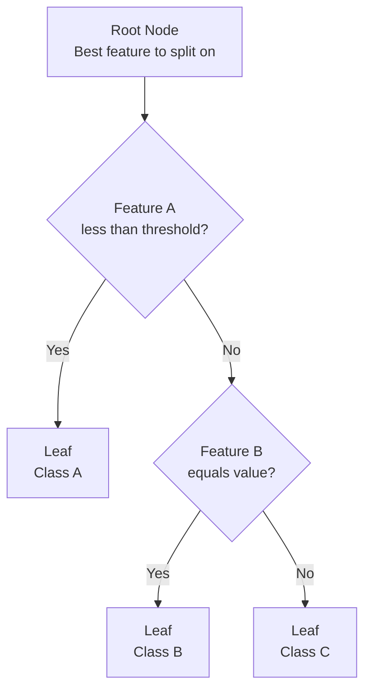

#### How a Decision Tree is Built

| Step | Action |
|---|---|
| **1. Select Feature** | Use **Information Gain**, **Gini Index**, or **Entropy** to find the best split |
| **2. Split Data** | Divide data at the node based on the chosen feature |
| **3. Repeat** | Recursively split each branch until stopping condition |
| **4. Stop** | Max depth reached or minimum samples per leaf hit |
| **5. Prune** | Remove branches that overfit the training data |

#### Key Vocabulary
- `Root Node` → Starting point; best overall feature
- `Internal Node` → A feature-based test/condition
- `Branch` → Outcome of a test (Yes / No)
- `Leaf Node` → Final prediction (class or value)
- `Pruning` → Cutting unnecessary branches to reduce overfitting

#### Pros & Cons

| Strengths | Weaknesses |
|---|---|
| Easy to visualize and explain | Easily overfits on noisy data |
| Handles numeric AND categorical data | Biased toward features with many levels |
| Minimal preprocessing required | Unstable — small data change = different tree |
| Captures non-linear relationships | **Fix:** Use Random Forest or Gradient Boosting |

> **Exam tip:** Overfitting in Decision Trees is fixed by **Pruning** or using **Ensemble Methods** (Random Forest).

---

### 4.2 Naïve Bayes Classifier

> A **probabilistic classifier** based on **Bayes' Theorem**.
> "Naïve" because it assumes all features are **conditionally independent** of each other.

#### Bayes' Theorem

$$P(C \mid X) = \frac{P(X \mid C) \cdot P(C)}{P(X)}$$

| Term | Name | Meaning |
|---|---|---|
| $P(C \mid X)$ | **Posterior** | Probability of class C given features X |
| $P(X \mid C)$ | **Likelihood** | Probability of seeing features X if class is C |
| $P(C)$ | **Prior** | Initial probability of class C (before data) |
| $P(X)$ | **Evidence** | Normalizing constant |

#### How It Works

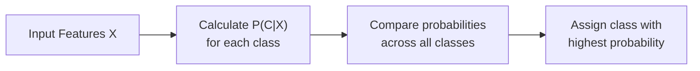

#### Pros & Cons

| Strengths | Weaknesses |
|---|---|
| Very fast and computationally cheap | Independence assumption rarely holds in real life |
| Works well with small datasets | Sensitive to correlated features |
| Scales to high-dimensional data | Needs smoothing to handle zero probabilities |
| Good baseline model | Less accurate than complex models |

> **Applications:** Spam detection · Sentiment analysis · Medical diagnosis · News categorization

---

### 4.3 Linear Regression

> Models the relationship between features and a **continuous output** by fitting a straight line.

#### The Equation

$$Y = \beta_0 + \beta_1X_1 + \beta_2X_2 + \cdots + \beta_nX_n + \epsilon$$

| Symbol | Meaning |
|---|---|
| $Y$ | Predicted output value |
| $X_1 \ldots X_n$ | Input features |
| $\beta_0$ | Intercept / bias |
| $\beta_1 \ldots \beta_n$ | Learned coefficients (weights) |
| $\epsilon$ | Error term (noise) |

- Coefficients are found using the **Least Squares Method** → minimizes sum of **squared errors** between predicted and actual values

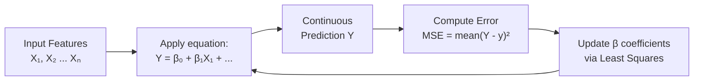

#### Pros & Cons

| Strengths | Weaknesses |
|---|---|
| Simple, fast, and interpretable | Fails on non-linear data |
| Shows feature influence clearly | Sensitive to outliers |
| Strong baseline for regression tasks | Assumes features are independent |

> **Applications:** House price prediction · Sales forecasting · Student performance analysis

---

### 4.4 Logistic Regression

> Used for **binary classification** — predicts the **probability** that an input belongs to class 1.
> Uses the **Sigmoid (logistic) function** to squash output to range **(0, 1)**.

#### Sigmoid Function

$$P(Y=1 \mid X) = \frac{1}{1 + e^{-(\beta_0 + \beta_1X_1 + \cdots + \beta_nX_n)}}$$

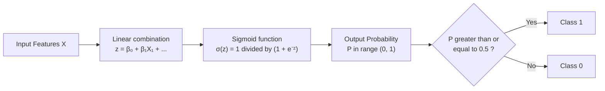

#### Pros & Cons

| Strengths | Weaknesses |
|---|---|
| Outputs a probability (interpretable) | Assumes a linear decision boundary |
| Efficient and widely used | Sensitive to multicollinearity |
| Extends to multiclass via Softmax | Needs feature scaling |

> **Applications:** Spam vs. not spam · Disease present/absent · Credit default yes/no

---

### 4.5 Bayesian Logistic Regression

> Extends standard logistic regression by treating model parameters as **probability distributions** instead of fixed values — capturing **uncertainty**.

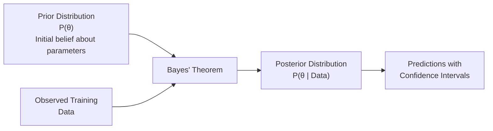

- Uses **MCMC** *(Markov Chain Monte Carlo)* to compute the posterior distribution

#### Standard vs Bayesian Logistic Regression

| | Standard | Bayesian |
|---|---|---|
| **Parameters** | Single fixed value | Full probability distribution |
| **Uncertainty** | Not captured | Explicitly quantified |
| **Output** | Point prediction | Distribution of predictions |
| **Small data** | Can be unreliable | More robust |
| **Prior knowledge** | Not used | Can incorporate it |

> **Applications:** Healthcare risk scoring · Financial decisions under uncertainty

---

### All Supervised Algorithms — One Table

| Algorithm | Task | Output | Core Idea | Key Weakness |
|---|---|---|---|---|
| **Decision Tree** | Classification / Regression | Class or value | Split by information gain | Overfits easily |
| **Naïve Bayes** | Classification | Class | Bayes + feature independence | Independence assumption |
| **Linear Regression** | Regression | Continuous number | Fit a line using Least Squares | Only linear relationships |
| **Logistic Regression** | Binary Classification | Probability 0–1 | Sigmoid on linear combination | Linear boundary only |
| **Bayesian Logistic Reg.** | Classification | Prob. distribution | Prior + Data = Posterior | Computationally heavy |

---
---

## 5. Neural Networks

> A **Neural Network** is a set of interconnected artificial **neurons** organized in layers — inspired by the human brain — capable of learning complex, non-linear patterns.

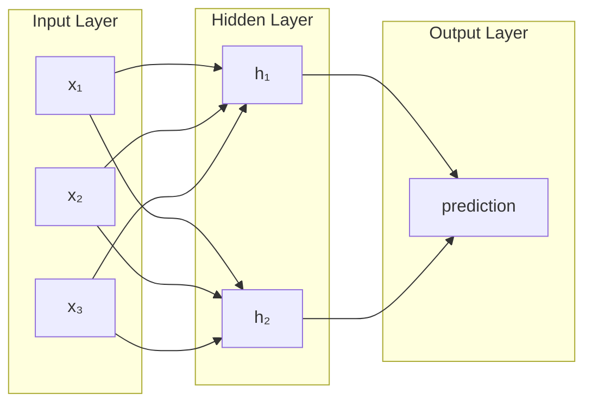

### Layers at a Glance

| Layer | Role |
|---|---|
| **Input Layer** | Receives raw input features (one node per feature) |
| **Hidden Layer(s)** | Extracts and transforms features; more layers = deeper learning |
| **Output Layer** | Produces the final prediction (class or value) |

---

### 5.1 Feed-Forward Neural Network (FFNN)

> The **simplest** form of neural network.
> Data flows **only forward** — input → hidden → output. **No cycles or loops.**

#### What Each Neuron Does

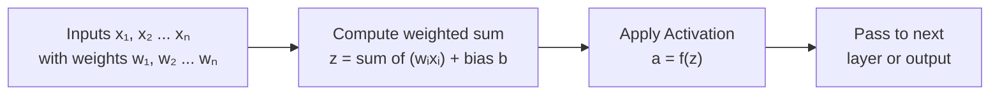

1. **Weighted Sum:** $z = w_1x_1 + w_2x_2 + \cdots + b$
2. **Activation:** $a = f(z)$ — adds non-linearity

> Used for: Classification · Regression · Pattern Recognition

---

### 5.2 Backpropagation

> The **training algorithm** for neural networks.
> Computes how much each weight contributed to the error, then adjusts all weights to reduce it.

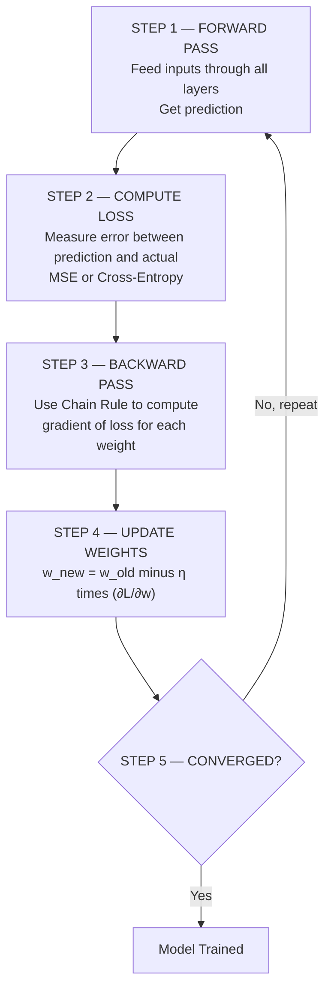

#### Step-by-Step Breakdown

| Step | Details |
|---|---|
| **Forward Pass** | Inputs flow layer by layer → prediction is generated |
| **Loss Calculation** | Error is measured using a loss function |
| **Backward Pass** | **Chain Rule** computes gradient of loss for every weight |
| **Weight Update** | $w_{new} = w_{old} - \eta \cdot \frac{\partial L}{\partial w}$ |
| **Epochs** | Repeat until the loss converges to a minimum |

#### Key Terms

| Term | Meaning |
|---|---|
| **Learning Rate (η)** | Controls step size — too high = unstable, too low = slow |
| **Epoch** | One complete pass through the entire training dataset |
| **Loss Function** | Measures the gap between predicted and actual values |
| **Gradient** | Direction and rate of steepest increase in loss |

#### Loss Functions

| Task | Loss Function | Formula |
|---|---|---|
| **Regression** | Mean Squared Error | $L = \frac{1}{N}\sum(y_{pred} - y_{true})^2$ |
| **Classification** | Cross-Entropy | $L = -\sum y \log(y_{pred})$ |

#### Backpropagation Problems & Fixes

| Problem | What Happens | Fix |
|---|---|---|
| **Vanishing Gradient** | Gradients shrink to near zero in early layers — slow or no learning | Use **ReLU**, proper weight initialization |
| **Exploding Gradient** | Gradients grow out of control — unstable training | **Gradient Clipping**, Batch Normalization |

---

### 5.3 Activation Functions

> Activation functions add **non-linearity** to the network.
> Without them, stacking layers is pointless — the whole network would behave as a single linear equation.

| Function | Formula | Output Range | When to Use |
|---|---|---|---|
| **Sigmoid** | $\frac{1}{1+e^{-z}}$ | (0, 1) | Binary output layer |
| **Tanh** | $\frac{e^z - e^{-z}}{e^z + e^{-z}}$ | (−1, 1) | Hidden layers (zero-centered) |
| **ReLU** | $\max(0, z)$ | [0, ∞) | Hidden layers — most popular |
| **Softmax** | $\frac{e^{z_i}}{\sum_j e^{z_j}}$ | (0,1), sums to 1 | Multi-class output layer |

> **ReLU** is preferred in hidden layers because it avoids the vanishing gradient problem that Sigmoid and Tanh suffer from at extreme values.

---

### 5.4 Regularization Techniques

> Regularization **controls model complexity** to prevent overfitting — where a model performs great on training data but fails on new data.

#### Overfitting vs Underfitting

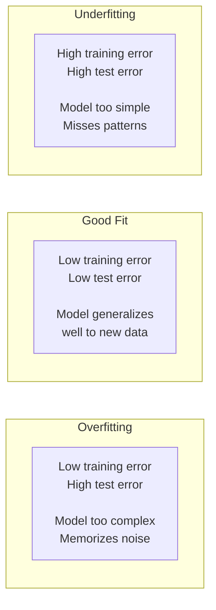

#### Regularization Methods

| Technique | How It Works | Best For |
|---|---|---|
| **L1 / Lasso** | Adds penalty on absolute weights → drives weak weights to 0 | Feature selection |
| **L2 / Ridge** | Adds penalty on squared weights → shrinks all weights | Smooth, stable models |
| **Dropout** | Randomly disables 20–50% of neurons each training step | Deep neural networks |
| **Early Stopping** | Halts training when validation loss stops decreasing | Any neural network |
| **Data Augmentation** | Generates new training samples via flipping, rotation, etc. | Image and audio models |
| **Batch Normalization** | Normalizes layer inputs each mini-batch — stable training | Deep networks |

---
---

## 6. Advanced Neural Networks

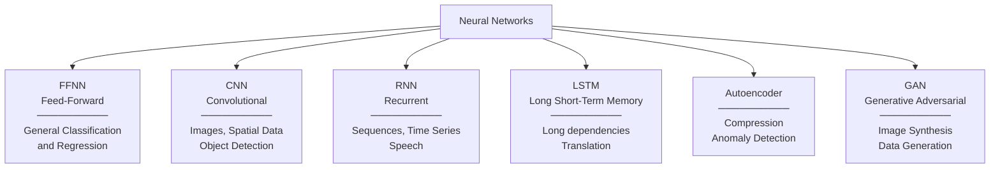

### CNN — Convolutional Neural Network

> Specialized for **spatial data** like images. Uses **filters** to extract features automatically.

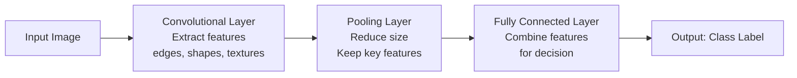

### RNN / LSTM — Recurrent Networks

> RNNs process **sequential data** by maintaining a **hidden state** that carries context across time steps.

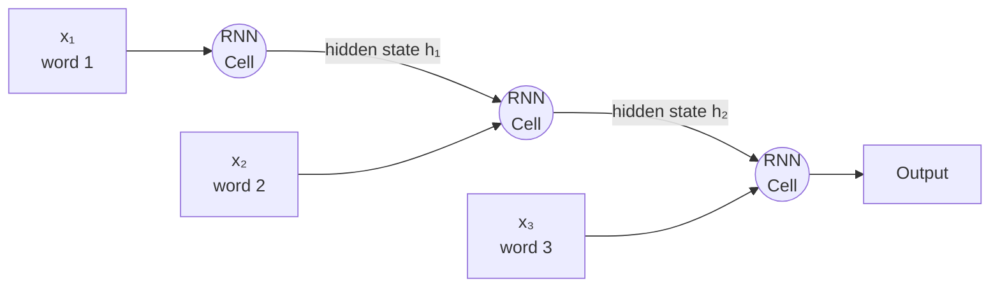

> **Problem:** RNNs suffer from **vanishing gradient** on long sequences.
> **Solution:** **LSTM** adds 3 gates — **Input gate**, **Forget gate**, **Output gate** — to control what to remember and what to discard.

### All Advanced Networks — Summary

| Network | Key Idea | Applications |
|---|---|---|
| **FFNN** | One-way flow, no memory | General classification, regression |
| **CNN** | Convolutional filters extract spatial features | Image recognition, medical scans, object detection |
| **RNN** | Hidden state for sequential memory | Speech, time series, text generation |
| **LSTM** | Gating mechanisms for long-term memory | Translation, sentiment analysis, stock prediction |
| **Autoencoder** | Compress input then reconstruct it | Denoising, anomaly detection, data compression |
| **GAN** | Generator vs Discriminator (adversarial game) | Image synthesis, data generation, deepfake detection |

---
---

## 7. Key Challenges in ML

| Challenge | What Goes Wrong | How to Fix It |
|---|---|---|
| **Overfitting** | Model memorizes training noise — fails on new data | Regularization · Dropout · Cross-validation |
| **Underfitting** | Model is too simple to learn anything useful | Add features · Use a more complex model |
| **Vanishing Gradient** | Early-layer weights stop updating in deep nets | ReLU · Batch Normalization · Residual connections |
| **Data Quality** | Biased / noisy data → unreliable model | Data cleaning · Balanced sampling |
| **Interpretability** | Deep models are "black boxes" — hard to explain | SHAP · LIME · Attention mechanisms |
| **Computational Cost** | Deep networks need expensive hardware | GPUs / TPUs · Efficient architectures |
| **Ethical Bias** | Model learns and amplifies societal biases | Fair training data · Ethical guidelines |

---
---

## 8. Real-World Applications

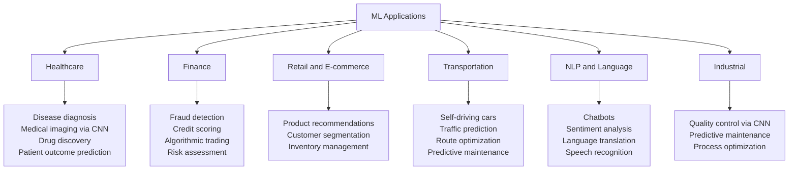

### Which Algorithm Goes Where?

| Domain | Task | Algorithm |
|---|---|---|
| Email | Spam detection | Naïve Bayes |
| Banking | Fraud detection | Neural Networks, Anomaly Detection |
| Real Estate | Price prediction | Linear Regression |
| Healthcare | Disease yes/no | Logistic Regression, Decision Tree |
| E-commerce | Product suggestions | Collaborative Filtering, Neural Networks |
| Computer Vision | Image classification | CNN |
| Language | Text and speech tasks | RNN / LSTM |
| Robotics / Games | Strategy learning | Reinforcement Learning |

---
---

## 9. Quick Revision

### Full ML Workflow

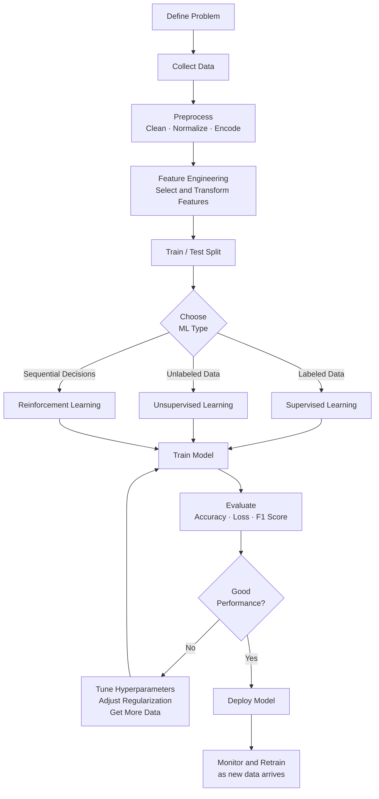

---

### ML Types — One-Liner Summary

| Type | One Line |
|---|---|
| **Supervised** | Learns from labeled data (input → known output) to predict |
| **Unsupervised** | Finds hidden patterns in unlabeled data |
| **Reinforcement** | Agent learns via rewards and penalties through trial and error |

---

### Algorithm Quick Reference

| Algorithm | Input | Output | Core Concept |
|---|---|---|---|
| **Decision Tree** | Labeled features | Class / Value | Split by Information Gain or Gini Index |
| **Naïve Bayes** | Features + Labels | Class | Bayes' Theorem + feature independence |
| **Linear Regression** | Continuous features | Continuous value | $Y = \beta_0 + \beta_1X + \epsilon$ |
| **Logistic Regression** | Features | Probability (0–1) | Sigmoid on linear combination |
| **Bayesian Logistic Reg.** | Features | Prob. distribution | Prior + Data → Posterior (MCMC) |
| **FFNN** | Any | Any | Weighted sum + Activation + Backprop |
| **CNN** | Images / spatial data | Class | Convolution + Pooling + Fully Connected |
| **RNN / LSTM** | Sequential data | Sequence output | Hidden state across time steps |

---

### Keywords Glossary — Exam Ready

| Keyword | Definition |
|---|---|
| **Generalization** | Model performs well on **unseen** (new) data |
| **Overfitting** | Model memorizes training data → fails on test data |
| **Underfitting** | Model is too simple → fails on both train and test data |
| **Feature** | An input variable used for making predictions |
| **Label** | The known correct output in supervised learning |
| **Epoch** | One full pass through the entire training dataset |
| **Learning Rate (η)** | Step size when updating weights in gradient descent |
| **Loss Function** | Measures how wrong the model's predictions are |
| **Gradient Descent** | Optimization that moves weights in direction of steepest loss decrease |
| **Backpropagation** | Algorithm to compute gradients and propagate error backward |
| **Activation Function** | Introduces non-linearity into a neural network |
| **ReLU** | $\max(0, z)$ — most common hidden layer activation |
| **Dropout** | Randomly disables neurons during training to reduce overfitting |
| **Pruning** | Removing unnecessary branches in a Decision Tree |
| **Prior / Posterior** | Bayesian terms: belief *before* / *after* observing data |
| **MCMC** | Algorithm for sampling from complex posterior distributions |
| **Vanishing Gradient** | Gradients become near-zero → early layers stop learning |
| **Gini Index / Entropy** | Measures of impurity used in Decision Tree splitting |
| **FFNN** | Feed-Forward Neural Network — simplest NN, no loops |
| **CNN** | Convolutional NN — designed for images and spatial data |
| **LSTM** | Long Short-Term Memory — RNN variant with gating for long sequences |

---

*BCA-V · Unit 3 · AI & Machine Learning · Exam Notes*
