# Unit 1

# ARTIFICIAL INTELLIGENCE & MACHINE LEARNING
## UNIT-I: Study Notes & Exam Questions

---

## 📚 SYLLABUS OVERVIEW
- Concept of Intelligence & AI
- AI Intelligent Agents
- Characteristics of AI
- Comparison: AI vs Machine Learning vs Deep Learning
- State Space Search
- Classical AI Problems (Water Jug, Missionary-Cannibal, Monkey-Banana)
- Applications of AI
- MYCIN Case Study

---

## 📝 PART A: CONCEPT NOTES

### 1. INTELLIGENCE

**Definition:**
Intelligence is the ability to learn, understand, adapt to new situations, and use knowledge to achieve desired outcomes.

**Key Components:**
- Problem solving
- Understanding abstract concepts
- Critical thinking and reasoning
- Planning and creativity

**Historical Note:**
Formal intelligence studies began in early 20th century with tests like:
- **Binet-Simon scale** (1905) - Alfred Binet & Theodore Simon
- **Stanford-Binet IQ test** - Lewis Terman adaptation
- **WAIS** (1939) - David Wechsler, first adult intelligence test

---

### 2. ARTIFICIAL INTELLIGENCE (AI)

**Definition:**
AI technology allows computers and machines to simulate human intelligence and problem-solving capabilities.

**Key Characteristics:**
1. Ability to rationalize and take actions to achieve specific goals
2. Automated learning from data without human assistance (Machine Learning)
3. Uses algorithms - simple for basic applications, complex for strong AI

**Historical Background:**
- AI research began in 1950s
- Used by US Department of Defense in 1960s to train computers to mimic human reasoning

**Types of AI (by Capability):**

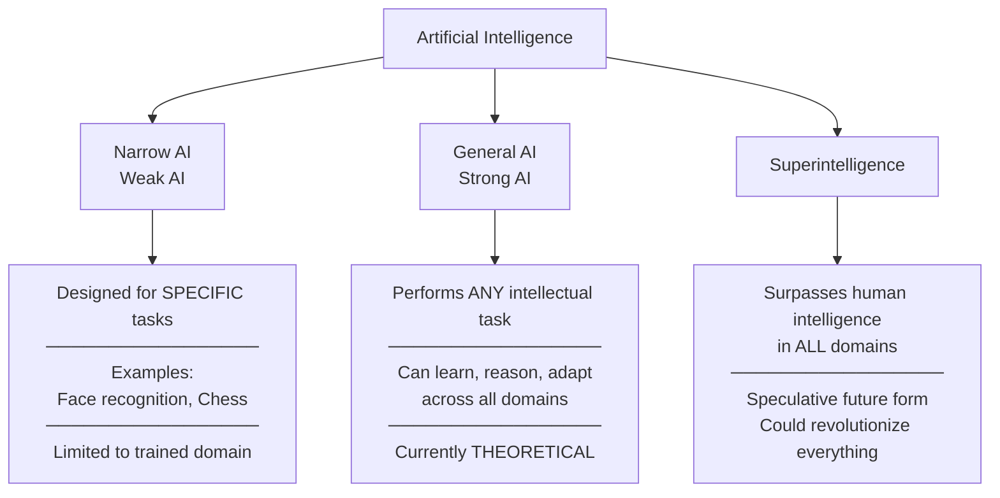

---

### 3. AI INTELLIGENT AGENTS

**Definition:**
An AI agent is a software program that interacts with its environment, collects data, and performs self-determined tasks to meet predetermined goals.

**Key Principles:**
- **Rational Decision Making** - Makes decisions based on perceptions and data
- **Autonomous Operation** - Works without constant human intervention
- **Environmental Sensing** - Uses physical or software interfaces to perceive environment
- **Goal-Oriented Behavior** - Takes actions to achieve specific objectives

**Architecture Components:**

1. **Architecture** - Base platform (physical/software)
   - Physical: Actuators, sensors, motors, robotic arms
   - Software: APIs, databases, text prompts

2. **Agent Function** - How data is translated into actions
   - Information type, AI capabilities, knowledge base

3. **Agent Program** - Implementation of agent function
   - Development, training, and deployment

**How AI Agents Work:**

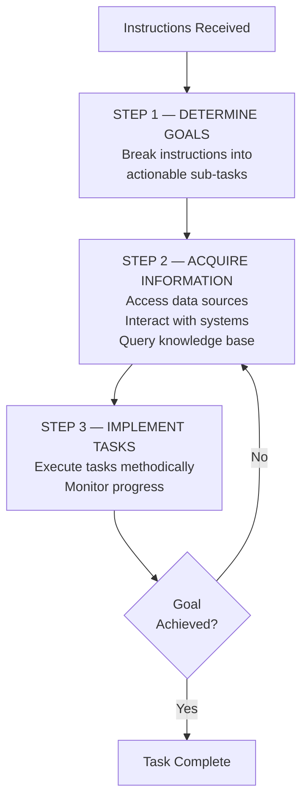

**Benefits:**
- ✓ Improved productivity (automate repetitive tasks)
- ✓ Reduced costs (minimize errors and inefficiencies)
- ✓ Informed decision-making (analyze real-time data)
- ✓ Enhanced customer experience (personalization)

---

**TYPES OF AI AGENTS:**

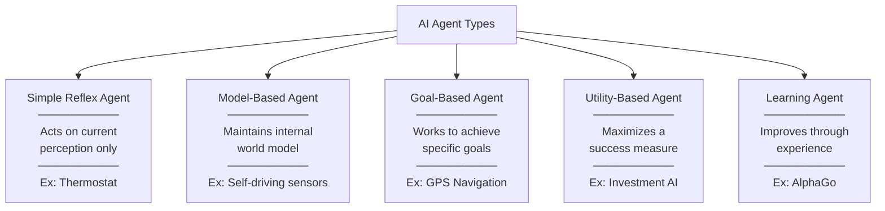

| Type | Description | Example |
|------|-------------|---------|
| **Simple Reflex** | Acts on current perception only | Thermostat |
| **Model-Based** | Maintains internal world model | Self-driving car sensors |
| **Goal-Based** | Works to achieve specific goals | GPS navigation |
| **Utility-Based** | Maximizes success measure | Investment AI |
| **Learning Agents** | Improves through experience | AlphaGo |

**Practical Examples:**

**A. Chatbot (Virtual Assistant)**
- Perception: Voice/text input
- Action: Process using NLP
- Decision-Making: Fetch data, set reminders
- Learning: Improve from user interactions

**B. Self-Driving Car**
- Perception: Cameras, radar, LIDAR
- Action: Accelerate, brake, steer
- Decision-Making: Analyze traffic, obstacles
- Learning: Update from driving experiences

---

### 4. CHARACTERISTICS OF AI

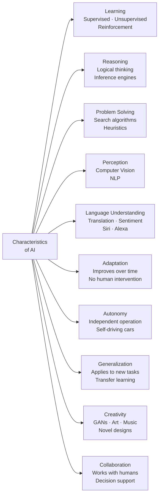

**A. LEARNING**
- **Supervised Learning** - Trained on labeled data
- **Unsupervised Learning** - Pattern identification from unlabeled data
- **Reinforcement Learning** - Trial and error with rewards/penalties

**B. REASONING**
- Simulates logical thinking
- Makes decisions and draws conclusions
- Uses rule-based systems and inference engines
- Mimics human thought processes

**C. PROBLEM SOLVING**
- Analyzes complex problems
- Generates solutions through:
  - Search algorithms (A*, Dijkstra's)
  - Optimization techniques
  - Heuristic methods

**D. PERCEPTION**
- Interprets environment through sensors
- **Computer Vision** - Visual data processing
- **Natural Language Processing** - Text/speech processing

**E. LANGUAGE UNDERSTANDING (NLP)**
- Translation, sentiment analysis
- Summarization, conversation
- Examples: Siri, Alexa, Google Assistant

**F. ADAPTATION**
- Improves performance over time
- Evolves without human intervention
- Critical for robotics, autonomous vehicles

**G. AUTONOMY**
- Operates independently
- Plans and navigates without direct control
- Self-driving cars, robotic systems

**H. GENERALIZATION**
- Applies learned knowledge to new situations
- Transfers understanding across tasks
- Model adapts to unseen data

**I. CREATIVITY**
- Generates novel ideas and solutions
- **GANs** (Generative Adversarial Networks)
- Creates art, music, designs

**J. COLLABORATION**
- Works alongside humans
- Understands intentions
- Supports decision-making and creative work

---

### 5. THREE MAIN CHARACTERISTICS FRAMEWORK

**① FEATURE ENGINEERING**

**Purpose:** Identifies optimal attributes from datasets

**Key Techniques:**
- Reduces system entropy
- PCA (Principal Component Analysis)
- Gram-Schmidt orthogonalization
- Achieves feature independence (zero correlation)

**Process:**
- Convert raw observations to features
- Simplify data transformations
- Enhance model accuracy
- Improve performance

**② ARTIFICIAL NEURAL NETWORKS (ANN)**

**Structure:**
- Collection of connected nodes (artificial neurons)
- Signal transmission through connections
- Layers transform data using algorithms

**Types:**
1. **Feedforward (Acyclic)**
   - Signal travels one direction
   - Perceptrons, multi-layer perceptrons
   - Radial basis networks

2. **Recurrent**
   - Allows feedback loops
   - Has memory of previous inputs

**Network Optimization Techniques:**

| Technique | Description |
|-----------|-------------|
| **Pruning** | Removes redundant connections |
| **Quantization** | Uses fewer bits for values |
| **Low-rank factorization** | Compresses tensors |
| **Compact filters** | Reduces parameters |
| **Knowledge distillation** | Small model mimics large model |

**Applications:**
- Targeted marketing (pattern recognition)
- Finance (volatile data modeling)
- Fraud detection (rare events)
- Disease diagnosis

**③ DEEP LEARNING**

**Features:**
- Multiple hidden layers between input/output
- Automatic feature extraction and classification
- Uses parallel-computing GPUs/TPUs
- High performance for complex tasks

**Applications:**
- Autonomous vehicles (self-driving cars)
- Computer vision
- Speech recognition
- Social media personalization
- Image recognition

---

### 6. COMPARISON: AI vs ML vs DL

| Feature | AI | Machine Learning | Deep Learning |
|---------|----|--------------------|---------------|
| **Definition** | Broad field for intelligent machines | Enables learning from data | Multi-layer neural networks |
| **Focus** | Mimic human intelligence | Learn and improve over time | Emulate brain structure |
| **Techniques** | Heuristics, rule-based, NLP, robotics | Decision trees, SVM, random forests | CNN, RNN, multi-layer networks |
| **Data Need** | Structured/unstructured, not always essential | Large structured data | Massive labeled data |
| **Processing** | General hardware | More computational resources | High power, GPUs/TPUs |
| **Accuracy** | Limited by rules | Good for specific tasks | Very high for vision/NLP |
| **Interpretability** | High (rule-based) | Moderate (traceable) | Low ("black box") |
| **Training Time** | Generally faster | Moderate | Extensive |
| **Learning Type** | Rule-based/learning | Supervised/unsupervised/reinforcement | Primarily supervised |
| **Scalability** | Depends on approach | Scalable with data | Highly scalable |
| **Human Intervention** | High (constant tuning) | Moderate (feature engineering) | Low (auto learning) |
| **Examples** | Chatbots, chess AI | Email filtering, recommendations | Image classification, autonomous cars |

**Key Relationship:**

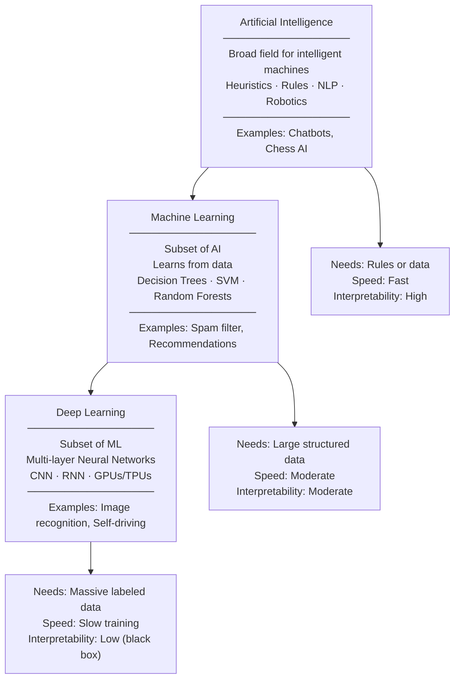

---

## 📝 PART B: STATE SPACE SEARCH

### 7. STATE SPACE SEARCH

**Definition:**
A framework that views problem-solving as navigating through a space of possible "states" to find a solution.

**Key Components:**

**① STATE SPACE**
- Collection of all possible configurations
- Each state = unique variable configuration
- Navigate from initial to goal state

**② ELEMENTS:**

| Element | Description |
|---------|-------------|
| **States** | Problem snapshots at given time |
| **Initial State** | Starting point |
| **Goal State** | Solution/target state |
| **Operators/Actions** | Change one state to another |
| **Cost** (optional) | Resource/time for transitions |
| **Path** | Sequence from initial to goal |

**③ PROBLEM DEFINITION REQUIRES:**
1. **Initial state** - Starting configuration
2. **Goal state** - Target configuration
3. **State transitions** - Movement rules
4. **Cost function** - (optional) For optimization

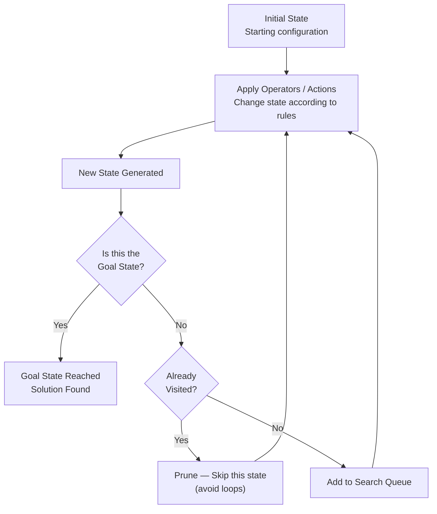

**④ SEARCH ALGORITHMS:**

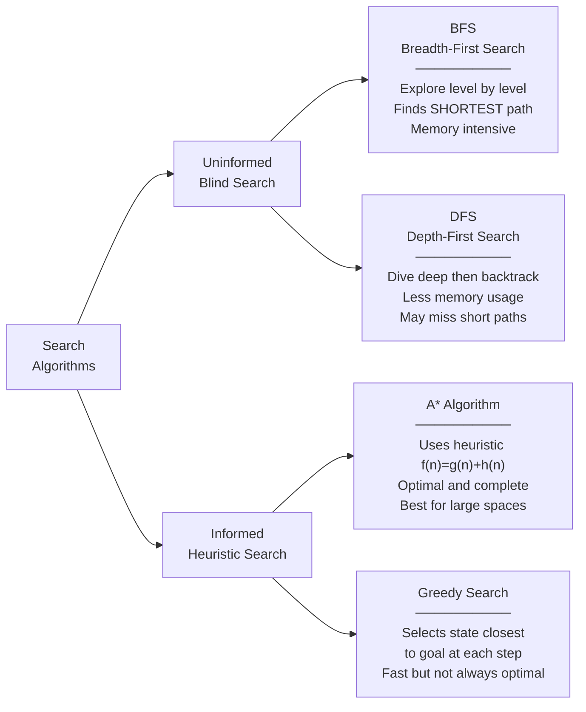

**A. Uninformed (Blind) Search:**

| Algorithm | Description | Advantage | Disadvantage |
|-----------|-------------|-----------|--------------|
| **BFS** | Level by level exploration | Finds shortest path | Memory intensive |
| **DFS** | Deep dive then backtrack | Less memory | May miss short paths |

**B. Informed (Heuristic) Search:**

| Algorithm | Description |
|-----------|-------------|
| **A Algorithm*** | Uses heuristic to estimate cost |
| **Greedy Search** | Selects state closest to goal |

**⑤ STATE SPACE EXPLOSION:**

**Problem:** Number of states grows exponentially

**Solutions:**
- **Heuristics** - Guide search efficiently
- **Pruning** - Cut unlikely branches

**⑥ APPLICATIONS:**
- Pathfinding (maze, graph)
- Puzzles (Rubik's cube, 8-puzzle, Sudoku)
- Games (chess, tic-tac-toe)

**⑦ 8-PUZZLE EXAMPLE:**

```
Problem: 3x3 grid, 8 numbered tiles, 1 empty space
Goal: Arrange in order (1-2-3-4-5-6-7-8)

Initial State: Current tile arrangement
Goal State: 1-2-3-4-5-6-7-8
Operators: Move tile into empty space
Cost: Number of moves
```

---

## 📝 PART C: CLASSICAL AI PROBLEMS

### 8. WATER JUG PROBLEM

**Problem Statement:**
Measure specific water quantity using jugs without volume markings.

**Example Setup:**
- Jug 1: 10 liters
- Jug 2: 7 liters  
- **Goal:** Measure exactly 6 liters

**State Representation:** (x, y)
- x = water in jug 1
- y = water in jug 2

**Initial State:** (0, 0)  
**Goal State:** (6, y) where 0 ≤ y ≤ 7

**Operators (Actions):**

1. Fill jug 1: (x, y) → (10, y)
2. Fill jug 2: (x, y) → (x, 7)
3. Empty jug 1: (x, y) → (0, y)
4. Empty jug 2: (x, y) → (x, 0)
5. Pour jug 2 → jug 1: (x, y) → (min(10, x+y), max(0, y-(10-x)))
6. Pour jug 1 → jug 2: (x, y) → (max(0, x-(7-y)), min(7, x+y))
7. Pour all from jug 2 → jug 1
8. Pour all from jug 1 → jug 2

**Solution Path Example:**

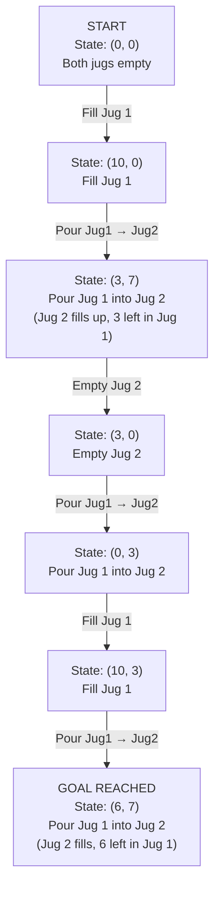

**Search Approaches:**

**BFS (Breadth-First Search):**
- Explores all actions level by level
- Finds shortest path
- More memory needed
- Guaranteed optimal solution

**DFS (Depth-First Search):**
- Dives deep then backtracks
- Less memory
- May find longer paths
- Uses pruning to avoid revisiting states

**Pruning:**
- Eliminates already-explored states
- Reduces computational resources
- Increases efficiency

**Real-World AI Parallels:**
- Route optimization (ride-sharing)
- Logistics planning (delivery routes)
- Medical diagnosis (pattern recognition)
- Fraud detection (anomaly spotting)

---

### 9. MISSIONARY-CANNIBAL PROBLEM

**Problem Statement:**
- 3 missionaries + 3 cannibals must cross a river
- 1 boat available (capacity: 2 people)
- **Constraint:** Cannibals cannot outnumber missionaries on either bank

**State Representation:** (ML, CL, MR, CR, B)
- ML = missionaries on left bank
- CL = cannibals on left bank
- MR = missionaries on right bank
- CR = cannibals on right bank
- B = boat position (0=left, 1=right)

**Initial State:** (3, 3, 0, 0, 0)  
**Goal State:** (0, 0, 3, 3, 1)

**Rules:**
1. Boat carries maximum 2 people
2. At least 1 person must be in boat
3. If cannibals > missionaries on any side → **missionaries eaten** (invalid state)
4. Any person can pilot the boat

**Solution Strategy:**
1. Move pairs strategically
2. Send one person back to maintain boat availability
3. Track states to ensure safety constraint met
4. Use state space search (BFS/DFS/A*)

**Example Solution Path:**

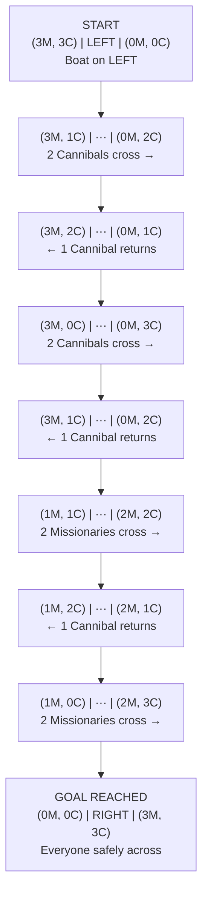

> **Constraint:** Cannibals must NEVER outnumber Missionaries on either bank — all states above satisfy this.

**AI Concepts Illustrated:**
- State-space search
- Constraint satisfaction
- Search algorithms (BFS, DFS, A*)
- Planning and optimization

**Educational Importance:**
- Teaches constraint handling
- Demonstrates state representation
- Shows search strategy importance

---

### 10. MONKEY & BANANA PROBLEM

**Components:**
- **Monkey** - Agent seeking goal
- **Banana** - Goal item (out of reach)
- **Box** - Tool to reach banana
- **Ground** - Initial position

**Scenario:**
- Monkey is on ground
- Banana hangs from ceiling (too high to reach)
- Box is on ground (can be used as platform)

**Actions Available:**
1. Move to box
2. Push box to desired location
3. Climb onto box
4. Grab banana

**Goal:** Obtain the banana

**Solution Steps:**

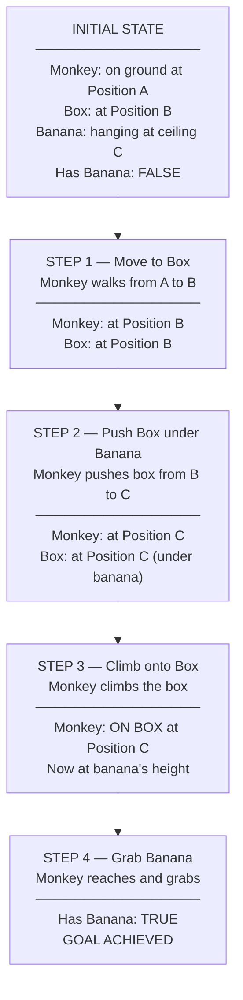

**AI Concepts Demonstrated:**

1. **State Representation**
   - Position of monkey
   - Position of box
   - Position of banana
   - Monkey's status (on ground/on box)

2. **Actions and Effects**
   - Each action changes state
   - Moving box changes its position
   - Climbing changes monkey's position

3. **Planning and Search**
   - Sequence of actions to goal
   - Multiple possible paths
   - Optimal solution selection

4. **Goal Formulation**
   - Clear objective definition
   - Success criteria

**Significance:**
- Foundational for understanding state-space search
- Illustrates goal formulation
- Shows action-effect relationships
- Simple yet comprehensive example

---

### 11. BLOCK WORDS PROBLEM

**Definition:**
AI unintentionally avoids or filters certain words/phrases from output.

**Causes:**

1. **Training Data Bias**
   - Underrepresented words/phrases
   - Limited exposure to certain language

2. **Content Moderation**
   - Overly aggressive filters
   - Safety-focused restrictions

3. **Over-Correction**
   - Blocking contextually appropriate words
   - Too conservative approach

4. **Keyword Filters**
   - Lack context awareness
   - Blanket term blocking

5. **Ethical Trade-offs**
   - Balance between safety and expression
   - Political correctness concerns

**Impact:**
- Incomplete/biased responses
- Reduced creativity and diversity
- Limited expression
- User frustration
- Suppressed important conversations

**Examples:**
- Medical chatbot blocking "cancer" in health queries
- AI avoiding legitimate political discussions
- Over-filtering of historically important terms

**Mitigation Strategies:**

1. **Context-Aware Systems**
   - NLP techniques for understanding context
   - Differentiate appropriate vs inappropriate use

2. **Balanced Training Data**
   - Diverse, representative datasets
   - Multiple language styles and cultures

3. **Human-in-the-Loop**
   - Human oversight for moderation
   - Correct over-filtering

4. **Transparency & Customization**
   - User control over filtering
   - Clear filtering policies

**Importance:**
- Highlights AI ethics challenges
- Shows need for balanced approaches
- Demonstrates real-world AI limitations

---

## 📝 PART D: APPLICATIONS OF AI

### 12. CORE AI APPLICATIONS

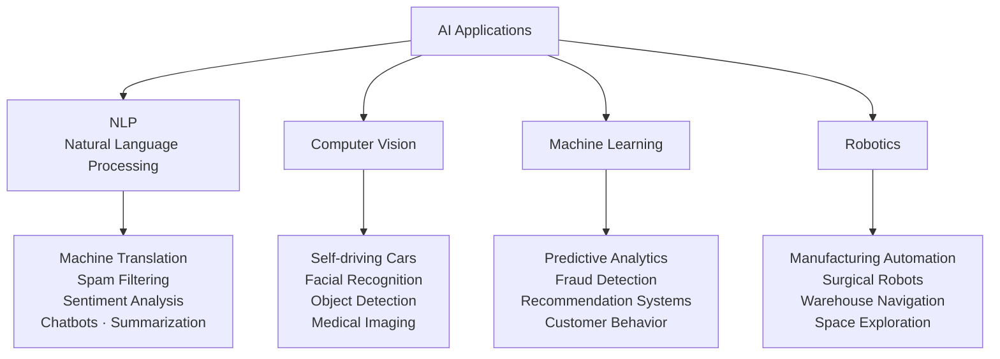

**① NATURAL LANGUAGE PROCESSING (NLP)**
- Machine translation
- Spam filtering
- Sentiment analysis
- Chatbots and virtual assistants
- Text summarization

**② COMPUTER VISION**
- Self-driving cars
- Facial recognition
- Object detection
- Medical image analysis
- Quality control in manufacturing

**③ MACHINE LEARNING**
- Predictive analytics
- Fraud detection
- Recommendation systems
- Pattern recognition
- Customer behavior analysis

**④ ROBOTICS**
- Manufacturing automation
- Healthcare assistance
- Space exploration
- Warehouse navigation
- Surgical robots

---

### 13. INDUSTRY-SPECIFIC APPLICATIONS

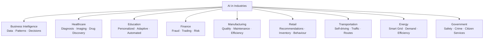

**A. BUSINESS INTELLIGENCE**
- **Data Collection** - Structured & unstructured data
- **Pattern Analysis** - Identify trends and relationships
- **Data Visualization** - Create insights
- **Decision Support** - Data-driven recommendations

**B. HEALTHCARE**
- **Disease Diagnosis** 
  - Pattern identification in medical data
  - Early and accurate diagnosis
- **Treatment Development**
  - Drug discovery through data analysis
  - New therapy identification
- **Personalized Care**
  - Tailored treatment plans
  - Patient-specific recommendations
- **Medical Imaging**
  - X-ray, MRI, CT scan analysis
  - Abnormality detection

**C. EDUCATION**
- **Personalized Learning**
  - Adaptive content delivery
  - Individual pace adjustment
  - Targeted instruction
- **Student Engagement**
  - Interactive experiences
  - Real-time feedback
  - Gamification
- **Administrative Automation**
  - Grading papers
  - Scheduling classes
  - Resource management

**D. FINANCE**
- **Risk & Fraud Detection**
  - Anomaly identification
  - Suspicious activity monitoring
  - Money laundering detection
- **Personalized Recommendations**
  - Investment advice
  - Banking offers
  - Portfolio management
- **Document Processing**
  - Loan servicing
  - Contract analysis
  - Data extraction
- **Algorithmic Trading**
  - Market analysis
  - Automated transactions

**E. MANUFACTURING**
- **Improved Efficiency**
  - Automation of assembly
  - Process optimization
- **Increased Productivity**
  - Workflow optimization
  - Resource allocation
- **Quality Control**
  - Defect detection
  - Inspection automation
- **Predictive Maintenance**
  - Equipment monitoring
  - Failure prediction

**F. RETAIL**
- **Personalized Shopping**
  - Customer preference analysis
  - Tailored experiences
- **Product Recommendations**
  - AI-driven suggestions
  - Cross-selling opportunities
- **Inventory Management**
  - Stock optimization
  - Demand forecasting
- **Customer Behavior Analysis**
  - Purchase pattern recognition
  - Trend identification

**G. TRANSPORTATION**
- **Self-Driving Cars**
  - Autonomous navigation
  - Obstacle avoidance
- **Traffic Management**
  - Flow optimization
  - Congestion reduction
- **Route Optimization**
  - Fastest path calculation
  - Fuel efficiency

**H. ENERGY**
- **Energy Efficiency**
  - Consumption optimization
  - Smart grid management
- **Demand Prediction**
  - Load forecasting
  - Resource planning
- **Resource Optimization**
  - Distribution efficiency

**I. GOVERNMENT**
- **Public Safety**
  - Emergency response
  - Disaster management
- **Crime Detection & Prevention**
  - Pattern analysis
  - Predictive policing
- **Citizen Services**
  - Chatbots for queries
  - Service automation
- **Policy Making**
  - Data-driven decisions
  - Impact analysis

---

## 📝 PART E: MYCIN CASE STUDY

### 14. MYCIN EXPERT SYSTEM

**Overview:**
- Developed by Stanford University (early-mid 1970s)
- Expert system for medical diagnosis
- Assists physicians with infectious diseases
- Recommends antibiotic treatments

**Purpose:**
- Diagnose infectious diseases
- Recommend appropriate antibiotics (hence "-mycin" suffix)
- Emulate expert thinking in infectious disease field
- Provide decision support to physicians

---

**THREE SUB-SYSTEMS:**

### **① CONSULTATION SYSTEM**

**Function:** Determines possible organisms and suggests treatment

**A. Static Data Structures:**

**Parameter Properties:**
- **EXPECT** - Range of possible values
- **PROMPT** - English sentence to elicit response
- **LABDATA** - Can be known from lab data
- **LOOKAHEAD** - Lists rules mentioning parameter in premise
- **UPDATED-BY** - Lists rules mentioning parameter in action

**Rule Base:**
- **Structure:** Premise-action pairs
- **Premises:** Conjunctions/disjunctions of conditions
- **Conditions:** Evaluate to True/False with certainty factor
- **Certainty Factors (CF):** Degree of belief (0-1 scale)
  - Attached to information
  - Combined to form new certainty factors
  - Rule CFs + data CFs → conclusion CFs

**B. Dynamic Data Structures:**

Store evolving case information:
- Patient details and context
- Possible diagnoses
- Rules consulted during session
- Therapy recommendations

**C. Control Structure:**

**Process:**
1. Creates "patient context" with case information
2. Compiles list of therapies for context
3. Uses **BACKWARD CHAINING** mechanism
4. Reasons from goals back to data (goal-driven)

**Goal:** "Compile a list of therapies"

**Question Prompting:**
- Prompted by rule invocation
- Finds necessary data
- Avoids unnecessary questions

---

### **② EXPLANATION SYSTEM**

**Function:** Answers questions about reasoning process

**Capabilities:**

**A. HOW Questions**
- "How did you reach this conclusion?"
- Traces conclusion path
- Shows rules invoked
- Displays reasoning chain

**B. WHY Questions**
- "Why did you ask this question?"
- Explains question rationale
- Shows goal being pursued
- Links to rule requirements

**C. Timing**
- During consultation (interactive)
- After consultation (review)

**D. General Queries**
- "What would you prescribe for organism X?"
- Consults static data structures
- Provides general knowledge

**Mechanism:**
- Manipulates rule invocation records
- Tracks goals being achieved
- Records information being discovered
- Maintains reasoning trace

**Significance:**
- Early "explainable AI"
- Transparency in medical decisions
- Educational tool for learning
- Trust building with physicians

---

### **③ RULE ACQUISITION SYSTEM**

**Function:** Allows experts to manage knowledge base

**Features:**

**A. Rule Entry**
- Experts can enter new rules
- Edit existing rules
- Delete obsolete rules

**B. Automatic Updates**
- **LOOKAHEAD List:** 
  - Automatically updated
  - All parameters in premise added
- **UPDATED-BY List:**
  - Automatically updated
  - All parameters in action added

**C. Knowledge Base Maintenance**
- Keep system current
- Incorporate new medical knowledge
- Refine existing rules

**D. Format:**
- Premise-action structure
- IF (conditions) THEN (conclusions)
- Certainty factors attached

**Importance:**
- System can grow and improve
- Experts maintain control
- No programmer needed for updates
- Domain knowledge stays current

---

### **MYCIN WORKFLOW DIAGRAM**

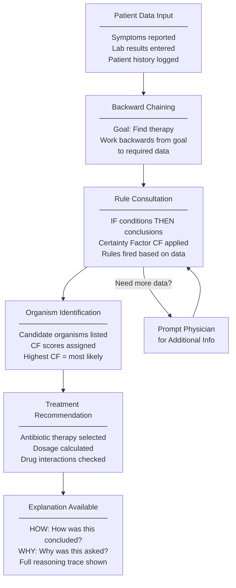

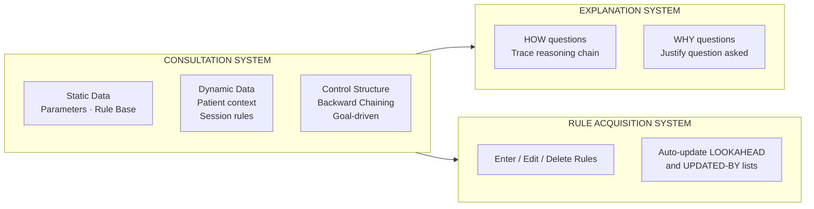

---

### **KEY INNOVATIONS**

1. **Certainty Factors**
   - Handle uncertain reasoning
   - Quantify degree of belief
   - Combine evidence mathematically

2. **Backward Chaining**
   - Goal-directed reasoning
   - Efficient question asking
   - Focus on relevant information

3. **Explanation Capability**
   - Transparent reasoning
   - Educational value
   - Trust building
   - Early "explainable AI"

4. **Knowledge Acquisition**
   - Expert-maintainable
   - No programming required
   - Continuous improvement

---

### **SIGNIFICANCE IN AI HISTORY**

1. **Pioneer Expert System**
   - One of first successful expert systems
   - Demonstrated AI in critical domains

2. **Medical AI Milestone**
   - Showed AI could work in healthcare
   - Performance comparable to experts
   - Inspired future medical AI systems

3. **Explainability Focus**
   - Set standard for explanation
   - Influenced modern XAI (Explainable AI)
   - Recognized importance of transparency

4. **Knowledge Engineering**
   - Demonstrated rule-based approaches
   - Showed value of domain expertise
   - Influenced expert system design

5. **Practical Impact**
   - Though not widely deployed clinically
   - Educational tool for medical students
   - Research platform for AI techniques

---

## 📝 PART F: EXAM-FOCUSED Q&A

### SHORT ANSWER QUESTIONS (2-5 marks)

**Q1. What is Intelligence?**

**Answer:** Intelligence is the ability to learn, understand, adapt to new situations, and use knowledge to achieve desired outcomes. It includes problem solving, understanding abstract concepts, critical thinking, reasoning, planning, and creativity. Formal studies began in early 20th century with tests like Binet-Simon scale (1905), Stanford-Binet IQ test, and WAIS (1939).

---

**Q2. Define Artificial Intelligence.**

**Answer:** Artificial Intelligence (AI) is technology that allows computers and machines to simulate human intelligence and problem-solving capabilities. It enables machines to rationalize and take actions to achieve specific goals, with ability to learn from data without explicit programming. AI research began in 1950s and was used by US Department of Defense in 1960s.

---

**Q3. What are AI Agents?**

**Answer:** AI agents are software programs that interact with their environment, collect data, and perform self-determined tasks to meet predetermined goals. They are rational agents that make decisions based on perceptions and data to produce optimal performance. They sense environment through physical or software interfaces and operate autonomously.

---

**Q4. List and explain types of AI Agents.**

**Answer:**
1. **Simple Reflex Agents** - Act on current perception only (e.g., thermostat)
2. **Model-Based Agents** - Maintain internal world model (e.g., self-driving car)
3. **Goal-Based Agents** - Work to achieve specific goals (e.g., GPS navigation)
4. **Utility-Based Agents** - Maximize success measure (e.g., investment AI)
5. **Learning Agents** - Improve through experience (e.g., AlphaGo)

---

**Q5. What are the components of AI Agent Architecture?**

**Answer:**
1. **Architecture** - Base platform (physical: actuators, sensors; software: APIs, databases)
2. **Agent Function** - How data is translated into actions
3. **Agent Program** - Implementation involving development, training, and deployment

---

**Q6. What is State Space Search?**

**Answer:** State space search is a framework that views problem-solving as navigating through a space of possible states to find a solution. It includes initial state (starting point), goal state (solution), operators (actions changing states), and search algorithms (BFS, DFS, A*) to find path from start to goal.

---

**Q7. Differentiate between BFS and DFS.**

**Answer:**
- **BFS (Breadth-First Search):**
  - Explores level by level
  - Guarantees shortest path
  - More memory intensive
  - Optimal for shortest solution

- **DFS (Depth-First Search):**
  - Dives deep then backtracks
  - May miss shorter solutions
  - Less memory usage
  - Faster if solution is deep

---

**Q8. What is the Water Jug Problem?**

**Answer:** The Water Jug Problem is a classic puzzle to measure specific water quantity using jugs without markings. Example: Using 10-liter and 7-liter jugs to measure exactly 6 liters. It illustrates state space search where each water configuration is a state, and filling/emptying/pouring are operators. Solved using BFS or DFS with pruning.

---

**Q9. State the Missionary-Cannibal Problem constraint.**

**Answer:** 3 missionaries and 3 cannibals must cross river using one boat (capacity 2 people). **Constraint:** Cannibals cannot outnumber missionaries on either bank, otherwise missionaries get eaten. Must find sequence of boat trips that gets everyone across safely while maintaining this constraint at all times.

---

**Q10. Explain the Monkey & Banana Problem.**

**Answer:** Monkey wants to reach banana hanging from ceiling but it's too high. A box on ground can be used. Solution: Monkey moves to box → pushes box under banana → climbs box → grabs banana. Demonstrates state representation, action-effect relationships, planning, and goal formulation in AI.

---

**Q11. List three main characteristics of AI.**

**Answer:**
1. **Feature Engineering** - Optimal attribute selection from datasets using PCA, achieving feature independence
2. **Artificial Neural Networks** - Connected nodes processing through feedforward or recurrent structures
3. **Deep Learning** - Multi-layer automatic feature extraction with high performance for complex tasks

---

**Q12. Name AI applications in Healthcare.**

**Answer:**
1. **Disease Diagnosis** - Pattern analysis in medical data for early detection
2. **Treatment Development** - Drug discovery and new therapy identification
3. **Personalized Care** - Tailored treatment plans based on patient data
4. **Medical Image Analysis** - X-ray, MRI, CT scan interpretation for abnormality detection

---

**Q13. What is MYCIN? List its sub-systems.**

**Answer:** MYCIN is an expert system developed by Stanford University (1970s) to assist physicians in diagnosing infectious diseases and recommending antibiotic treatments.

**Three Sub-systems:**
1. **Consultation System** - Determines organisms and suggests treatment
2. **Explanation System** - Answers HOW and WHY questions
3. **Rule Acquisition System** - Allows experts to manage knowledge base

---

**Q14. What are Certainty Factors in MYCIN?**

**Answer:** Certainty Factors (CF) are numerical values (0-1 scale) representing degree of belief attached to information in MYCIN. They quantify uncertainty in medical diagnosis. When rules are applied, CFs from rules combine with CFs from data to produce new certainty factors for conclusions, allowing system to reason under uncertainty.

---

**Q15. Differentiate AI, Machine Learning, and Deep Learning.**

**Answer:**
- **AI** - Broad field creating intelligent machines using heuristics, rules, NLP
- **Machine Learning** - Subset of AI enabling learning from data using algorithms like decision trees, SVM
- **Deep Learning** - Subset of ML using multi-layer neural networks for complex patterns

**Relationship:** AI ⊃ ML ⊃ DL

---

### LONG ANSWER QUESTIONS (10 marks)

**Q1. Explain AI Intelligent Agents in detail with examples. (10 marks)**

**Answer Structure:**

**Introduction:**
An AI intelligent agent is a computer system that perceives its environment, takes action to achieve objectives, and improves through learning.

**Key Principles:**
- Rational decision making based on perceptions and data
- Autonomous operation without constant human intervention
- Environmental sensing through physical/software interfaces
- Goal-oriented behavior

**Architecture Components:**
1. **Architecture** - Base platform
   - Physical: actuators, sensors, motors, robotic arms
   - Software: APIs, databases, text prompts

2. **Agent Function** - Data translation to actions
   - Information type, AI capabilities, knowledge base

3. **Agent Program** - Implementation
   - Development, training, deployment

**Working Mechanism:**
1. **Determine Goals** - Receive instructions, break into actionable tasks
2. **Acquire Information** - Access data sources, interact with systems
3. **Implement Tasks** - Execute methodically, evaluate progress

**Types with Examples:**

| Type | Description | Example |
|------|-------------|---------|
| Simple Reflex | Current perception only | Thermostat (activates heater when cold) |
| Model-Based | Internal world model | Self-driving car (road/traffic model) |
| Goal-Based | Achieve specific goals | GPS navigation (find route) |
| Utility-Based | Maximize utility | Financial AI (maximize profit, minimize risk) |
| Learning | Improve through experience | AlphaGo (learned by playing millions of games) |

**Practical Example 1: Chatbot**
- **Perception:** Voice/text input
- **Action:** NLP processing
- **Decision-Making:** Fetch weather, set reminders
- **Learning:** Improve from user interactions

**Practical Example 2: Self-Driving Car**
- **Perception:** Cameras, radar, LIDAR data
- **Action:** Accelerate, brake, steer
- **Decision-Making:** Analyze traffic, obstacles
- **Learning:** Update from driving experiences

**Benefits:**
- Improved productivity (automate repetitive tasks)
- Reduced costs (minimize errors)
- Informed decision-making (real-time data analysis)
- Enhanced customer experience (personalization)

**Conclusion:**
AI intelligent agents are core to modern applications, from simple reactive systems to sophisticated autonomous agents, making decisions and improving over time.

---

**Q2. Describe the Characteristics of AI in detail. (10 marks)**

**Answer Structure:**

**Introduction:**
AI refers to simulation of human intelligence in machines programmed to think, learn, and perform tasks requiring human cognitive abilities.

**Ten Key Characteristics:**

**1. LEARNING**
- **Supervised Learning:** Trained on labeled data (input-output known)
- **Unsupervised Learning:** Pattern identification from unlabeled data
- **Reinforcement Learning:** Trial and error with rewards/penalties
- Allows AI to improve without explicit programming

**2. REASONING**
- Simulates logical thinking processes
- Makes decisions, draws conclusions, infers information
- Uses rule-based systems and inference engines
- Example: Expert systems in medical diagnosis

**3. PROBLEM SOLVING**
- Analyzes complex problems
- Generates solutions through:
  - Search algorithms (A*, Dijkstra's)
  - Optimization techniques
  - Heuristic methods
- Evaluates multiple possibilities toward goals

**4. PERCEPTION**
- Senses and interprets environment
- **Computer Vision:** Identify/interpret visual content
- **NLP:** Understand human language
- Examples: Self-driving cars, facial recognition

**5. LANGUAGE UNDERSTANDING**
- Understand and generate human language (NLP)
- Translation, sentiment analysis, summarization
- Conversational interactions
- Examples: Siri, Alexa, Google Assistant

**6. ADAPTATION**
- Adapts to new data/situations
- Improves performance over time
- Evolves without human intervention
- Critical for robotics, autonomous vehicles

**7. AUTONOMY**
- Operates independently to achieve goals
- No direct human intervention
- Self-driving cars, robotic systems
- Plans, navigates, interacts effectively

**8. GENERALIZATION**
- Applies learned knowledge to new tasks
- Transfers understanding across domains
- Model recognizes unseen objects
- Adapts to related but distinct tasks

**9. CREATIVITY**
- Generates new ideas, designs, solutions
- Explores possibilities humans may not consider
- **GANs:** Create realistic images
- Outputs in art, music, design

**10. COLLABORATION**
- Works alongside humans
- Understands human intentions
- Supports decision-making, problem-solving
- Improves efficiency and accuracy

**Levels of AI:**

1. **Narrow AI (Weak AI)**
   - Specific tasks (face recognition, chess)
   - Limited to trained domain

2. **General AI (Strong AI)**
   - Theoretical: any intellectual task
   - Learn, reason, adapt widely

3. **Superintelligence**
   - Speculative: surpasses human intelligence
   - Could revolutionize all fields

**Conclusion:**
Each characteristic essential for intelligent systems capable of performing tasks with increasing complexity and autonomy, bringing AI closer to mimicking human-like intelligence.

---

**Q3. Give detailed comparison between AI, Machine Learning, and Deep Learning. (10 marks)**

**Answer Structure:**

**Introduction:**
AI, Machine Learning, and Deep Learning represent progressively specialized subsets of intelligent systems technology.

**Relationship:**
```
AI (Broad Field)
  ↓ contains
Machine Learning (Subset of AI)
  ↓ contains
Deep Learning (Subset of ML)
```

**Detailed Comparison Table:**

| Feature | AI | Machine Learning | Deep Learning |
|---------|----|--------------------|---------------|
| **Definition** | Broad field creating intelligent machines | Enables learning from data without explicit programming | Multi-layer neural networks modeling complex patterns |
| **Focus** | Mimic human intelligence and decision making | Learn from data and improve over time | Emulate human brain structure and functions |
| **Techniques** | Heuristics, rule-based, NLP, robotics | Decision trees, random forests, SVM | CNN, RNN, multi-layered neural networks |
| **Data Requirements** | Structured/unstructured, not always essential | Large amounts of structured data | Massive amounts of labeled data |
| **Processing Power** | General computing hardware | More computational resources than basic AI | High power, GPUs/TPUs required |
| **Accuracy** | Limited by predefined rules and heuristics | Generally accurate for specific tasks | Very high accuracy, especially image/NLP |
| **Interpretability** | High - rule-based decisions transparent | Moderate - decision paths traceable | Low - "black box" neural networks |
| **Training Time** | Faster than ML/DL | Moderate, depends on algorithm | Extensive due to complex models |
| **Learning Type** | Rule-based or learning-based | Supervised, unsupervised, reinforcement | Primarily supervised, also reinforcement |
| **Scalability** | Depends on approach | Scalable with large datasets | Highly scalable but resource-intensive |
| **Human Intervention** | High - continuous tuning required | Moderate - feature engineering needed | Low - automatic feature learning |

**Examples:**

**AI Applications:**
- Chatbots and expert systems
- Game playing AI (chess, Go)
- Autonomous systems (rule-based)

**Machine Learning Applications:**
- Email spam filtering
- Recommendation systems (Netflix, Amazon)
- Predictive maintenance
- Customer segmentation

**Deep Learning Applications:**
- Image classification and object detection
- Speech recognition (voice assistants)
- Natural language processing (translation)
- Autonomous driving (Tesla, Waymo)

**Key Distinctions:**

**Data Handling:**
- AI: May not require learning from data
- ML: Requires learning from structured data
- DL: Requires massive labeled datasets

**Feature Engineering:**
- AI: Manual feature definition
- ML: Manual feature extraction needed
- DL: Automatic feature extraction

**Complexity:**
- AI: Simple to complex rules
- ML: Statistical models
- DL: Deep neural architectures

**Conclusion:**
AI is the broad umbrella encompassing all intelligent systems. Machine Learning is a subset focusing on learning from data. Deep Learning is a specialized subset of ML using neural networks to automatically learn complex patterns. Each has specific use cases, with trade-offs between interpretability, accuracy, and computational requirements.

---

**Q4. Explain State Space Search with problem-solving approach. (10 marks)**

**Answer Structure:**

**Introduction:**
State space search is a powerful framework in AI used to represent and solve complex problems by viewing problem-solving as navigating through a space of possible "states."

**1. STATE SPACE CONCEPT**

**Definition:**
Collection of all possible configurations (states) of a problem.

**Key Elements:**
- **State:** Snapshot of problem at particular time
  - Example: Chess board positions
- **Initial State:** Starting point
  - Example: Chess starting position
- **Goal State:** Final state solving problem
  - Example: Checkmate position

**2. PROBLEM AS STATE SPACE SEARCH**

Finding sequence of actions/transitions from initial state to goal state.

**Elements Involved:**

| Element | Description | Example (Chess) |
|---------|-------------|-----------------|
| States | Different configurations | Board positions |
| Operators | Actions changing states | Legal moves |
| Cost | Resources for transitions | Time per move |
| Path | Sequence from initial to goal | Game moves sequence |

**3. PROBLEM DEFINITION**

**Requirements:**
1. **Initial State** - Starting point (puzzle configuration)
2. **Goal State** - Target configuration (solved puzzle)
3. **State Transitions** - Rules for state changes (swap pieces)
4. **Cost Function** - (Optional) For optimal path

**4. TYPES OF PROBLEMS**

**a) Pathfinding Problems**
- Shortest path in maze/graph
- Each point = state
- Movement = operator

**b) Combinatorial Puzzles**
- Rubik's Cube, 8-puzzle, Sudoku
- Each configuration = state
- Allowed moves = operators

**c) Games**
- Chess, tic-tac-toe
- Board configuration = state
- Legal moves = operators

**5. SEARCH ALGORITHMS**

**A. Uninformed (Blind) Search:**

**Breadth-First Search (BFS):**
- Explores level by level
- Considers all transitions before going deeper
- **Advantage:** Finds shortest path
- **Disadvantage:** Memory intensive

**Depth-First Search (DFS):**
- Dives deep along path
- Backtracks at dead-end
- **Advantage:** Less memory
- **Disadvantage:** May miss shortest path

**B. Informed (Heuristic) Search:**

**A* Algorithm:**
- Uses heuristic function
- Estimates cost to reach goal
- More efficient in large state spaces

**Greedy Search:**
- Selects next state closest to goal
- Fast but not always optimal

**6. STATE SPACE EXPLOSION**

**Challenge:**
Number of states grows exponentially with problem complexity.

**Example:** Chess has enormous possible states.

**Solutions:**

**a) Heuristics**
- Rules of thumb
- Guide search efficiently toward goal
- Reduce exploration

**b) Pruning**
- Alpha-beta pruning in game trees
- Cut branches unlikely to lead to goal
- Save computational resources

**7. 8-PUZZLE EXAMPLE**

**Problem Setup:**
- 3×3 grid
- 8 numbered tiles + 1 empty space
- Move tiles into empty space

**State Space Definition:**
- **Initial State:** Current tile arrangement
- **Goal State:** Target arrangement (1-2-3-4-5-6-7-8)
- **Operators:** Move tile into empty space (4 directions)
- **Cost:** Number of moves

**Solution Approach:**
Apply A* algorithm with heuristic:
- Manhattan distance
- Misplaced tiles count

Find shortest sequence to goal state.

**8. APPLICATIONS**

| Domain | Application | State Representation |
|--------|-------------|---------------------|
| Navigation | Pathfinding | Map positions |
| Puzzles | Solving algorithms | Configuration |
| Games | Strategy | Board/game state |
| Robotics | Motion planning | Robot positions |
| Scheduling | Resource allocation | Task assignments |

**Conclusion:**
State space search is foundational to solving wide variety of AI problems. By defining states, transitions, and goals, then using appropriate search algorithms, we can systematically explore solutions from puzzles and games to real-world optimization and decision-making problems. Efficiency depends on choosing right search strategy and applying techniques like heuristics and pruning.

---

**Q5. What is Water Jug Problem? Explain solution approach in detail. (10 marks)**

**Answer Structure:**

**Introduction:**
Water Jug Problem is a classic puzzle in artificial intelligence and mathematics demonstrating state space search and problem-solving algorithms.

**PROBLEM STATEMENT**

**Setup:**
Measure specific quantity of water using two or more jugs with different capacities, none having volume markings.

**Example:**
- Jug 1: 10 liters capacity
- Jug 2: 7 liters capacity
- **Goal:** Measure exactly 6 liters

**Challenge:**
Find sequence of actions (filling, emptying, pouring) leading to desired measurement.

**STATE REPRESENTATION**

**Notation:** (x, y)
- x = amount of water in Jug 1 (10-liter)
- y = amount of water in Jug 2 (7-liter)

**Initial State:** (0, 0) - Both jugs empty

**Goal State:** (6, y) where 0 ≤ y ≤ 7

**OPERATORS (ACTIONS)**

Eight possible operators:

1. **Fill Jug 1:** (x, y) → (10, y) if x < 10
2. **Fill Jug 2:** (x, y) → (x, 7) if y < 7
3. **Empty Jug 1:** (x, y) → (0, y) if x > 0
4. **Empty Jug 2:** (x, y) → (x, 0) if y > 0
5. **Pour Jug 2 → Jug 1:** Until Jug 1 full or Jug 2 empty
6. **Pour Jug 1 → Jug 2:** Until Jug 2 full or Jug 1 empty
7. **Pour all from Jug 2 → Jug 1:** If sum ≤ 10
8. **Pour all from Jug 1 → Jug 2:** If sum ≤ 7

**SOLUTION PATH EXAMPLE**

```
Step-by-Step Solution:

1. (0, 0) → Fill Jug 1 → (10, 0)
2. (10, 0) → Pour Jug 1 to Jug 2 → (3, 7)
   [Poured 7 liters, leaving 3 in Jug 1]
3. (3, 7) → Empty Jug 2 → (3, 0)
4. (3, 0) → Pour Jug 1 to Jug 2 → (0, 3)
5. (0, 3) → Fill Jug 1 → (10, 3)
6. (10, 3) → Pour Jug 1 to Jug 2 → (6, 7)
   [Poured 4 liters to fill Jug 2, leaving 6]

GOAL REACHED: (6, 7) ✓
Exactly 6 liters in Jug 1!
```

**SEARCH ALGORITHMS**

**1. BREADTH-FIRST SEARCH (BFS)**

**Approach:**
- Explores all actions level by level
- Expands outward systematically
- Considers every possibility

**Process:**
```
Level 0: (0, 0)
Level 1: (10, 0), (0, 7)
Level 2: All states reachable in 2 moves
...continue until goal found
```

**Advantages:**
- Finds shortest path guaranteed
- Optimal solution
- Complete algorithm

**Disadvantages:**
- Memory intensive
- Stores all nodes at current level

**Example in Water Jug:**
Starting from (0, 0), BFS explores all possible fills/pours at each level until finding (6, 7).

**2. DEPTH-FIRST SEARCH (DFS)**

**Approach:**
- Dives deep along one path
- Backtracks when stuck
- Explores depth-first

**Process:**
```
(0,0) → (10,0) → (3,7) → (3,0) → ...
If stuck, backtrack and try alternative
```

**Advantages:**
- Less memory usage
- Can find solutions quickly if on right path

**Disadvantages:**
- May miss shorter solutions
- Can explore suboptimal paths deeply

**3. PRUNING TECHNIQUE**

**Purpose:**
Optimize search by eliminating redundant states.

**Method:**
- Track visited states
- Don't revisit explored configurations
- Significantly reduces state space

**Example:**
If (10, 0) already explored, algorithm skips it in future, saving computational resources.

**Benefits:**
- Enhances efficiency
- Reduces time and memory
- Focuses on new paths

**AI TRAINING GROUND CONCEPTS**

**1. State Representation**
- Quantifying problem state: (x, y)
- Basis for analyzing actions and outcomes
- Example: (3, 7) shows 3 liters in Jug 1, 7 in Jug 2

**2. Action Selection**
- AI selects best action based on current state
- Evaluates all possible operators
- Example: From (3, 7) can fill Jug 1 → (10, 7), empty Jug 2 → (3, 0), etc.

**3. Goal Evaluation**
- Continuously checks if goal met
- Guides search toward solution
- Example: Check if current state = (6, y)

**REAL-WORLD AI PARALLELS**

**1. Route Optimization**
- Ride-sharing apps find fastest routes
- Similar to exploring action sequences efficiently
- Saves time and fuel

**2. Logistics Planning**
- Delivery route optimization
- Each step calculated like jug fills
- Minimizes costs, ensures timeliness

**3. Robotics Navigation**
- Warehouse robots navigate obstacles
- Careful movement like precise pouring
- Pathfinding algorithms

**4. Medical Diagnosis**
- Detect abnormalities through pattern recognition
- Similar to identifying successful sequences
- Accurate and quick diagnoses

**5. Fraud Detection**
- Monitor transactions for anomalies
- Like spotting deviations in jug patterns
- Flag unusual activity

**SOLVABILITY CONDITION**

For Water Jug Problem to have solution:
**Target volume must be multiple of GCD(capacity1, capacity2)**

Example: GCD(10, 7) = 1
Therefore, any integer from 0 to 10 can be measured.

**Conclusion:**
Water Jug Problem serves as fundamental exercise in AI problem-solving, illustrating state space search, search algorithms (BFS, DFS), pruning, and principles widely applicable to route optimization, robotics, logistics, and beyond. It demonstrates how AI systematically navigates complex problem spaces to find optimal solutions.

---

**Q6. Explain Monkey & Banana Problem in detail. (10 marks)**

**Answer Structure:**

**Introduction:**
Monkey & Banana Problem is a classic example in AI and robotics illustrating concepts of problem-solving, planning, goal achievement, and state-space representation.

**PROBLEM DESCRIPTION**

**Components:**

1. **Monkey** - Agent needing to achieve goal
2. **Banana** - Goal item monkey wants
3. **Box** - Object for reaching banana
4. **Ground/Room** - Environment

**Scenario:**
- Monkey initially on ground
- Banana hanging from ceiling (too high to reach directly)
- Box on ground (can be used to climb)

**Goal:** Monkey must obtain banana

**ACTIONS AVAILABLE**

Four possible actions:

1. **Move to Box**
   - Monkey walks to box location
   - Changes monkey's position

2. **Push Box**
   - Push box to desired location
   - Typically under banana
   - Changes box position

3. **Climb Box**
   - Monkey climbs onto box
   - Changes monkey's vertical position

4. **Grab Banana**
   - Once on box and under banana
   - Achieve goal

**STATE REPRESENTATION**

**State Components:**

| Component | Possible Values | Description |
|-----------|----------------|-------------|
| Monkey Position | Ground, On Box, Near Box | Where monkey is |
| Box Position | Location X, Location Y, Under Banana | Where box is |
| Banana Position | High Up (constant) | Out of reach |
| Monkey Has Banana | True, False | Goal state indicator |

**Initial State Example:**
```
Monkey: On ground at position A
Box: On ground at position B
Banana: Hanging at position C
Has Banana: False
```

**Goal State:**
```
Monkey: On box
Box: Under banana (position C)
Banana: Position C
Has Banana: True
```

**SOLUTION STEPS**

**Step-by-Step Plan:**

```
INITIAL STATE:
├─ Monkey at Position A (ground)
├─ Box at Position B (ground)
└─ Banana at Position C (ceiling)

STEP 1: Move to Box
├─ Action: Walk from A to B
└─ Result: Monkey at Position B (near box)

STEP 2: Push Box under Banana
├─ Action: Push box from B to C
└─ Result: Monkey at C, Box at C (under banana)

STEP 3: Climb Box
├─ Action: Climb onto box
└─ Result: Monkey on box at C

STEP 4: Grab Banana
├─ Action: Reach and grab
└─ GOAL ACHIEVED: Monkey has banana! ✓
```

**AI CONCEPTS ILLUSTRATED**

**1. STATE REPRESENTATION**

**Definition:** Representing problem configuration

**In Monkey-Banana:**
- Position variables (monkey, box, banana)
- Status variables (on ground, on box)
- Goal variable (has banana)

**Importance:** Foundation for search and planning

**2. ACTIONS AND EFFECTS**

**Action-Effect Pairs:**

| Action | Effect on State |
|--------|----------------|
| Move to box | Monkey position changes |
| Push box | Box position changes, monkey follows |
| Climb box | Monkey's vertical position changes |
| Grab banana | Has_banana = True |

**Preconditions:**
- Can only push box if near it
- Can only climb if box is there
- Can only grab if on box under banana

**3. PLANNING AND SEARCH**

**Planning Process:**
1. Identify goal state
2. Determine current state
3. Find action sequence bridging gap
4. Consider preconditions and effects

**Search Space:**
- All possible state configurations
- All possible action sequences
- Navigate to find solution path

**4. GOAL FORMULATION**

**Clear Objective:**
- Primary goal: Obtain banana
- Sub-goals:
  - Get to box
  - Position box correctly
  - Achieve height advantage

**Goal-Directed Reasoning:**
- Backward chaining from goal
- "To get banana, must be on box"
- "To be on box, box must be under banana"
- "To move box, must be near box"

**5. CONSTRAINT SATISFACTION**

**Constraints:**
- Monkey can't reach banana from ground
- Must use box as tool
- Box must be positioned correctly
- Actions must follow logical sequence

**SEARCH ALGORITHMS APPLICATION**

**Forward Search:**
- Start from initial state
- Apply actions forward
- Check if goal reached

**Backward Search:**
- Start from goal
- Work backwards
- Determine what actions needed

**Heuristics:**
- Distance of box from under banana
- Distance of monkey from box
- Number of actions remaining

**IMPORTANCE IN AI EDUCATION**

**1. Foundational Understanding**
- Introduces state-space concepts simply
- Clear action-effect relationships
- Visible planning requirements

**2. Planning Concepts**
- Goal decomposition
- Sub-goal identification
- Sequential action planning

**3. Problem-Solving Skills**
- Tool use representation
- Multi-step solution design
- Logical reasoning

**4. Scalability to Complex Problems**
- Same principles apply to:
  - Robot task planning
  - Automated manufacturing
  - Game playing
  - Resource allocation

**EXTENSIONS AND VARIATIONS**

**Multiple Boxes:**
- Choose appropriate box
- Decision-making complexity

**Multiple Bananas:**
- Optimize collection order
- Multi-goal planning

**Obstacles:**
- Path planning around barriers
- Constraint satisfaction

**Moving Banana:**
- Dynamic environment
- Real-time replanning

**REAL-WORLD ANALOGS**

| Scenario | Monkey-Banana Analogy |
|----------|----------------------|
| Robot assembly | Tool selection and use |
| Warehouse automation | Resource positioning and use |
| Construction planning | Equipment placement and sequencing |
| Emergency response | Resource deployment for goals |

**Conclusion:**
Monkey & Banana Problem is elegant, simple yet comprehensive example in AI. It effectively demonstrates state representation, action-effect relationships, planning, goal formulation, and constraint satisfaction. Despite simplicity, principles illustrated are fundamental to complex real-world AI applications in robotics, automated planning, resource management, and intelligent agent design. It serves as perfect introductory problem for understanding how AI systems navigate from initial state to goal state through logical action sequences.

---

**Q7. Describe Applications of AI across different industries. (10 marks)**

**Answer Structure:**

**Introduction:**
Artificial intelligence applications are software programs using AI techniques to perform tasks ranging from simple repetitive operations to complex cognitive activities requiring human-like intelligence. AI is transforming numerous industries.

**CORE AI APPLICATION AREAS**

**1. NATURAL LANGUAGE PROCESSING (NLP)**

**Applications:**
- Machine translation (Google Translate)
- Spam filtering (email systems)
- Sentiment analysis (social media monitoring)
- Chatbots and virtual assistants
- Text summarization
- Speech recognition

**Impact:** Enables human-computer interaction in natural language

**2. COMPUTER VISION**

**Applications:**
- Self-driving cars (object detection, lane recognition)
- Facial recognition (security systems)
- Object detection (manufacturing quality control)
- Medical image analysis (X-ray, MRI interpretation)

**Impact:** Allows machines to "see" and interpret visual world

**3. MACHINE LEARNING**

**Applications:**
- Predictive analytics (business forecasting)
- Fraud detection (banking, insurance)
- Recommendation systems (Netflix, Amazon)
- Pattern recognition
- Customer behavior analysis

**Impact:** Enables data-driven decision-making

**4. ROBOTICS**

**Applications:**
- Manufacturing automation
- Healthcare assistance (surgical robots)
- Space exploration
- Warehouse navigation
- Agricultural automation

**Impact:** Physical automation of tasks

**INDUSTRY-SPECIFIC APPLICATIONS**

**A. BUSINESS INTELLIGENCE**

**1. Data Collection**
- Collect from multiple sources
- Handle structured data (databases)
- Handle unstructured data (documents, images, videos)

**2. Data Analysis**
- Identify patterns, trends, relationships
- Real-time analytics
- Predictive modeling

**3. Data Visualization**
- Create intuitive dashboards
- Make complex data understandable
- Support executive decisions

**4. Decision Support**
- Insights and recommendations
- Data-driven strategies
- Risk assessment

**Benefits:** Improved decision-making, increased productivity, reduced costs

---

**B. HEALTHCARE**

**1. Disease Diagnosis**
- Analyze patient data
- Identify disease patterns
- Earlier and more accurate diagnosis
- Example: Detecting cancer in medical images

**2. Treatment Development**
- Analyze large patient datasets
- Identify new patterns for drug development
- Accelerate therapy discovery
- Personalized medicine

**3. Personalized Care**
- Analyze individual patient data
- Develop tailored treatment plans
- Match therapy to patient needs
- Improve outcomes

**4. Medical Imaging**
- X-ray, MRI, CT scan analysis
- Detect abnormalities
- Assist radiologists
- Reduce diagnosis time

**Benefits:** Improved patient outcomes, cost reduction, efficiency

---

**C. EDUCATION**

**1. Personalized Learning**
- Create customized learning experiences
- Track individual student progress
- Identify areas needing support
- Provide targeted instruction
- Adaptive content delivery

**2. Student Engagement**
- Interactive learning experiences
- Real-time feedback and support
- Gamification elements
- Maintain interest and motivation

**3. Administrative Automation**
- Automate grading papers
- Schedule classes efficiently
- Manage resources
- Free teachers to focus on teaching

**Benefits:** Better learning outcomes, teacher efficiency, student satisfaction

---

**D. FINANCE**

**1. Risk and Fraud Detection**
- Detect suspicious activity faster
- Money laundering identification
- Real-time transaction monitoring
- Pattern-based anomaly detection

**2. Personalized Recommendations**
- Investment advice based on risk profile
- Customized banking offers
- Portfolio management
- Financial planning

**3. Document Processing**
- Extract structured/unstructured data
- Analyze, search, store information
- Loan servicing automation
- Contract analysis

**4. Algorithmic Trading**
- High-frequency trading
- Market trend analysis
- Automated buy/sell decisions

**Benefits:** Reduced fraud, better customer service, efficiency

---

**E. MANUFACTURING**

**1. Improved Efficiency**
- Automate assembly tasks
- Robotic automation
- Process optimization
- Reduce production time

**2. Increased Productivity**
- Optimize production processes
- Resource allocation
- Workflow management
- Minimize waste

**3. Quality Control**
- Defect detection
- Automated inspection
- Real-time monitoring
- Reduce errors

**4. Predictive Maintenance**
- Monitor equipment health
- Predict failures before occurrence
- Schedule maintenance efficiently
- Reduce downtime

**Benefits:** Cost reduction, higher quality, less downtime

---

**F. RETAIL**

**1. Personalized Shopping**
- Analyze customer preferences
- Tailor shopping experiences
- Product customization
- Targeted marketing

**2. Product Recommendations**
- AI-driven suggestions
- Collaborative filtering
- Cross-selling opportunities
- Increase sales

**3. Inventory Management**
- Demand forecasting
- Stock optimization
- Reduce overstock/understock
- Supply chain efficiency

**4. Customer Behavior Analysis**
- Purchase pattern recognition
- Trend identification
- Market segmentation
- Customer lifetime value prediction

**Benefits:** Increased sales, customer satisfaction, optimized inventory

---

**G. TRANSPORTATION**

**1. Self-Driving Cars**
- Autonomous navigation
- Obstacle detection and avoidance
- Real-time decision making
- Examples: Tesla, Waymo

**2. Traffic Management**
- Flow optimization
- Congestion reduction
- Smart traffic lights
- Incident detection

**3. Route Optimization**
- Fastest path calculation
- Fuel efficiency
- Real-time rerouting
- Examples: Google Maps, Uber

**Benefits:** Safety improvement, time savings, environmental benefits

---

**H. ENERGY**

**1. Energy Efficiency**
- Consumption optimization
- Smart grid management
- Load balancing
- Waste reduction

**2. Demand Prediction**
- Load forecasting
- Peak demand management
- Resource planning
- Price optimization

**3. Resource Optimization**
- Distribution efficiency
- Renewable integration
- Storage management

**Benefits:** Cost savings, sustainability, reliability

---

**I. GOVERNMENT**

**1. Public Safety**
- Emergency response optimization
- Disaster management
- Surveillance and security
- Resource allocation

**2. Crime Detection & Prevention**
- Pattern analysis
- Predictive policing
- Evidence analysis
- Case management

**3. Citizen Services**
- Chatbots for queries
- Service automation
- Document processing
- 24/7 availability

**4. Policy Making**
- Data-driven decisions
- Impact analysis
- Scenario modeling
- Resource planning

**Benefits:** Improved services, cost efficiency, better governance

---

**EMERGING APPLICATIONS**

**1. Agriculture**
- Crop monitoring
- Yield prediction
- Pest detection
- Automated farming

**2. Entertainment**
- Content recommendation
- Game AI
- Personalized streaming
- Content creation

**3. Legal**
- Document review
- Contract analysis
- Legal research
- Case prediction

**Conclusion:**
AI applications span virtually every industry, from healthcare diagnosis to financial fraud detection, from personalized education to autonomous vehicles. As AI technology continues developing, we can expect even more innovative and groundbreaking applications transforming how we live and work. The key benefits across all industries include improved efficiency, better decision-making, cost reduction, and enhanced user experiences.

---

**Q8. Explain the MYCIN Case Study in detail. (10 marks)**

**Answer Structure:**

**Introduction:**
MYCIN is a pioneering expert system developed by Stanford University in early-to-mid 1970s designed to assist physicians in diagnosis of infectious diseases and recommendation of antibiotic treatments.

**OVERVIEW**

**Name Origin:**
"MYCIN" comes from antibiotic suffix "-mycin" (erythromycin, streptomycin), reflecting its medical focus.

**Purpose:**
- Diagnose infectious diseases
- Recommend appropriate antibiotic treatments
- Emulate expert thinking in infectious disease field
- Provide decision support to physicians

**Historical Significance:**
- One of first successful expert systems
- Demonstrated AI viability in critical domains
- Pioneer in medical AI applications
- Influenced future expert system design

---

**THREE SUB-SYSTEMS**

### **SUB-SYSTEM 1: CONSULTATION SYSTEM**

**Function:** Works out possible organisms and suggests treatment

**A. STATIC DATA STRUCTURES**

**Parameter Properties:**

| Property | Description |
|----------|-------------|
| **EXPECT** | Range of possible values for parameter |
| **PROMPT** | English sentence to elicit response from user |
| **LABDATA** | Can be known for certain from laboratory data |
| **LOOKAHEAD** | Lists rules mentioning parameter in premise |
| **UPDATED-BY** | Lists rules mentioning parameter in action/conclusion |

**Example Parameter:** FEVER
- EXPECT: Yes/No or Temperature value
- PROMPT: "Does the patient have a fever?"
- LABDATA: Temperature reading
- LOOKAHEAD: Rules checking if patient is febrile
- UPDATED-BY: Rules that might conclude fever

**B. RULE BASE**

**Structure:** Premise-Action Pairs

**Format:**
```
IF [Premises/Conditions]
THEN [Actions/Conclusions]
WITH CERTAINTY FACTOR
```

**Premises:**
- Conjunctions (AND) of conditions
- Disjunctions (OR) of conditions
- Evaluate to True/False

**Example Rule:**
```
IF:
1. Patient has fever
2. AND recent surgery
3. AND wound shows redness
THEN:
1. Infection is likely (CF: 0.7)
2. Consider Staphylococcus as organism (CF: 0.6)
```

**Certainty Factors (CF):**

**Definition:** Degree of belief attached to information (0 to 1 scale)

**How They Work:**
- CF = 0: No confidence
- CF = 0.5: Uncertain
- CF = 1.0: Completely certain
- Negative CFs indicate disbelief

**Combination:**
- Rule CF + Data CF → Conclusion CF
- Multiple rules can affect same conclusion
- Mathematical combination formulas
- Handles uncertainty in medical reasoning

**C. DYNAMIC DATA STRUCTURES**

**Store Evolving Case Information:**
- Patient details and context
- Symptoms and test results
- Possible diagnoses with CFs
- Rules consulted during session
- Therapy recommendations
- Reasoning chains

**D. CONTROL STRUCTURE**

**Process Flow:**

1. **Create Patient Context**
   - Initialize case information
   - Set up data structures

2. **Compile Therapy List**
   - Overall goal of system
   - Determines organisms
   - Recommends treatments

3. **Use Backward Chaining**
   - Goal-driven reasoning
   - Reasons from goals back to data
   - Top-down approach

**Backward Chaining Process:**
```
Goal: "What antibiotic to prescribe?"
  ↓
Sub-goal: "What organism is causing infection?"
  ↓
Sub-goal: "What are infection site and symptoms?"
  ↓
Data Collection: Ask questions to gather needed info
```

**Question Prompting:**
- Prompted by rule invocation
- Only asks necessary questions
- Avoids unnecessary queries
- Efficient information gathering

---

### **SUB-SYSTEM 2: EXPLANATION SYSTEM**

**Function:** Answers questions about reasoning process

**Capabilities:**

**A. HOW Questions**

**User Asks:** "How did you conclude patient has Streptococcus infection?"

**System Response:**
```
I used RULE 052:
IF:
  1. Site of culture is blood
  2. Gram stain is grampos
  3. Morphology is coccus
  4. Growth conformation is chains
THEN:
  Organism is Streptococcus (CF: 0.8)

The certainty factor of 0.8 comes from:
- Rule certainty: 0.9
- Data certainties: All 1.0
- Combined: 0.8
```

**B. WHY Questions**

**User Asks:** "Why are you asking about fever?"

**System Response:**
```
I am trying to determine if:
  RULE 003 applies:
  
  IF patient has fever
  AND recent surgery
  THEN suspect post-operative infection (CF: 0.7)

This would help me:
- Identify infection site
- Narrow organism possibilities
- Recommend appropriate treatment
```

**C. Timing Options**

- **During Consultation:** Interactive questioning
  - User can ask WHY/HOW anytime
  - Understand system's reasoning in real-time
  
- **After Consultation:** Review session
  - Examine reasoning trace
  - Educational review
  - Quality assurance

**D. General Questions**

**User Asks:** "What would you prescribe for E. coli infection?"

**System Consults Static Database:**
```
For E. coli infections:
- First-line: Gentamicin or Tobramycin
- Alternative: Cephalosporins
- Consider antimicrobial susceptibility
- Dosage depends on: patient weight, renal function
```

**Mechanism:**

**How Explanation Works:**
1. **Record Keeping:**
   - Track all rules invoked
   - Record goals being pursued
   - Log data collected
   - Maintain reasoning chains

2. **Trace Manipulation:**
   - Can traverse reasoning tree
   - Show parent-child rule relationships
   - Display data flow

3. **Natural Language Generation:**
   - Convert rules to readable text
   - Explain technical concepts
   - User-friendly responses

**Significance of Explanation:**

**Benefits:**
- **Transparency:** Users understand decisions
- **Trust Building:** Physicians trust transparent systems
- **Education:** Teaches medical reasoning
- **Debugging:** Developers find knowledge base errors
- **Accountability:** Traceable decision path

**Innovation:**
- Early "Explainable AI" (XAI)
- Set standard for future systems
- Recognized importance of interpretability
- Critical for medical applications

---

### **SUB-SYSTEM 3: RULE ACQUISITION SYSTEM**

**Function:** Allows domain experts to manage knowledge base

**Capabilities:**

**A. Rule Entry**

**Process:**
1. Expert enters new rule in structured format
2. System parses rule
3. Validates syntax and logic
4. Adds to knowledge base

**Example Entry:**
```
NEW RULE 250:
IF:
  - Culture site is throat
  - Patient age < 5 years
  - Season is winter
THEN:
  - Consider viral infection (CF: 0.6)
  - Consider Streptococcus pyogenes (CF: 0.5)
```

**B. Rule Editing**

**Capabilities:**
- Modify existing rules
- Update certainty factors
- Refine conditions
- Correct errors

**C. Automatic Updates**

**LOOKAHEAD List Update:**
- When new rule added with parameter in premise
- System automatically adds rule to that parameter's LOOKAHEAD
- Ensures rule will be considered when needed

**UPDATED-BY List Update:**
- When new rule added with parameter in conclusion
- System automatically adds rule to that parameter's UPDATED-BY
- Tracks what can affect this parameter

**Example:**
```
New Rule added:
IF patient has cough
THEN suspect respiratory infection

System Automatically:
- Adds to "cough" LOOKAHEAD list
- Adds to "respiratory infection" UPDATED-BY list
```

**D. Knowledge Base Maintenance**

**Benefits:**
- Keep system current with medical knowledge
- Incorporate new research findings
- Refine based on experience
- Continuous improvement

**E. No Programming Required**

**Key Feature:**
- Domain experts (physicians) can update
- No need for programmer intervention
- Structured but accessible format
- Empowers medical professionals

---

**MYCIN WORKFLOW DIAGRAM**

```
┌─────────────────────────────────────┐
│     PATIENT DATA INPUT              │
│  (Symptoms, Lab Results, History)   │
└──────────────┬──────────────────────┘
               │
               ▼
┌─────────────────────────────────────┐
│   CREATE PATIENT CONTEXT            │
│   (Initialize Data Structures)      │
└──────────────┬──────────────────────┘
               │
               ▼
┌─────────────────────────────────────┐
│   BACKWARD CHAINING ENGINE          │
│   Goal: Compile list of therapies   │
└──────────────┬──────────────────────┘
               │
               ▼
┌─────────────────────────────────────┐
│   RULE CONSULTATION                 │
│   - Match premises with data        │
│   - Apply rules                     │
│   - Calculate certainty factors     │
│   - Prompt for needed information   │
└──────────────┬──────────────────────┘
               │
               ▼
┌─────────────────────────────────────┐
│   ORGANISM IDENTIFICATION           │
│   With Confidence Levels (CFs)      │
│   Example: E. coli (CF: 0.75)       │
└──────────────┬──────────────────────┘
               │
               ▼
┌─────────────────────────────────────┐
│   TREATMENT RECOMMENDATION          │
│   - Antibiotic selection            │
│   - Dosage calculation              │
│   - Duration recommendation         │
└──────────────┬──────────────────────┘
               │
               ▼
┌─────────────────────────────────────┐
│   EXPLANATION AVAILABLE             │
│   - Answer HOW questions            │
│   - Answer WHY questions            │
│   - Provide reasoning trace         │
│   - General knowledge queries       │
└─────────────────────────────────────┘
```

---

**KEY INNOVATIONS**

**1. Certainty Factors**

**Problem Solved:** Medical diagnosis involves uncertainty

**Solution:**
- Quantify degree of belief (0-1 scale)
- Combine evidence mathematically
- Handle conflicting information
- More intuitive than probability for doctors

**2. Backward Chaining**

**Advantages:**
- Goal-directed reasoning (efficient)
- Asks only relevant questions
- Focuses on necessary information
- Avoids exhaustive data collection

**3. Explanation Capability**

**Revolutionary Feature:**
- Transparent decision-making
- Medical professionals could verify reasoning
- Educational tool
- Built trust in AI recommendations
- Set standard for medical AI systems

**4. Knowledge Acquisition Tools**

**Empowerment:**
- Domain experts maintain knowledge
- No programming expertise required
- Continuous improvement possible
- Adaptable to new medical knowledge

---

**PERFORMANCE & EVALUATION**

**Clinical Performance:**
- Tested on 80 meningitis cases
- Performed as well as or better than infectious disease specialists
- Recommendations often more accurate than general physicians

**Limitations:**
- Never widely deployed clinically
- Legal and liability concerns
- Physician acceptance challenges
- Technology infrastructure limitations (1970s)

**Legacy:**
- Proof of concept for medical AI
- Educational impact significant
- Influenced expert system design
- Research platform for AI techniques

---

**SIGNIFICANCE IN AI HISTORY**

**1. Pioneer Expert System**
- Demonstrated knowledge-based systems work
- Showed AI could handle complex domains
- Inspired numerous other expert systems

**2. Medical AI Milestone**
- First significant AI system in healthcare
- Showed potential for AI-assisted diagnosis
- Influenced modern clinical decision support

**3. Explainability Standard**
- Established need for transparent AI
- Influenced modern XAI research
- Critical for medical applications

**4. Knowledge Engineering**
- Demonstrated capturing expert knowledge
- Showed value of rule-based reasoning
- Separation of knowledge and inference

**5. Research Impact**
- Platform for AI research
- Studied human reasoning processes
- Uncertainty handling techniques

---

**LESSONS FROM MYCIN**

**Technical Lessons:**
- Rule-based systems effective for some domains
- Explanation crucial for trust
- Knowledge acquisition tools important
- Uncertainty handling necessary

**Deployment Lessons:**
- Technical success ≠ clinical adoption
- User acceptance critical
- Integration challenges matter
- Legal/social factors important

**Modern Relevance:**
- Principles still applicable
- Explainability more important than ever
- Expert system concepts in modern AI
- Knowledge representation still relevant

**Conclusion:**
MYCIN stands as landmark achievement in AI history. Its three sub-systems—Consultation, Explanation, and Rule Acquisition—demonstrated sophisticated approach to medical diagnosis. Key innovations including certainty factors, backward chaining, and explanation capabilities influenced decades of AI research. Though never widely deployed clinically, MYCIN proved AI viability in complex, critical domains and set standards for transparency and knowledge-based reasoning that remain relevant today. It pioneered concepts of explainable AI and expert systems, making it essential case study for understanding AI's evolution and application in real-world domains.

---

## 🎯 EXAM PREPARATION STRATEGY

### DIAGRAM PRACTICE (IMPORTANT!)

**Must-Draw Diagrams:**

1. **AI Agent Architecture**
   - Three components: Architecture, Agent Function, Agent Program
   - Show flow from environment to agent

2. **Types of AI Agents Flowchart**
   - All 5 types with examples

3. **State Space Search Tree**
   - Initial state, operators, intermediate states, goal state
   - Show branching

4. **Water Jug State Transitions**
   - Key states: (0,0), (10,0), (3,7), (3,0), (0,3), (10,3), (6,7)
   - Show operators between states

5. **Missionary-Cannibal Solution Path**
   - Show safe states
   - Mark invalid states (cannibals outnumber)

6. **Monkey-Banana Steps**
   - 4 steps with diagrams
   - Show state changes

7. **AI vs ML vs DL Venn Diagram**
   - Show containment relationship

8. **MYCIN Architecture**
   - Three sub-systems
   - Show data flow

9. **MYCIN Workflow**
   - From patient data to treatment
   - Include explanation loop

10. **Neural Network Structure**
    - Input layer, hidden layers, output layer
    - Show connections

11. **BFS vs DFS Tree**
    - Same tree, different exploration order

12. **Backward Chaining Example**
    - Goal tree breaking down to sub-goals

---

### KEY TERMS GLOSSARY

**A**
- **Adaptation:** AI improving over time
- **Agent:** Software interacting with environment
- **Algorithm:** Step-by-step procedure
- **ANN (Artificial Neural Networks):** Connected node structures
- **Autonomy:** Independent operation
- **A Algorithm:*** Informed search using heuristics

**B**
- **Backward Chaining:** Goal-driven reasoning
- **BFS (Breadth-First Search):** Level-by-level exploration

**C**
- **Certainty Factor:** Degree of belief (0-1)
- **Computer Vision:** Visual data processing  
- **Constraint Satisfaction:** Meeting problem constraints

**D**
- **Deep Learning:** Multi-layer neural networks
- **DFS (Depth-First Search):** Depth-first exploration

**F**
- **Feature Engineering:** Attribute selection from data

**G**
- **Generalization:** Applying knowledge to new situations
- **Goal State:** Target configuration
- **GAN:** Generative Adversarial Network

**H**
- **Heuristic:** Rule of thumb for search guidance

**I**
- **Initial State:** Starting configuration
- **Informed Search:** Uses domain knowledge

**L**
- **Learning Agent:** Improves through experience

**M**
- **Machine Learning:** Learning from data
- **MYCIN:** Medical expert system

**N**
- **Narrow AI:** Task-specific AI
- **NLP (Natural Language Processing):** Language understanding
- **Neural Network:** Interconnected node structure

**O**
- **Operator:** State-changing action

**P**
- **Perception:** Environmental sensing
- **Pruning:** Eliminating unlikely paths

**R**
- **Reasoning:** Logical thinking simulation
- **Reinforcement Learning:** Learning through rewards

**S**
- **State:** Problem configuration snapshot
- **State Space:** All possible configurations
- **Supervised Learning:** Learning from labeled data

**U**
- **Uninformed Search:** No domain knowledge
- **Unsupervised Learning:** Learning from unlabeled data
- **Utility-Based Agent:** Maximizes utility function

---

### TOPIC WEIGHTAGE (Predicted)

| Topic | Expected Marks | Priority |
|-------|----------------|----------|
| AI Agents (types, architecture) | 10-15 | 🔴 HIGH |
| Characteristics of AI | 10 | 🔴 HIGH |
| AI vs ML vs DL Comparison | 5-10 | 🔴 HIGH |
| State Space Search | 10 | 🔴 HIGH |
| Water Jug Problem | 10 | 🔴 HIGH |
| Missionary-Cannibal | 5-10 | 🟡 MEDIUM |
| Monkey-Banana | 5-10 | 🟡 MEDIUM |
| Applications of AI | 10-15 | 🔴 HIGH |
| MYCIN Case Study | 10-15 | 🔴 HIGH |
| Block Words Problem | 5 | 🟢 LOW |

---

### ANSWER WRITING TIPS

**For Short Answers (2-5 marks):**
- ✓ Start with direct definition
- ✓ Use bullet points
- ✓ Give 1-2 examples
- ✓ Keep concise (100-150 words)

**For Long Answers (10 marks):**
- ✓ Introduction (2 marks)
- ✓ Main content with subheadings (6 marks)
- ✓ Examples/diagrams (1 mark)
- ✓ Conclusion (1 mark)
- ✓ Write 400-500 words
- ✓ Use tables where possible

**General Tips:**
- ✓ Underline key terms
- ✓ Number your points
- ✓ Leave margins
- ✓ Write neatly and clearly
- ✓ Draw diagrams in pencil first
- ✓ Label diagrams completely
- ✓ Manage time (1 mark = 1 minute)

---

### TIME MANAGEMENT

**For 3-Hour Exam:**

| Section | Time Allocation |
|---------|----------------|
| Reading questions | 10 minutes |
| Planning answers | 5 minutes |
| Short answers (5×5=25 marks) | 40 minutes |
| Long answers (3×10=30 marks) | 100 minutes |
| Revision | 25 minutes |

**Strategy:**
1. Read all questions first
2. Identify sure-shot questions
3. Attempt easiest first
4. Save time for high-mark questions
5. Leave space for diagrams
6. Review before submitting

---

### FINAL REVISION CHECKLIST

**Day Before Exam:**
- [ ] Review all definitions
- [ ] Memorize agent types with examples
- [ ] Practice comparison table (AI/ML/DL)
- [ ] Know all problem constraints
- [ ] Remember MYCIN's 3 systems
- [ ] List applications by industry
- [ ] Practice drawing all diagrams
- [ ] Review key terms

**Morning of Exam:**
- [ ] Quick glance at diagrams
- [ ] Review short answer list
- [ ] Read long answer structures
- [ ] Stay calm and confident

---

**📌 REMEMBER:**
- **Theory > Numericals** (Focus on concepts)
- **Diagrams = Easy Marks** (Practice drawing)
- **Examples Matter** (Real-world applications)
- **Structure Your Answers** (Headings, bullets)
- **Time Management** (Don't spend too long on one question)

---

## 🎓 ALL THE BEST FOR YOUR EXAM!

*"Success is where preparation and opportunity meet."*

---

**End of Study Material**

---
---
# Unit 2
# 🤖 Unit 2: Artificial Intelligence — Searching & Knowledge Representation
### BCA-V | BCA-75T-301 | AI & Machine Learning

---

## 📚 Table of Contents
1. [Searching in AI](#1-searching-in-ai)
2. [Uninformed Search Strategies](#2-uninformed-search-strategies)
3. [Informed (Heuristic) Search Strategies](#3-informed-heuristic-search-strategies)
4. [Constraint Satisfaction Problems (CSP)](#4-constraint-satisfaction-problems-csp)
5. [Adversarial Search & Game Playing](#5-adversarial-search--game-playing)
6. [Knowledge Representation](#6-knowledge-representation)
7. [Logic in AI](#7-logic-in-ai)
8. [Reasoning Methods](#8-reasoning-methods)
9. [⭐ Important Questions](#9--important-questions)

---

## 1. Searching in AI

> **Definition:** Searching is the process of exploring a **state space** to find a sequence of actions leading from the **initial state** to the **goal state**.

### � Why is Searching Important in AI?

Most real-world AI problems — whether it is a robot finding a path, a chess engine picking a move, or a doctor's system diagnosing illness — can be modeled as a **search problem**. The AI system doesn't have a direct formula to jump from start to goal; it must *explore* possibilities.

Searching provides a **systematic way** to:
- Evaluate different possible actions at each step
- Avoid revisiting the same states unnecessarily
- Find a path that is either **complete** (finds any solution) or **optimal** (finds the best solution)

Without search, AI would have no structured method to handle uncertainty, explore alternatives, or make intelligent decisions in complex environments.

### 📐 State Space Representation

A search problem is formally defined by **5 components:**

1. **Initial State** — Where the agent starts
2. **Actions** — Set of possible moves at each state
3. **Transition Model** — Result of applying an action to a state
4. **Goal Test** — Determines if a state is the goal
5. **Path Cost** — Total cost of the solution path

> Together, initial state + actions + transition model define the **State Space** — a graph where nodes are states and edges are actions.

### �🔑 Key Terminology

| Term | Meaning |
|------|---------|
| **State Space** | Set of all possible configurations reachable from the initial state |
| **Initial State** | Starting configuration of the problem |
| **Goal State** | Desired target configuration |
| **Solution** | Sequence of actions from initial → goal state |
| **Path Cost** | Cost associated with reaching a state |
| **Heuristic** | Domain-specific estimate guiding the search |

### Search Categories

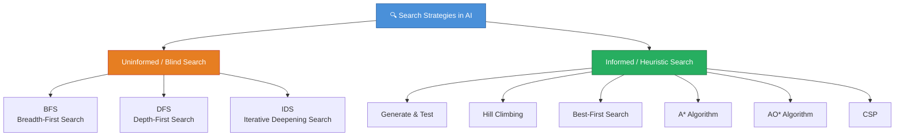

---

## 2. Uninformed Search Strategies

> These strategies explore the state space **without any domain knowledge** — they don't know how far they are from the goal.

---

### 2.1 Breadth-First Search (BFS)

> **Explores level by level** — visits all nodes at depth `d` before moving to depth `d+1`

**Data Structure used:** `Queue (FIFO)`

#### 📖 How BFS Works (Theory)

BFS treats the state space like **concentric rings** expanding outward from the start. It guarantees that when it first reaches the goal, it has taken the **fewest possible steps** (shortest path in terms of number of actions).

**Step-by-step working:**
1. Put the **initial state** into a queue
2. Dequeue the front node; if it's the goal → **stop**
3. Otherwise, **expand** it — add all unvisited children to the back of the queue
4. Mark visited nodes to avoid revisiting
5. Repeat until queue is empty (no solution) or goal is found

**Why memory is high?** — At depth `d` with branching factor `b`, BFS stores **all** nodes at level `d` which grows as `b^d`. For branching factor 10 at depth 6 → 1,000,000 nodes stored simultaneously.

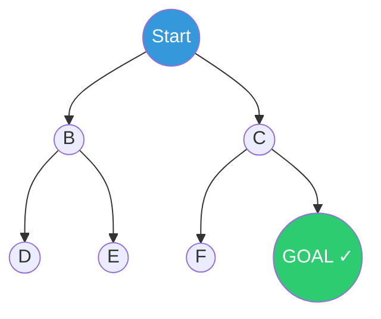

**Order of exploration:** A → B → C → D → E → F → G

| ✅ Advantages | ❌ Disadvantages |
|--------------|----------------|
| **Complete** — always finds a solution if one exists | **High memory usage** — stores all nodes at current depth |
| **Optimal** — finds shortest path in unweighted graphs | **Slow** for large/deep state spaces |

**Applications:** Shortest path in maps, 8-puzzle, network routing

---

### 2.2 Depth-First Search (DFS)

> **Explores one path completely** before backtracking — goes as deep as possible first

**Data Structure used:** `Stack (LIFO)` or Recursion

#### 📖 How DFS Works (Theory)

DFS is like exploring a **maze by always taking the first available turn** until you hit a dead end, then backing up and trying the next option. It dives deep before spreading wide.

**Step-by-step working:**
1. Push the **initial state** onto a stack
2. Pop the top node; if it's the goal → **stop**
3. Otherwise, **expand** it — push all unvisited children onto the stack
4. Repeat until stack is empty or goal is found

**Why memory is low?** — At any point, DFS only stores nodes along the **current path** from root to the current node. If max depth is `m` and branching factor is `b`, it only needs `O(b × m)` memory — far less than BFS.

**Why not optimal?** — DFS may find a long winding path to the goal even if a shorter one exists, because it commits to the first branch it explores. It also risks getting stuck in **infinite loops** on cyclic graphs unless visited nodes are tracked.

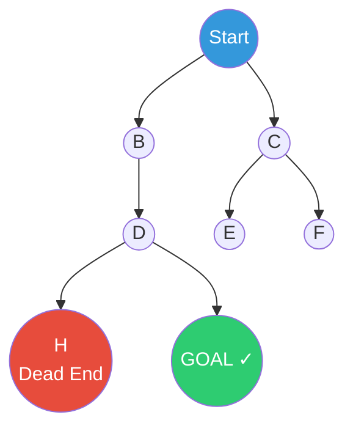

**Order of exploration:** A → B → D → H (backtrack) → I ✓

| ✅ Advantages | ❌ Disadvantages |
|--------------|----------------|
| **Memory-efficient** — stores only current path | **Not optimal** — may miss shortest path |
| Suitable for **deep solutions** | Can get **trapped in infinite loops** (cyclic graphs) |

**Applications:** Maze solving, pathfinding, combinatorial exploration

---

### 2.3 Iterative Deepening Search (IDS)

> **Best of both worlds** — combines BFS's completeness with DFS's memory efficiency

**How it works:**
- Run DFS with depth limit = 0, then 1, then 2... until goal is found

#### 📖 How IDS Works (Theory)

IDS solves the core dilemma in uninformed search: BFS is complete and optimal but wastes memory, while DFS saves memory but is neither complete nor optimal. IDS resolves this by **repeating DFS with an increasing depth limit**.

Although it seems wasteful to re-explore nodes at shallow levels multiple times, the total overhead is small because nodes at shallower depths are **exponentially fewer** than deeper nodes. The repeated work at level `d-1` is like `1/b` of the work at level `d` — negligible.

**Why it's preferred in practice:** IDS is the standard go-to uninformed search when you don't know the depth of the solution, have limited memory, and still want guarantees of completeness and optimality.


| ✅ Advantages | ❌ Disadvantages |
|--------------|----------------|
| Memory-efficient like DFS | Re-explores shallow nodes multiple times |
| Complete & optimal like BFS | Slightly more computational overhead |
| Avoids infinite loops | — |

---

### 📊 Comparison: BFS vs DFS vs IDS

| Property | BFS | DFS | IDS |
|----------|-----|-----|-----|
| **Complete?** | ✅ Yes | ❌ No (cyclic) | ✅ Yes |
| **Optimal?** | ✅ Yes | ❌ No | ✅ Yes |
| **Time** | O(b^d) | O(b^m) | O(b^d) |
| **Memory** | O(b^d) 🔴 High | O(bm) 🟢 Low | O(bd) 🟢 Low |
| **Data Structure** | Queue | Stack | Stack |

> `b` = branching factor, `d` = depth of solution, `m` = max depth

---

## 3. Informed (Heuristic) Search Strategies

> Uses **domain-specific knowledge** — a **heuristic function `h(n)`** — to estimate the cost from current node to goal, making search smarter and faster.

### 📖 What is a Heuristic?

A **heuristic** is a rule of thumb or educated guess that helps the search algorithm decide which state to explore next. It doesn't guarantee the perfect answer, but it guides the search in the **right direction**.

- **Admissible Heuristic:** Never overestimates the cost — guarantees optimal solution (used in A*)
- **Consistent Heuristic:** `h(n) ≤ cost(n → n') + h(n')` for every successor `n'` — a stronger property

The quality of the heuristic directly determines efficiency. A **perfect heuristic** would guide you directly to the goal with no wasted exploration; a **poor heuristic** may perform no better than uninformed search.

> **Example heuristics:** In pathfinding, Euclidean (straight-line) distance to goal; in 8-puzzle, number of misplaced tiles; in chess, total piece values on board.

---

### 3.1 Generate-and-Test

> **Generate** candidate solutions → **Test** if they satisfy the goal

#### 📖 Theory

This is the most basic problem-solving strategy. It works in two alternating phases:
- **Generator:** Produces candidate solutions from the state space, either systematically (like DFS/BFS) or randomly
- **Tester:** Checks whether the generated candidate satisfies the goal conditions

The strategy is **exhaustive** in the worst case — it may try every possible solution before finding the right one. It becomes practical only when:
1. The search space is small
2. A good generator can skip obviously wrong solutions (making it closer to a heuristic search)

**Example:** Finding a combination lock 000–999 by trying each code until the correct one opens the lock.

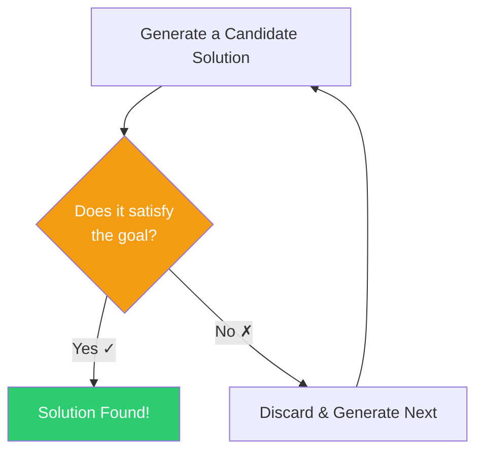

| ✅ Advantages | ❌ Disadvantages |
|--------------|----------------|
| Simple to implement | Inefficient for large state spaces |
| Works for any domain | No guidance — redundant computations |

---

### 3.2 Hill Climbing

> **Greedy approach** — always moves to the neighbor with the best heuristic value

#### 📖 Theory

Hill Climbing is inspired by the idea of climbing a hill in a fog. You can't see the entire landscape — you can only see your immediate neighbors. You always step in the direction that feels most "uphill." The algorithm repeats this until no neighbor is better than the current position.

**Types of Hill Climbing:**
- **Simple Hill Climbing** — moves to the first neighbor that is better than current
- **Steepest Ascent Hill Climbing** — evaluates all neighbors and picks the best one
- **Stochastic Hill Climbing** — randomly picks from neighbors that are improvements (avoids ridges)

**Key Characteristics:**
- No memory of previous states — makes it very memory-efficient but also blind to bigger picture
- Greedy by nature — can find a "good enough" local solution very fast
- Does **not maintain a search tree** — only current state is stored

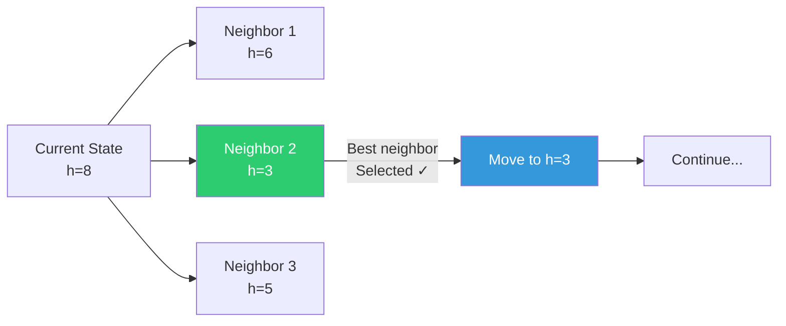

#### ⚠️ Problems with Hill Climbing

```mermaid
graph TD
    A[Hill Climbing Problems] --> B[Local Maxima\nStuck at peak\nnot global best]
    A --> C[Plateau\nAll neighbors\nhave same value]
    A --> D[Ridge\nGradient blocked\nby terrain shape]

    style A fill:#e74c3c,color:#fff
    style B fill:#c0392b,color:#fff
    style C fill:#c0392b,color:#fff
    style D fill:#c0392b,color:#fff
```

#### 💡 Solutions to Hill Climbing Problems
- **Stochastic Hill Climbing** — pick random neighbor with probability proportional to improvement
- **Random Restarts** — restart from different initial states
- **Simulated Annealing** — occasionally accept worse states to escape local optima

---

### 3.3 Best-First Search

> Selects the **most promising node** using evaluation function `f(n) = h(n)`

#### 📖 Theory

Best-First Search improves on Hill Climbing by maintaining a **global view** — it uses a priority queue to keep track of all frontier nodes and always picks the one with the lowest estimated cost to goal `h(n)`, regardless of how far it already is from the start.

This makes it more flexible than Hill Climbing (which only looks at immediate neighbors) but it can still lead to suboptimal paths because it ignores the actual cost already paid `g(n)`. In the worst case, it may chase a promising-looking but costly path.

- Uses a **Priority Queue** ordered by `h(n)` (heuristic to goal)
- Also called **Greedy Best-First Search**
- Greedy but not guaranteed to be optimal

---

### 3.4 A* Algorithm ⭐

> **Best informed search** — combines actual cost `g(n)` + heuristic estimate `h(n)`

$$f(n) = g(n) + h(n)$$

| Component | Meaning |
|-----------|---------|
| `g(n)` | Actual cost from **start → current node** |
| `h(n)` | Estimated (heuristic) cost from **current node → goal** |
| `f(n)` | Total estimated cost of path through `n` |

> **Admissible Heuristic:** `h(n)` never **overestimates** the actual cost → guarantees optimal solution

#### 📖 Theory

A* is the most widely used informed search algorithm. It balances two concerns:
1. **"How much have I already paid?"** — `g(n)`: actual path cost so far
2. **"How much more will it likely cost?"** — `h(n)`: heuristic estimate to goal

By summing both into `f(n)`, A* avoids the pitfalls of both greedy search (ignores cost paid) and BFS (ignores remaining cost). The result is a search that is:
- **Complete** — always finds a solution if one exists
- **Optimal** — finds the least-cost solution (if `h(n)` is admissible)
- **Efficient** — explores fewer nodes than uninformed search

**Numerical Example:**

```
Nodes:  Start → A → B → Goal

g(A) = 2  (cost Start→A)
h(A) = 5  (estimate A→Goal)
f(A) = 7

g(B) = 1  (cost Start→B, different path)
h(B) = 6  (estimate B→Goal)
f(B) = 7

g(C) = 3  (cost Start→C)
h(C) = 2  (estimate C→Goal)
f(C) = 5  ← A* picks C first (lowest f)
```

A* expands nodes in order of increasing `f(n)` values, so the cheapest overall path is explored first.

```mermaid
flowchart TD
    A[Start] --> B[Add Start to\nPriority Queue]
    B --> C[Pick node with\nLowest f n = g n + h n]
    C --> D{Is it\nGoal?}
    D -->|Yes ✓| E[Return Path!]
    D -->|No| F[Expand node\nAdd neighbors]
    F --> G[Update costs\nif better path found]
    G --> C

    style E fill:#2ecc71,color:#fff
    style D fill:#f39c12,color:#fff
    style A fill:#3498db,color:#fff
```

| ✅ Advantages | ❌ Disadvantages |
|--------------|----------------|
| **Optimal** with admissible heuristic | Memory-intensive in large spaces |
| Balances cost + heuristic | Speed depends on heuristic quality |

**Applications:** Robot navigation, GPS pathfinding, game AI

---

### 3.5 AO* Algorithm

> For **AND-OR graphs** — problems decomposable into subproblems

#### 📖 Theory

Standard search algorithms (BFS, DFS, A*) work on **OR graphs**, where from each state you choose *one* action to take. But some problems are naturally **hierarchical** — they must be broken into parts that *all* need to be solved (AND relationship).

**AO* (AND-OR A*)** handles this by working on **AND-OR graphs:**
- **OR node:** You choose *one* of the child subproblems to solve (like a regular choice)
- **AND node:** You must solve *all* child subproblems (like parallel requirements)

**Example — Robot Task:**  A robot must "Go to kitchen and pick up cup" — this is an AND problem (both sub-tasks are required). But "Go via Route A or Route B" is an OR problem (just pick one).

**How AO* works:**
1. Start from root; expand nodes using heuristics
2. Mark each expanded node as AND or OR based on the problem structure
3. Propagate costs from leaves upward:
   - AND node cost = sum of all children costs
   - OR node cost = minimum of children costs
4. Update the best partial solution (policy) and prune inferior sub-trees
5. Repeat until the root is fully solved

**Key difference from A*:** AO* solves a problem with **interdependent subgoals**, while A* solves a single path optimization.

```mermaid
graph TD
    ROOT[Main Goal] -->|OR| OR1[Approach A]
    ROOT -->|OR| OR2[Approach B ✓]
    OR2 -->|AND| AND1[Subgoal 1 ✓]
    OR2 -->|AND| AND2[Subgoal 2 ✓]
    AND1 --> T1[Task 1.1]
    AND1 --> T2[Task 1.2]

    style ROOT fill:#4a90d9,color:#fff
    style OR2 fill:#27ae60,color:#fff
    style AND1 fill:#27ae60,color:#fff
    style AND2 fill:#27ae60,color:#fff
```

| Node Type | Requirement |
|-----------|-------------|
| **AND node** | **ALL** child subgoals must succeed |
| **OR node** | **ONE** child subgoal is enough |

---

### 📊 Heuristic Search Comparison

| Algorithm | Evaluation | Optimal? | Use Case |
|-----------|-----------|----------|----------|
| **Hill Climbing** | `h(n)` only | ❌ No | Quick local optimization |
| **Best-First** | `h(n)` only | ❌ No | Fast goal finding |
| **A\*** | `g(n) + h(n)` | ✅ Yes (admissible h) | Optimal pathfinding |
| **AO\*** | AND-OR heuristics | ✅ Yes | Hierarchical problems |

---

## 4. Constraint Satisfaction Problems (CSP)

> **Definition:** Assign values to variables such that **all constraints are satisfied**

### � Theory

CSP is a special class of AI problems where instead of asking "how do I get from start to goal?", we ask **"what assignment of values satisfies all given rules?"**. The solution is not a path — it is an **assignment** of values to all variables.

CSPs are **declarative** by nature: you specify *what* the solution must satisfy (constraints), not *how* to find it. This makes them very naturally suited for:
- Scheduling (exams, jobs, flights)
- Puzzle solving (Sudoku, crosswords, N-Queens)
- Configuration problems (product assembly, circuit layout)
- Resource allocation (assigning people to tasks)

**Why CSP is powerful:** Instead of blind search, the constraint structure allows the solver to detect conflicts **early** and prune large sections of the search space before even exploring them.

### �🔑 3 Components of CSP

```mermaid
graph LR
    CSP[CSP] --> V[Variables X\ne.g. cells in Sudoku]
    CSP --> D[Domains D\ne.g. values 1-9]
    CSP --> C[Constraints C\ne.g. no repeated in row]

    style CSP fill:#4a90d9,color:#fff
    style V fill:#e67e22,color:#fff
    style D fill:#27ae60,color:#fff
    style C fill:#8e44ad,color:#fff
```

---

### 4.1 Backtracking

> Assign values one-by-one; **backtrack** on constraint violation

#### 📖 Theory

Backtracking is a systematic depth-first search over the space of partial assignments. At each step, it picks an unassigned variable, tries a value from its domain, checks constraints, and proceeds. If at any point a constraint is violated, it **undoes the last assignment** (backtracks) and tries the next value.

It is the foundation of all CSP solving — more advanced techniques like forward checking and constraint propagation are built **on top of** backtracking to make it faster.

**Why backtracking alone is slow:** In the worst case, it tries every possible combination. For 10 variables each with 10 values, that's 10^10 possibilities. Heuristics and pruning reduce this dramatically.

**Example — Map Coloring (4 regions, 3 colors):**
```
Assign Red to A  → OK
Assign Red to B  → FAIL (B adjacent to A, same color)
Try Green for B  → OK
Assign Red to C  → FAIL (C adjacent to A)
Try Green for C  → FAIL (C adjacent to B)
Try Blue for C   → OK
... and so on
```

```mermaid
flowchart TD
    A[Select unassigned variable] --> B[Assign a value from domain]
    B --> C{Constraints\nsatisfied?}
    C -->|Yes| D{All variables\nassigned?}
    C -->|No ✗| E[Backtrack!\nTry next value]
    E --> B
    D -->|Yes ✓| F[Solution Found!]
    D -->|No| A

    style F fill:#2ecc71,color:#fff
    style E fill:#e74c3c,color:#fff
    style C fill:#f39c12,color:#fff
    style D fill:#f39c12,color:#fff
```

---

### 4.2 Forward Checking

> When assigning a variable, **immediately eliminate** conflicting values from neighboring variable domains

#### 📖 Theory

Instead of waiting until a conflict actually occurs (like in backtracking), forward checking **looks ahead** and removes values that would definitely cause conflicts with the current assignment.

**Why this helps:** If a neighbor variable's domain becomes **empty** after forward checking, we know immediately that the current assignment can never lead to a solution — so we backtrack right away, without wasting time exploring further.

Forward checking transforms backtracking from **reactive** (fix problems after they occur) to **proactive** (prevent problems before they happen).

**Example (Sudoku):** Assign `5` to a cell → remove `5` from all cells in same row, column, block

**Example (Map Coloring):**
```
Assign Red to A.
Forward Check:
  B (adjacent to A): remove Red from B’s domain → B can be [Green, Blue]
  C (adjacent to A): remove Red from C’s domain → C can be [Green, Blue]
  If any domain becomes empty → Backtrack immediately!
```

```mermaid
sequenceDiagram
    participant A as Variable A
    participant B as Neighbor B
    participant C as Neighbor C

    Note over A: Assign value = Red
    A->>B: Remove Red from domain
    A->>C: Remove Red from domain
    Note over B: Domain: [Blue, Green]
    Note over C: Domain: [Blue]
    Note over C: If domain empty → Backtrack!
```

---

### 4.3 Constraint Propagation (Arc Consistency - AC-3)

> Iteratively enforce constraints across **all** variable pairs, reducing domains globally

#### 📖 Theory

Forward checking propagates consequences of a single assignment. Constraint propagation goes further — it continuously enforces constraints between **all pairs (arcs) of unassigned variables**, not just those adjacent to the last assignment.

**Arc Consistency (AC-3):** For every pair of variables (X, Y) connected by a constraint, every value in X's domain must have at least one compatible value in Y's domain. If a value in X has no compatible value in Y, that value is removed from X's domain. This may trigger further removals in variables connected to X.

**Why it's powerful:** AC-3 can sometimes solve the entire problem **without any search at all** — pure domain reduction. For Sudoku, many puzzles can be solved entirely by constraint propagation.

**AC-3 Example:**
```
Variables: X, Y
X domain: {1, 2, 3}  
Y domain: {2, 3}
Constraint: X ≠ Y

Arc (X,Y): value 1 in X → any of {2,3} in Y works → keep 1
           value 2 in X → only 3 in Y works → keep 2
           value 3 in X → only 2 in Y works → keep 3
Arc (Y,X): value 2 in Y → 1 or 3 in X works → keep 2
           value 3 in Y → 1 or 2 in X works → keep 3

No values removed in this case, but AC-3 continues for all arcs.
```

---

### 4.4 CSP Heuristics

```mermaid
graph LR
    H[CSP Heuristics] --> MRV[MRV\nMinimum Remaining Values\nChoose most constrained variable\nfirst]
    H --> DH[Degree Heuristic\nChoose variable with\nmost constraints on others]
    H --> LCV[Least Constraining Value\nChoose value that rules\nout fewest neighbors]

    style H fill:#4a90d9,color:#fff
    style MRV fill:#27ae60,color:#fff
    style DH fill:#e67e22,color:#fff
    style LCV fill:#8e44ad,color:#fff
```

**Example (Sudoku):** MRV picks cell with only 1 possible value → assign it first

---

### 4.5 Real-Life CSP Applications

| Application | Variables | Domains | Constraints |
|-------------|-----------|---------|-------------|
| **Sudoku** | 81 cells | 1–9 | No repeat in row/col/box |
| **Map Coloring** | Regions | Colors | Adjacent regions differ |
| **Scheduling** | Tasks | Time slots | No overlap, resource limits |
| **N-Queens** | Queens | Board positions | No two queens attack each other |

---

## 5. Adversarial Search & Game Playing

> Used in **competitive environments** where agents have conflicting goals (e.g., chess, tic-tac-toe)

### Key Terms

| Term | Meaning |
|------|---------|
| **Zero-Sum Game** | One player's gain = other's loss |
| **MAX player** | Tries to **maximize** utility |
| **MIN player** | Tries to **minimize** utility |
| **Utility Function** | Assigns a score to terminal game states |

---

### 5.1 Minimax Algorithm

> Assumes **both players play optimally**; MAX maximizes, MIN minimizes

#### 📖 Theory

Minimax is the foundational algorithm for two-player zero-sum games. The idea is straightforward but powerful:
- **MAX** will always pick the move that yields the **highest** value
- **MIN** will always pick the move that yields the **lowest** value (worst for MAX)
- Both players are assumed to be **perfectly rational** and play optimally

The algorithm builds a **game tree** from the current state down to terminal states (win/lose/draw), applies a utility function at the leaves, and then **backs up values** to the root:
- At a MIN node: take the **minimum** of children’s values
- At a MAX node: take the **maximum** of children’s values

The root value tells MAX what score it can guarantee, regardless of how MIN plays. The move leading to that score is chosen.

**Tic-Tac-Toe utility values:**
```
+1 = X wins (MAX wins)
-1 = O wins (MIN wins)  
 0 = Draw
```

**Why it's computationally expensive:** The game tree grows exponentially. For chess with branching factor ~35 and game length ~80, the tree has 35^80 ≈ 10^123 nodes — impossible to fully evaluate. That's why alpha-beta pruning and evaluation functions are essential.

```mermaid
graph TD
    ROOT["MAX\nChoose Max"] --> A["MIN\nChoose Min"]
    ROOT --> B["MIN\nChoose Min"]

    A --> A1["Terminal\n+3"]
    A --> A2["Terminal\n+5"]
    B --> B1["Terminal\n+2"]
    B --> B2["Terminal\n+9"]

    A -->|min 3,5 = 3| ROOT
    B -->|min 2,9 = 2| ROOT

    style ROOT fill:#3498db,color:#fff
    style A fill:#e74c3c,color:#fff
    style B fill:#e74c3c,color:#fff
    style A1 fill:#95a5a6,color:#fff
    style A2 fill:#95a5a6,color:#fff
    style B1 fill:#95a5a6,color:#fff
    style B2 fill:#95a5a6,color:#fff
```

**MAX picks the branch with value `3`** (best of {3, 2})

```mermaid
flowchart TD
    A[Start at Root - MAX node] --> B[Expand all children]
    B --> C{Terminal\nState?}
    C -->|Yes| D[Apply Utility Function]
    C -->|No| E{MAX or MIN\nnode?}
    E -->|MAX| F[Return MAX\nof children values]
    E -->|MIN| G[Return MIN\nof children values]
    F --> H[Propagate up]
    G --> H
    D --> H

    style A fill:#3498db,color:#fff
    style D fill:#2ecc71,color:#fff
```

| ✅ Advantages | ❌ Disadvantages |
|--------------|----------------|
| Guarantees optimal play | Exponential time: O(b^m) |
| Simple to understand | Infeasible for large games (chess ~10^120 states) |

---

### 5.2 Alpha-Beta Pruning ✂️

> **Optimization of Minimax** — eliminates branches that **cannot affect** the final decision

| Symbol | Meaning |
|--------|---------|
| **α (alpha)** | Best value MAX can guarantee so far |
| **β (beta)** | Best value MIN can guarantee so far |
| **Pruning condition** | If `α ≥ β` → prune the branch |

```mermaid
graph TD
    ROOT["MAX\nα=-∞ β=+∞"] --> A["MIN\nα=-∞ β=+∞"]
    ROOT --> B["MIN\nα=3 β=+∞"]

    A --> A1["3\n✓ α=3"]
    A --> A2["5\nβ updated=3"]
    B --> B1["1\nβ=1 < α=3\n✂ PRUNE!"]
    B --> B2["❌ Pruned"]

    style ROOT fill:#3498db,color:#fff
    style A fill:#e74c3c,color:#fff
    style B fill:#e74c3c,color:#fff
    style B1 fill:#e74c3c,color:#fff
    style B2 fill:#7f8c8d,color:#fff,stroke-dasharray: 5 5
```

**Result:** Branch under B2 is pruned — no need to evaluate it!

| ✅ Advantages | ❌ Disadvantages |
|--------------|----------------|
| Reduces nodes evaluated significantly | Still exponential in worst case |
| Maintains Minimax optimality | Requires good move ordering for max benefit |
| Makes deep game trees feasible | — |

---

### 5.3 Evaluation Functions

> Used when full tree exploration is infeasible — **estimates utility** of non-terminal states

#### 📖 Theory

For complex games like chess and Go, it is **impossible to explore down to the terminal states**. Instead, the search is cut off at a **depth limit** and an evaluation function estimates how good the current position is for MAX.

A good evaluation function must:
1. **Agree with the utility function** on terminal states
2. Be **fast to compute** (called thousands of times per second)
3. **Accurately reflect** winning potential — it's a heuristic, not perfect

Evaluation functions are typically designed by **domain experts** or learned by AI systems through self-play (as in AlphaZero).

**Chess Example:**

$$\text{Eval} = \sum(\text{Piece values for MAX}) - \sum(\text{Piece values for MIN}) + \text{Positional bonuses}$$

| Piece | Value |
|-------|-------|
| Queen | 9 |
| Rook | 5 |
| Bishop/Knight | 3 |
| Pawn | 1 |

---

### 5.4 Tic-Tac-Toe with Minimax

```mermaid
graph TD
    S["Empty Board\nMAX plays X"] --> M1["X in center\nMIN plays O"]
    S --> M2["X in corner\nMIN plays O"]
    M1 --> T1["...explore..."]
    M2 --> T2["...explore..."]
    T1 --> E1["Eval: Draw=0"]
    T2 --> E2["Eval: Win=+1"]

    style S fill:#3498db,color:#fff
    style E2 fill:#2ecc71,color:#fff
    style E1 fill:#f39c12,color:#fff
```

---

## 6. Knowledge Representation

> **Definition:** The way AI systems **store, organize, and access information** about the world to reason and solve problems

### 📖 Theory

For any AI system to exhibit intelligent behavior, it must have access to **knowledge** — not just data, but structured information about the world that it can reason with.

**Knowledge Representation (KR)** is the subfield of AI concerned with:
1. **Encoding** real-world knowledge in a machine-processable form
2. **Organizing** it so the system can efficiently retrieve relevant facts
3. **Enabling inference** — deriving new knowledge from existing knowledge

A good KR system must satisfy these properties:
- **Representational Adequacy** — can represent all types of knowledge needed
- **Inferential Adequacy** — supports drawing new conclusions
- **Inferential Efficiency** — does so quickly
- **Acquisitional Efficiency** — easy to add new knowledge

Without proper KR, an AI system would just be a lookup table — unable to reason, generalize, or handle new situations.

### Types of Knowledge

```mermaid
mindmap
  root((Knowledge\nin AI))
    Declarative
      Facts about the world
      What is known
      eg: Delhi is capital of India
    Procedural
      How to do something
      Steps and methods
      eg: Steps to solve quadratic eq
    Meta-Knowledge
      Knowledge about knowledge
      eg: This fact was derived by rule 2
    Heuristic
      Rules of thumb
      eg: In chess control the center
    Structural
      Relations between concepts
      eg: Dog is a mammal
```

---

### 6.1 Approaches to Knowledge Representation

```mermaid
graph TD
    KR[Knowledge Representation\nApproaches] --> L[Logical\nRepresentation]
    KR --> SN[Semantic\nNetworks]
    KR --> F[Frames]
    KR --> PR[Production\nRules]
    KR --> SC[Scripts]

    L --> L1[Propositional Logic\nPredicate Logic]
    SN --> SN1[Graph: nodes=concepts\nedges=relations]
    F --> F1[Structured slots\nwith values]
    PR --> PR1[IF-THEN rules]
    SC --> SC1[Sequence of\nevent patterns]

    style KR fill:#4a90d9,color:#fff
    style L fill:#27ae60,color:#fff
    style SN fill:#e67e22,color:#fff
    style F fill:#8e44ad,color:#fff
    style PR fill:#c0392b,color:#fff
    style SC fill:#16a085,color:#fff
```

---

### 6.2 Semantic Networks

> **Graph-based** — nodes = concepts/objects, edges = relationships

#### 📖 Theory

Semantic networks visually represent **associations between concepts**, much like a mind-map. They are one of the earliest and most intuitive KR methods, reflecting how psychologists believe human memory is organized — as a network of related concepts.

**Key features:**
- **Inheritance** — if Dog *is-a* Mammal and Mammal *can* Breathe, then Dog *can* Breathe (inherited)
- **Reasoning** — finding paths in the graph answers queries ("Can a Dog breathe?" → yes, via is-a chain)
- **Expressive** for hierarchical and relational knowledge

**Limitation:** No standard semantics — different systems may interpret edges differently. Also struggles with complex logical statements like negation or quantification.

```mermaid
graph LR
    Dog -->|is-a| Mammal
    Mammal -->|is-a| Animal
    Dog -->|has| FourLegs
    Dog -->|can| Bark
    Animal -->|can| Breathe

    style Dog fill:#e67e22,color:#fff
    style Mammal fill:#3498db,color:#fff
    style Animal fill:#2ecc71,color:#fff
```

---

### 6.3 Frames

> **Structured data** with slots (attributes) and values — like objects in OOP

#### 📖 Theory

Frames were introduced by Marvin Minsky as a way to represent **stereotypical situations**. They work like a template or prototype for a concept. When you encounter a specific instance, you fill in the slots.

Frames are analogous to **classes in object-oriented programming**. Just like a class defines fields and methods, a frame defines **slots** (attributes) and **procedural attachments** (methods).

**Inheritance in Frames:** A sub-frame (e.g., `ElectricCar`) inherits all slots of its parent frame (`Car`) and can override specific ones (e.g., `Engine: Electric`).

**Default values:** Slots can have default values that apply unless overridden. This allows reasoning under incomplete information — if we don't know a specific car's color, we can assume the default.

**Limitation:** Frames are not easily suited for complex logical reasoning (e.g., negation, disjunction). They work best for well-structured, stereotypical domains.

```
Frame: CAR
├── Color    : Red
├── Engine   : V8
├── Wheels   : 4
├── Start()  : [Turn key → ignition → engine on]
└── Stop()   : [Apply brake → engine off]
```

**Features:**
- Supports **inheritance** (subclass inherits parent attributes)
- Contains both **declarative** (slots/values) and **procedural** (methods) knowledge

---

### 6.4 Production Rules

> **IF condition → THEN action** rules used in expert systems

#### 📖 Theory

Production rules are the most widely used KR method in **rule-based expert systems**. Each rule captures a small, independent piece of knowledge in an intuitive if-then format. The system's behavior emerges from the collective application of many rules.

**Three components of a Production System:**
1. **Working Memory (WM)** — current facts and state
2. **Rule Base** — collection of all IF-THEN rules (the knowledge)
3. **Inference Engine** — matches WM facts against rule conditions, decides which rules to fire

**Conflict Resolution:** When multiple rules apply simultaneously, strategies like:
- *Specificity* — more specific rule wins
- *Recency* — most recently added fact's rule wins
- *Priority* — user-assigned rule priority

**Advantage over frames/semantic nets:** Rules are highly modular, easy to add/remove, and transparent — you can trace exactly which rules led to a conclusion. This is why MYCIN and other expert systems use them.

```
Rule 1: IF (fever > 38°C) AND (cough = yes) THEN (possible = flu)
Rule 2: IF (possible = flu) THEN (recommend = antiviral)
Rule 3: IF (BP > 140) THEN (condition = hypertension)
```

**Components:**
- **Working Memory** — current facts
- **Rule Base** — IF-THEN rules
- **Inference Engine** — matches facts → fires rules

---

## 7. Logic in AI

> **Why Logic?** Logic gives AI a **formal, unambiguous language** to represent knowledge and draw valid conclusions. Unlike natural language (which is ambiguous), logic has precise syntax and semantics. It also provides **soundness** (derived conclusions are always true if premises are true) and **completeness** (any valid conclusion can be derived).

---

### 7.1 Propositional Logic

> Deals with **simple true/false statements** (propositions) connected by logical operators

#### 📖 Theory

Propositional logic is the **simplest form of logic**. It deals with statements that are either completely true or completely false, with no middle ground. These statements are combined using logical connectives to form complex expressions.

**Truth Table for key connectives:**

| P | Q | P ∧ Q | P ∨ Q | ¬P | P → Q |
|---|---|--------|--------|-----|--------|
| T | T | T | T | F | T |
| T | F | F | T | F | F |
| F | T | F | T | T | T |
| F | F | F | F | T | T |

> Note: `P → Q` is **False only when P is True and Q is False** ("If it rains, ground is wet" — only false if it rained but ground stayed dry)

**Limitation:** Cannot say "All humans are mortal." It would need a separate proposition for *each* human, which is not feasible for general statements.

| Connective | Symbol | Meaning |
|-----------|--------|---------|
| AND | `∧` | Both must be true |
| OR | `∨` | At least one true |
| NOT | `¬` | Negation |
| IMPLIES | `→` | If...then |
| BICONDITIONAL | `↔` | If and only if |

**Example:**
- P: "It is raining"
- Q: "Ground is wet"
- Rule: `P → Q`

**Limitation:** Cannot express relationships between objects or use quantifiers

---

### 7.2 Predicate Logic (First-Order Logic)

> **Extends propositional logic** with predicates, variables, and quantifiers

#### 📖 Theory

First-Order Logic (FOL) overcomes propositional logic’s main weakness — it can express **general statements about objects and their relationships**. FOL introduces:

- **Predicates:** Properties or relations applied to objects (e.g., `Human(Socrates)`, `Loves(John, Mary)`)
- **Variables:** Stand for any object (e.g., `x`, `y`)
- **Constants:** Specific objects (e.g., `Socrates`, `John`)
- **Quantifiers:** Generalize over objects
  - `∀x` — "For all x": universal statement
  - `∃x` — "There exists some x": existential statement
- **Functions:** Map objects to objects (e.g., `FatherOf(John)`)

FOL is the basis of **Prolog** (logic programming language) and most automated theorem provers.

| Symbol | Meaning | Example |
|--------|---------|---------|
| `∀x` | For all x | ∀x (Human(x) → Mortal(x)) |
| `∃x` | There exists x | ∃x (Student(x) ∧ Smart(x)) |
| Predicate | Property/relation | Human(x), Mortal(x) |

**Classic Example:**
```
Fact 1:  ∀x (Human(x) → Mortal(x))   — All humans are mortal
Fact 2:  Human(Socrates)               — Socrates is human
Deduce:  Mortal(Socrates)              — Socrates is mortal ✓
```

---

### 7.3 Propositional vs Predicate Logic

| Feature | Propositional | Predicate (FOL) |
|---------|--------------|-----------------|
| **Statements** | Simple true/false | Objects + relations |
| **Variables** | ❌ Not supported | ✅ Supported |
| **Quantifiers** | ❌ Not supported | ✅ ∀, ∃ |
| **Expressiveness** | Limited | More powerful |
| **Example** | P: "It rains" | ∀x (Rain(x) → Wet(x)) |

---

### 7.4 Conversion to Clause Form (CNF)

> Required for **automated reasoning via resolution**

#### 📖 Theory

Before the **resolution rule** can be applied mechanically, all logical statements must be converted to a standard form called **Conjunctive Normal Form (CNF)**. In CNF:
- Every formula is a **conjunction (AND)** of clauses
- Each clause is a **disjunction (OR)** of literals
- A literal is an atom or its negation

**Why CNF?** Resolution works on exactly two clauses with complementary literals. CNF guarantees every formula looks like this, making the algorithm uniform and systematic.

**De Morgan’s Laws** (used in step 2):
```
¬(A ∧ B)  ≡  ¬A ∨ ¬B
¬(A ∨ B)  ≡  ¬A ∧ ¬B
```

**Skolemization** (step 4): Replace existential quantifiers with **Skolem constants or functions**.
- If `∃x Likes(x, Ice-cream)` → introduce constant `c`: `Likes(c, Ice-cream)`
- If `∀x ∃y Loves(x, y)` → introduce function: `Loves(x, f(x))`

**Steps:**

```mermaid
flowchart LR
    S1["1. Eliminate Implications\nA→B becomes ¬A∨B"] --> S2
    S2["2. Move NOT inward\nDe Morgan's Laws"] --> S3
    S3["3. Standardize Variables\nRename if needed"] --> S4
    S4["4. Skolemize\nRemove existential quantifiers"] --> S5
    S5["5. Drop Universal Quantifiers\n∀x becomes implicit"] --> S6
    S6["6. Distribute ∧ over ∨\nConvert to CNF"]

    style S1 fill:#3498db,color:#fff
    style S2 fill:#3498db,color:#fff
    style S3 fill:#3498db,color:#fff
    style S4 fill:#3498db,color:#fff
    style S5 fill:#3498db,color:#fff
    style S6 fill:#27ae60,color:#fff
```

**Example:**
```
Statement:  ∀x (Human(x) → Mortal(x))
Step 1:     ∀x (¬Human(x) ∨ Mortal(x))
Clause Form: {¬Human(x), Mortal(x)}
```

---

### 7.5 Resolution

> **Inference technique** — derive new clause by eliminating complementary literals

#### 📖 Theory

Resolution is a **complete and sound inference rule** for automatic theorem proving. It uses **proof by refutation** (also called proof by contradiction):

1. To prove a statement `S` is true:
2. Add `¬S` (negation of S) to the knowledge base
3. Apply resolution repeatedly
4. If you derive the **empty clause** (contradiction) → `¬S` must be false → `S` is **proved**

**Why refutation?** It avoids searching for a proof forward (which could go anywhere). Instead, it shows that the negation leads to contradiction, which is often more efficient.

**Unification** (for predicate logic): The process of finding a **substitution** for variables that makes two predicates syntactically identical.
```
Unify:  Human(x)  and  Human(Socrates)
Result: [x / Socrates]  (substitute x with Socrates)
```

#### Resolution in Propositional Logic

```
Clause 1:  {P, Q}      → P ∨ Q
Clause 2:  {¬P}        → ¬P
Resolvent: {Q}         → Q  ✓
```

#### Resolution in Predicate Logic (with Unification)

> **Unification:** Find a substitution to make two predicates identical

```
Clause 1:  {¬Human(x), Mortal(x)}   from Rule
Clause 2:  {Human(Socrates)}         Fact

Unify: x = Socrates
Resolve: Mortal(Socrates) ✓
```

```mermaid
flowchart TD
    A[Convert all statements\nto Clause Form CNF] --> B[Negate the\ngoal to prove]
    B --> C[Apply Resolution\nRepeatedly]
    C --> D{Empty clause\nderived?}
    D -->|Yes ✓| E[Original goal\nis PROVED!]
    D -->|No more clauses| F[Goal cannot\nbe proved]

    style E fill:#2ecc71,color:#fff
    style F fill:#e74c3c,color:#fff
    style D fill:#f39c12,color:#fff
```

---

## 8. Reasoning Methods

> Reasoning is the process of using known facts and rules to draw **new conclusions** or verify **hypotheses**. In AI, reasoning is what transforms stored knowledge into intelligent action.

**Types of Reasoning in AI:**
| Type | Direction | Process | Example |
|------|-----------|---------|----------|
| **Deductive** | General → Specific | Applies rules to facts | All men mortal; Socrates is man → mortal |
| **Inductive** | Specific → General | Generalizes from examples | All observed crows are black → all crows are black |
| **Abductive** | Observation → Best explanation | Finds most likely cause | Patient has fever + cough → flu hypothesis |
| **Non-monotonic** | Revises conclusions | New info can override old | Birds fly; Tweety is a bird; but Tweety is a penguin → Tweety can't fly |

---

### 8.1 Forward Chaining

> **Data-driven** — start from known facts → apply rules → reach conclusions

#### 📖 Theory

Forward chaining is like a **domino effect** — known facts trigger rules, which generate new facts, which trigger more rules, and so on until the goal is reached or no new facts can be derived.

**When to use Forward Chaining:**
- When you have a lot of facts and want to derive all possible conclusions
- When you don’t know in advance what the goal will be
- When new data arrives continuously and the system must react (monitoring systems)

**Algorithm:**
1. Start with initial facts in working memory
2. Scan all rules; find a rule whose IF part matches available facts (“pattern matching”)
3. Fire the rule — add its THEN part as a new fact
4. Repeat until goal is found or no new facts can be added (fixed point)

**Disadvantage:** May derive many irrelevant facts that are never needed for the goal.

```mermaid
flowchart LR
    F[Known Facts] --> M{Match\nIF part\nof rules}
    M -->|Match found| T[Fire THEN part\nNew fact added]
    T --> NF[Updated Facts]
    NF --> M
    M -->|Goal reached ✓| G[Done!]

    style F fill:#3498db,color:#fff
    style G fill:#2ecc71,color:#fff
    style T fill:#e67e22,color:#fff
```

**Example:**
```
Facts:     It rains (P)
Rule 1:    P → Ground is wet (Q)
Rule 2:    Q → Plants grow (R)

Step 1: P + Rule 1 → Q (Ground is wet)
Step 2: Q + Rule 2 → R (Plants grow) ✓
```

**Best for:** Situations where facts are known and you want all possible conclusions

---

### 8.2 Backward Chaining

> **Goal-driven** — start from goal → work backwards → verify if facts support it

#### 📖 Theory

Backward chaining works like a **detective** — you start with a hypothesis (goal) and gather evidence to prove or disprove it. It only explores facts **relevant to the goal**, making it much more focused.

**When to use Backward Chaining:**
- When you have a specific goal or hypothesis to verify
- When the number of rules is large — forward chaining would explore too much
- In diagnostic systems (is this disease present?)

**Algorithm:**
1. Start with the goal to prove
2. Find all rules that could conclude the goal
3. For each such rule, check if its preconditions (IF part) are satisfied
4. Recursively treat unsatisfied preconditions as sub-goals
5. Stop when all sub-goals reduce to known facts (success) or no rule applies (failure)

**Why it’s used in MYCIN:** A doctor asks "Does this patient have infection X?" and the system works backward through rules and symptoms to confirm or deny it — exactly the diagnostic use case.

```mermaid
flowchart RL
    G[Goal: Plants grow R] --> M{Rule that\nconcludes R?}
    M -->|Rule 2: Q→R| Q{Is Q true?\nGround wet?}
    Q -->|Rule 1: P→Q| P{Is P true?\nIt rains?}
    P -->|Check facts| F[YES - It rains ✓]
    F --> P1[P proved ✓]
    P1 --> Q1[Q proved ✓]
    Q1 --> G1[R proved ✓\nGoal achieved!]

    style G fill:#3498db,color:#fff
    style G1 fill:#2ecc71,color:#fff
    style F fill:#27ae60,color:#fff
```

**Best for:** Specific goal checking (medical diagnosis, debugging)

---

### 8.3 Forward vs Backward Chaining vs Resolution

| Feature | Forward Chaining | Backward Chaining | Resolution |
|---------|-----------------|------------------|------------|
| **Direction** | Data → Goal | Goal → Data | Refutation-based |
| **Style** | Data-driven | Goal-driven | Contradiction-based |
| **Best when** | All facts known | Specific goal | Theorem proving |
| **Example** | Disease prediction | Medical diagnosis | Logic puzzles |
| **Used in** | Expert systems, monitoring | MYCIN, planning | Automated provers |

---

### 8.4 MYCIN — Classic Expert System

> Medical expert system for diagnosing **bacterial infections** (Stanford, 1970s)

#### 📖 Theory

MYCIN was developed at Stanford University as one of the first expert systems to demonstrate AI could match expert-level human performance in a specialized domain. It was designed for diagnosing **blood infections (bacteremia) and meningitis** and recommending antibiotic treatments.

**Key Innovations of MYCIN:**
1. **Certainty Factors (CF):** Instead of strict true/false, MYCIN used confidence levels (e.g., 0.7 = 70% confidence). This was an early form of handling **uncertainty** in medical diagnosis.
2. **Rule-based Knowledge:** ~450 IF-THEN rules encoded the diagnostic expertise of physicians
3. **Backward Chaining:** Goal was to identify the infection, so it worked backward from the diagnosis to verify symptoms
4. **Explanation capability:** MYCIN could explain *why* it asked a question and *how* it reached a conclusion

**Historical Significance:** MYCIN performed as well as human infectious disease specialists in tests. It inspired a whole generation of expert systems and is considered a landmark in AI history. The knowledge representation framework it used (called EMYCIN) became a reusable shell for building other expert systems.

```mermaid
graph TD
    Patient["Patient Data\nSymptoms + Lab Results"] --> KB
    KB["Knowledge Base\n~450 IF-THEN Rules"] --> IE
    IE["Inference Engine\nBackward Chaining"] --> D
    D["Diagnosis\n+ Treatment Recommendation"]

    style Patient fill:#3498db,color:#fff
    style KB fill:#e67e22,color:#fff
    style IE fill:#8e44ad,color:#fff
    style D fill:#2ecc71,color:#fff
```

**Sample MYCIN Rule:**
```
IF:   Infection is primary-bacteremia
AND:  Culture site is sterile
AND:  Entry point is gastrointestinal
THEN: Organism is Bacteroides (confidence: 0.7)
```

---

## 9. ⭐ Important Questions

> These are the most likely exam questions — study these thoroughly

---

### 🔵 Very Short (1–2 marks)

1. **What is searching in AI?** — Exploring state space to find sequence of actions from initial → goal state
2. **What is a heuristic?** — Domain-specific estimate of cost to goal that guides informed search
3. **BFS vs DFS?** — BFS: level-by-level, optimal, high memory; DFS: depth-first, memory-efficient, not optimal
4. **What is A\*?** — Informed search using `f(n) = g(n) + h(n)`, optimal with admissible heuristic
5. **What is alpha-beta pruning?** — Minimax optimization that prunes branches with `α ≥ β`
6. **AND vs OR nodes in AO\*?** — AND: all subgoals must succeed; OR: one subgoal is enough
7. **What is CSP?** — Assigning values to variables satisfying all given constraints
8. **Declarative vs Procedural knowledge?** — Declarative: "what" (facts); Procedural: "how" (steps)
9. **What is resolution?** — Inference technique deriving new clause by eliminating complementary literals
10. **What is forward chaining?** — Data-driven reasoning from facts to conclusions

---

### 🟡 Short (4–5 marks)

**Q1. Explain BFS with advantages and disadvantages.**

Breadth-First Search (BFS) is an uninformed search strategy that explores the state space **level by level**. It uses a **FIFO queue** to maintain the frontier of unexplored nodes. Starting at the initial state, BFS visits all nodes at depth 1, then depth 2, and so on until the goal is found.

**Advantages:**
- **Complete** — always finds a solution if one exists
- **Optimal** — finds the shortest path (fewest steps) in unweighted graphs

**Disadvantages:**
- **Memory-intensive** — stores all nodes at current depth; O(b^d) memory where b=branching factor, d=depth
- **Slow** for large or deep state spaces due to exponential node growth

**Applications:** Shortest path problems, 8-puzzle, social network connectivity, GPS routing.

---

**Q2. Explain Hill Climbing and its limitations.**

Hill Climbing is a **heuristic, greedy search** technique. At each step, the algorithm evaluates all neighbors of the current state and moves to whichever has the **best heuristic value** (higher if maximizing). This continues until no neighbor improves on the current state.

**Advantages:**
- Very **memory-efficient** — only current state is stored
- Fast for finding local solutions in optimization problems

**Limitations:**
- **Local Maxima:** Gets stuck at a peak that is not the global best — no neighbor is better but the global optimum exists elsewhere
- **Plateaus:** A flat region where all neighbors have the same heuristic value — no direction to move
- **Ridges:** A narrow elevated region where no single move improves the score

**Solutions:** Stochastic Hill Climbing (random choice among improving neighbors), Random Restarts (restart from different points), Simulated Annealing (accept worse states occasionally).

---

**Q3. Explain A\* algorithm and admissible heuristics.**

A\* is an **informed search algorithm** that finds the optimal path from start to goal using:
$$f(n) = g(n) + h(n)$$
where `g(n)` is the actual cost from start to node `n`, and `h(n)` is the heuristic estimate from `n` to goal.

A\* maintains a **priority queue** ordered by `f(n)` and always expands the node with the lowest `f(n)` value.

**Admissible Heuristic:** A heuristic `h(n)` is admissible if it **never overestimates** the true cost to the goal, i.e., `h(n) ≤ h*(n)` for all nodes. With an admissible heuristic, A\* **guarantees** finding the optimal solution.

**Example:** Straight-line (Euclidean) distance to goal is admissible for pathfinding because the actual road distance is always ≥ straight-line distance.

**Applications:** GPS navigation, game AI pathfinding, robot motion planning.

---

**Q4. Explain CSP with backtracking and forward checking.**

A **Constraint Satisfaction Problem (CSP)** requires assigning values to variables such that all constraints are satisfied.

**Backtracking** assigns values one variable at a time and reverts (backtracks) whenever a constraint is violated. It is complete but slow in the worst case.

**Forward Checking** improves backtracking by, after each assignment, immediately removing values from neighboring variables' domains that would violate constraints. If any domain becomes empty, it backtracks right away without further exploration.

**Example in Sudoku:** Assign 5 to a cell → immediately remove 5 from the same row, column, and 3x3 block. If any cell’s domain becomes empty, undo the assignment.

Together with **MRV heuristic** (pick variable with fewest remaining valid values), these techniques make CSP solving highly efficient.

---

**Q5. Explain forward and backward chaining with examples.**

**Forward Chaining** (data-driven): Starts with known facts and repeatedly applies IF-THEN rules to derive new facts until the goal is reached.
```
Fact: It rains
Rule 1: If It rains → Ground is wet
Rule 2: If Ground is wet → Plants grow
Result: Derives "Plants grow" step by step
```
Used in: monitoring systems, production systems.

**Backward Chaining** (goal-driven): Starts with a hypothesis (goal) and works backward, verifying whether facts support it.
```
Goal: Prove Plants grow
Need: Ground is wet (from Rule 2)
Need: It rains (from Rule 1)
Fact: It rains → Goal proved!
```
Used in: diagnostic expert systems like MYCIN, Prolog programming.

**Key difference:** Forward chaining explores everything from the data; backward chaining focuses only on what is relevant to the goal, making it more efficient when the goal is specific.

---

**Q6. Explain propositional vs predicate logic with examples.**

**Propositional Logic** represents knowledge as simple **true/false propositions** connected by logical connectives (AND, OR, NOT, IMPLIES). It cannot represent objects, relationships, or quantifiers.
- Example: `P → Q` ("If it rains, ground is wet")
- Limitation: Cannot express "All humans are mortal" without a separate proposition for each human

**Predicate Logic (First-Order Logic)** extends propositional logic with **predicates, variables, and quantifiers**, making it far more expressive:
- `∀x (Human(x) → Mortal(x))` = "All humans are mortal"
- `∃x (Student(x) ∧ Brilliant(x))` = "Some student is brilliant"

**Key differences:**
| Feature | Propositional | Predicate |
|---------|-------------|----------|
| Objects | No | Yes |
| Variables | No | Yes |
| Quantifiers | No | ∀, ∃ |
| Expressiveness | Limited | Rich |

---

### 🔴 Long (10–15 marks)

**Q1. Explain all search strategies in AI — uninformed and informed.**

**Introduction:** Searching is a fundamental AI technique for solving state-space problems by navigating from an initial state to a goal state.

**Uninformed Search** (no domain knowledge):
- **BFS:** Level-by-level using FIFO queue. Complete and optimal. Memory-intensive O(b^d). Use when shortest path needed.
- **DFS:** Depth-first using stack. Memory-efficient O(bm). Not optimal, may loop. Use for deep/large spaces.
- **IDS:** Combines BFS+DFS. DFS with increasing depth limits. Complete, optimal, memory-efficient. Best general uninformed method.

**Informed (Heuristic) Search** (uses h(n)):
- **Generate-and-Test:** Generate candidates, test each. Simple but inefficient.
- **Hill Climbing:** Greedy; move to best neighbor. Fast but stuck at local maxima.
- **Best-First Search:** Priority queue on h(n). Efficient but not optimal.
- **A\*:** f(n)=g(n)+h(n). Optimal with admissible h(n). Best general informed method.
- **AO\*:** For AND-OR graphs. Handles hierarchical subproblems.
- **CSP:** Assign values satisfying constraints using backtracking, forward checking, propagation.

**Comparison Table:**
| Algorithm | Complete | Optimal | Memory | Use Case |
|-----------|----------|---------|--------|----------|
| BFS | ✅ | ✅ | 🔴 High | Shortest path |
| DFS | ❌ | ❌ | 🟢 Low | Deep search |
| IDS | ✅ | ✅ | 🟢 Low | General uninformed |
| Hill Climbing | ❌ | ❌ | 🟢 Low | Local optimization |
| A\* | ✅ | ✅ | 🔴 High | Optimal pathfinding |
| AO\* | ✅ | ✅ | Medium | Hierarchical problems |

---

**Q2. Explain CSP — backtracking, forward checking, constraint propagation, MRV heuristic with applications.**

**Definition:** A CSP has variables X, domains D, and constraints C. Goal: assign values from domains to variables satisfying all constraints.

**Backtracking:** Depth-first search over assignments. Assign value → check constraints → if violated, backtrack. Complete but slow without enhancements.

**Forward Checking:** On assignment, immediately remove conflicting values from neighbors' domains. If any domain empties, backtrack at once. Proactive conflict prevention.

**Constraint Propagation (AC-3):** For every arc (X,Y), every value in X must have compatible value in Y. Iteratively enforce until no more removals. Can often solve puzzle without any search.

**MRV Heuristic (Minimum Remaining Values):** Select variable with fewest legal values in its domain. Most-constrained variable first — reduces search tree early. Break ties with Degree Heuristic (most constrained variable).

**Real-life Applications:**
- **Sudoku:** 81 variables, domain {1-9}, no-repeat constraints per row/col/box
- **Map Coloring:** Regions as variables, colors as domain, adjacent regions must differ
- **Exam Scheduling:** Exams as variables, time slots as domain, constraints on shared students
- **N-Queens:** Place N queens on N×N board such that no two queens attack each other

---

**Q3. Explain adversarial search — Minimax, Alpha-Beta Pruning, evaluation functions, AND-OR graphs.**

**Introduction:** Adversarial search is used in two-player zero-sum games where one player's gain is the other's loss (chess, tic-tac-toe, checkers).

**Minimax Algorithm:**
- Builds a complete game tree
- MAX player chooses highest-valued move; MIN player chooses lowest-valued move
- Values backed up from terminal states (utility) to root
- Guarantees optimal play but exponential time: O(b^m)
- For tic-tac-toe: terminal values are +1 (X wins), -1 (O wins), 0 (draw)

**Alpha-Beta Pruning:**
- Optimization of Minimax — same result, fewer nodes evaluated
- α = best MAX guarantee so far; β = best MIN guarantee so far
- If α ≥ β at any node → prune that subtree
- Reduces complexity: O(b^m) → O(b^(m/2)) with perfect move ordering
- Used in all practical game-playing AI (chess engines like Stockfish)

**Evaluation Functions:**
- Used to cut off search at depth limit (not expand to terminal states)
- Must capture game-relevant factors: material, position, mobility
- Chess: f = Σ(MAX pieces) - Σ(MIN pieces) + positional bonuses
- Can be hand-crafted by experts or learned via machine learning

**AND-OR Graphs and AO\*:**
- AND nodes: all children must succeed (parallel requirements)
- OR nodes: one child enough (alternative choices)
- AO\* evaluates costs and selects optimal policy
- Applications: planning in robotics, game strategy with subgoals

---

**Q4. Explain knowledge representation in AI — types, approaches, propositional/predicate logic, clause form, resolution.**

**Introduction:** Knowledge Representation (KR) is how AI stores structured information to enable reasoning, inference, and problem-solving.

**Types of Knowledge:**
- *Declarative:* Facts ("Earth orbits the Sun")
- *Procedural:* How-to steps (algorithm to sort numbers)
- *Meta-Knowledge:* Knowledge about knowledge ("Rule 3 was derived from Rule 1")
- *Heuristic:* Rules of thumb ("In chess, control the center")
- *Structural:* Relationships ("Dog is-a Mammal is-a Animal")

**Approaches:**
- *Logic:* Propositional and predicate logic — formal, precise
- *Semantic Networks:* Graph with concepts as nodes, relations as edges
- *Frames:* Structured slots/values like OOP classes; support inheritance
- *Production Rules:* IF-THEN rules in expert systems
- *Scripts:* Stereotypical event sequences

**Propositional Logic:** True/false statements with ∧, ∨, ¬, → connectives. Cannot represent objects.

**Predicate Logic (FOL):** Predicates, variables, ∀, ∃ quantifiers. `∀x(Human(x)→Mortal(x))` is far more expressive.

**Conversion to CNF:** Eliminate →, move ¬ inward (De Morgan), standardize vars, Skolemize, drop ∀, distribute to get conjunctions of disjunctions.

**Resolution:** Proof by refutation. Negate goal, add to KB, apply resolution until empty clause (contradiction) derived → goal is proven. Requires unification for predicate logic.

---

**Q5. Explain logic-based reasoning — forward chaining, backward chaining, resolution, and automated theorem proving.**

**Introduction:** Logic-based reasoning uses formal inference rules to derive new knowledge from existing knowledge.

**Forward Chaining (data-driven):**
- Start with facts; match rule IF parts; fire rules to add new facts; repeat
- Used when all data is available up front and all consequences need to be derived
- Used in: production systems, monitoring, expert systems

**Backward Chaining (goal-driven):**
- Start with goal; find rules concluding the goal; recursively verify preconditions
- Focuses only on goal-relevant facts — more efficient for specific queries
- Used in: MYCIN, Prolog, diagnostic systems

**Resolution:**
- Universal inference rule for CNF formulas: cancel complementary literals to produce new clause
- Combined with proof by refutation: negate goal → derive contradiction → goal proved
- Example: `{P,Q}` + `{¬P}` = `{Q}` (propositional)
- With unification (predicate): `{¬Human(x), Mortal(x)}` + `{Human(Socrates)}` = `{Mortal(Socrates)}`

**Automated Theorem Proving (ATP):**
- Software that uses resolution and other inference rules to prove/disprove logical statements automatically
- Applications: software verification, mathematical proof checking, expert system consistency, planning system verification
- Examples: Vampire, Prover9, Z3
- Limitation: computationally expensive; struggles with large or uncertain knowledge

---

### 📝 Quick Revision Cheat Sheet

```
SEARCH:
  Uninformed: BFS (queue,optimal) | DFS (stack, memory-efficient) | IDS (best of both)
  Informed:   Hill Climbing (greedy) | Best-First h(n) | A* g(n)+h(n) | AO* (AND-OR)
  CSP:        Backtrack → Forward Check → Constraint Propagate | MRV heuristic

GAMES:
  Minimax → MAX maximizes, MIN minimizes → optimal but slow
  Alpha-Beta → prune if α≥β → same result, faster
  Evaluation fn → estimates non-terminal states

KNOWLEDGE:
  Types: Declarative (what) | Procedural (how) | Meta | Heuristic | Structural
  Representations: Logic | Semantic Net | Frames | Prod Rules | Scripts

LOGIC:
  Propositional: P, Q, ¬,∧,∨,→  (no objects/quantifiers)
  Predicate FOL: predicates, variables, ∀, ∃  (more expressive)
  Clause Form: convert to CNF → eliminate →, move ¬ inward, Skolemize, distribute
  Resolution: cancel complementary literals → derive new clause (proof by refutation)

REASONING:
  Forward Chaining: facts → rules → new facts → goal (data-driven)
  Backward Chaining: goal → rules → facts (goal-driven, used in MYCIN)
  Resolution: negate goal → derive contradiction → goal proved
```

---

*📖 Notes prepared from BCA-75T-301: Artificial Intelligence & Machine Learning — Unit 2*

---
---
# Unit 3

# AI & Machine Learning — Unit 3
**BCA-V &nbsp;|&nbsp; BCA-75T-301 &nbsp;|&nbsp; Theory Exam Notes**

---

## Table of Contents

| # | Topic |
|---|---|
| 1 | [What is Machine Learning?](#1-what-is-machine-learning) |
| 2 | [Types of Machine Learning](#2-types-of-machine-learning) |
| 3 | [Foundations of ML](#3-foundations-of-ml) |
| 4 | [Supervised Learning Algorithms](#4-supervised-learning-algorithms) |
| 5 | [Neural Networks](#5-neural-networks) |
| 6 | [Advanced Neural Networks](#6-advanced-neural-networks) |
| 7 | [Key Challenges](#7-key-challenges-in-ml) |
| 8 | [Real-World Applications](#8-real-world-applications) |
| 9 | [Quick Revision](#9-quick-revision) |


---
---

## 1. What is Machine Learning?

> **Machine Learning (ML)** is a subset of **Artificial Intelligence (AI)** that enables systems to **learn from data**, recognize patterns, and make decisions — **without being explicitly programmed**.

### Traditional Programming vs Machine Learning

```mermaid
flowchart LR
    subgraph Traditional["Traditional Programming"]
        direction LR
        T1["Rules written\nby Human"] --> T2["Input Data"] --> T3["Output"]
    end
    subgraph ML["Machine Learning"]
        direction LR
        M1["Input Data"] --> M2["Known Output\nLabels"] --> M3["Model learns\nthe Rules"]
    end
```

### Why ML Matters

| Purpose | Real Example |
|---|---|
| **Automation** | Spam email filtering |
| **Prediction** | Stock price forecasting |
| **Pattern Recognition** | Fraud detection in banking |
| **Personalization** | Netflix / YouTube recommendations |
| **Decision Support** | Medical diagnosis from scans |

---
---

## 2. Types of Machine Learning

```mermaid
flowchart TD
    ML["Machine Learning"] --> A & B & C

    A["Supervised Learning"]
    B["Unsupervised Learning"]
    C["Reinforcement Learning"]

    A --> A1["Uses LABELED data\n─────────────\nInput + Output known\n─────────────\nTasks: Classification,\nRegression"]
    B --> B1["Uses UNLABELED data\n─────────────\nNo predefined output\n─────────────\nTasks: Clustering,\nDimensionality Reduction"]
    C --> C1["Agent + Environment\n─────────────\nRewards and Penalties\n─────────────\nTasks: Game AI,\nRobotics"]
```

### 2.1 Supervised Learning
- Trains on **labeled data** — input is paired with a known correct output
- Learns a mapping: **f(X) → Y**
- **Classification** → discrete output (spam / not spam)
- **Regression** → continuous output (house price)
- **Examples:** Email spam detection, disease prediction, house price forecasting

### 2.2 Unsupervised Learning
- Trains on **unlabeled data** — no correct answer is given
- Discovers **hidden structures**, clusters, or patterns
- **Techniques:** K-Means Clustering, PCA, Association Rules
- **Examples:** Customer segmentation, market basket analysis

### 2.3 Reinforcement Learning
- An **agent** takes actions in an **environment**
- Receives **reward** (good action) or **penalty** (bad action)
- Learns the **optimal strategy** through trial and error
- **Examples:** Self-driving cars, Chess/Go AI, warehouse robots

### Comparison at a Glance

| | Supervised | Unsupervised | Reinforcement |
|---|:---:|:---:|:---:|
| **Data** | Labeled | Unlabeled | No fixed dataset |
| **Goal** | Predict output | Find patterns | Maximize reward |
| **Feedback** | Labels (direct) | None | Reward / Penalty |
| **Output** | Class or Value | Clusters / Groups | Policy / Action |
| **Example** | Spam filter | Customer groups | Game-playing AI |

---
---

## 3. Foundations of ML

> ML is built on **five core disciplines** that provide its mathematical and computational backbone.

```mermaid
flowchart LR
    ML["Machine Learning\nFoundations"]

    ML --> S["Statistics and\nProbability"]
    ML --> LA["Linear\nAlgebra"]
    ML --> OPT["Optimization"]
    ML --> CS["Computer\nScience"]
    ML --> DK["Domain\nKnowledge"]

    S --> S1["Distributions,\nuncertainty,\nBayesian models"]
    LA --> LA1["Vectors and Matrices,\nPCA, Neural\nnetwork math"]
    OPT --> OPT1["Gradient Descent,\nMinimize loss,\nConvergence"]
    CS --> CS1["Algorithms,\nTensorFlow,\nPyTorch"]
    DK --> DK1["Feature selection,\nInterpretation,\nProblem context"]
```

| Foundation | What it provides |
|---|---|
| **Statistics & Probability** | Analyzing data distributions, estimating uncertainty, Naïve Bayes |
| **Linear Algebra** | Representing data as vectors/matrices, neural network computations, PCA |
| **Optimization** | Gradient descent to minimize loss and improve accuracy |
| **Computer Science** | Efficient algorithms, data structures, ML frameworks |
| **Domain Knowledge** | Guides feature selection, model evaluation, problem interpretation |

---
---

## 4. Supervised Learning Algorithms

### Overall Workflow

```mermaid
flowchart LR
    A["Raw Data"] --> B["Feature\nEngineering"]
    B --> C["Split: Train\nand Test Sets"]
    C --> D["Train Model\non Training Data"]
    D --> E["Evaluate on\nTest Data"]
    E --> F{"Performance\nAcceptable?"}
    F -- No --> G["Tune Model /\nAdjust Features"]
    G --> D
    F -- Yes --> H["Deploy\nModel"]
```

---

### 4.1 Decision Tree

> A **tree-structured model** where data is recursively split based on feature conditions.
> Each path from root to leaf = one decision rule.

```mermaid
flowchart TD
    R["Root Node\nBest feature to split on"]
    R --> C1{"Feature A\nless than threshold?"}
    C1 -- Yes --> L1["Leaf\nClass A"]
    C1 -- No --> C2{"Feature B\nequals value?"}
    C2 -- Yes --> L2["Leaf\nClass B"]
    C2 -- No --> L3["Leaf\nClass C"]
```

#### How a Decision Tree is Built

| Step | Action |
|---|---|
| **1. Select Feature** | Use **Information Gain**, **Gini Index**, or **Entropy** to find the best split |
| **2. Split Data** | Divide data at the node based on the chosen feature |
| **3. Repeat** | Recursively split each branch until stopping condition |
| **4. Stop** | Max depth reached or minimum samples per leaf hit |
| **5. Prune** | Remove branches that overfit the training data |

#### Key Vocabulary
- `Root Node` → Starting point; best overall feature
- `Internal Node` → A feature-based test/condition
- `Branch` → Outcome of a test (Yes / No)
- `Leaf Node` → Final prediction (class or value)
- `Pruning` → Cutting unnecessary branches to reduce overfitting

#### Pros & Cons

| Strengths | Weaknesses |
|---|---|
| Easy to visualize and explain | Easily overfits on noisy data |
| Handles numeric AND categorical data | Biased toward features with many levels |
| Minimal preprocessing required | Unstable — small data change = different tree |
| Captures non-linear relationships | **Fix:** Use Random Forest or Gradient Boosting |

> **Exam tip:** Overfitting in Decision Trees is fixed by **Pruning** or using **Ensemble Methods** (Random Forest).

---

### 4.2 Naïve Bayes Classifier

> A **probabilistic classifier** based on **Bayes' Theorem**.
> "Naïve" because it assumes all features are **conditionally independent** of each other.

#### Bayes' Theorem

$$P(C \mid X) = \frac{P(X \mid C) \cdot P(C)}{P(X)}$$

| Term | Name | Meaning |
|---|---|---|
| $P(C \mid X)$ | **Posterior** | Probability of class C given features X |
| $P(X \mid C)$ | **Likelihood** | Probability of seeing features X if class is C |
| $P(C)$ | **Prior** | Initial probability of class C (before data) |
| $P(X)$ | **Evidence** | Normalizing constant |

#### How It Works

```mermaid
flowchart LR
    Input["Input Features X"] --> Calc["Calculate P(C|X)\nfor each class"]
    Calc --> Compare["Compare probabilities\nacross all classes"]
    Compare --> Output["Assign class with\nhighest probability"]
```

#### Pros & Cons

| Strengths | Weaknesses |
|---|---|
| Very fast and computationally cheap | Independence assumption rarely holds in real life |
| Works well with small datasets | Sensitive to correlated features |
| Scales to high-dimensional data | Needs smoothing to handle zero probabilities |
| Good baseline model | Less accurate than complex models |

> **Applications:** Spam detection · Sentiment analysis · Medical diagnosis · News categorization

---

### 4.3 Linear Regression

> Models the relationship between features and a **continuous output** by fitting a straight line.

#### The Equation

$$Y = \beta_0 + \beta_1X_1 + \beta_2X_2 + \cdots + \beta_nX_n + \epsilon$$

| Symbol | Meaning |
|---|---|
| $Y$ | Predicted output value |
| $X_1 \ldots X_n$ | Input features |
| $\beta_0$ | Intercept / bias |
| $\beta_1 \ldots \beta_n$ | Learned coefficients (weights) |
| $\epsilon$ | Error term (noise) |

- Coefficients are found using the **Least Squares Method** → minimizes sum of **squared errors** between predicted and actual values

```mermaid
flowchart LR
    X["Input Features\nX₁, X₂ ... Xₙ"] --> Eq["Apply equation:\nY = β₀ + β₁X₁ + ..."]
    Eq --> Pred["Continuous\nPrediction Y"]
    Pred --> Err["Compute Error\nMSE = mean(Y - y)²"]
    Err --> Upd["Update β coefficients\nvia Least Squares"]
    Upd --> Eq
```

#### Pros & Cons

| Strengths | Weaknesses |
|---|---|
| Simple, fast, and interpretable | Fails on non-linear data |
| Shows feature influence clearly | Sensitive to outliers |
| Strong baseline for regression tasks | Assumes features are independent |

> **Applications:** House price prediction · Sales forecasting · Student performance analysis

---

### 4.4 Logistic Regression

> Used for **binary classification** — predicts the **probability** that an input belongs to class 1.
> Uses the **Sigmoid (logistic) function** to squash output to range **(0, 1)**.

#### Sigmoid Function

$$P(Y=1 \mid X) = \frac{1}{1 + e^{-(\beta_0 + \beta_1X_1 + \cdots + \beta_nX_n)}}$$

```mermaid
flowchart LR
    X["Input Features X"] --> Z["Linear combination\nz = β₀ + β₁X₁ + ..."]
    Z --> Sig["Sigmoid function\nσ(z) = 1 divided by (1 + e⁻ᶻ)"]
    Sig --> P["Output Probability\nP in range (0, 1)"]
    P --> Dec{"P greater than or \nequal to 0.5 ?"}
    Dec -- Yes --> C1["Class 1"]
    Dec -- No  --> C0["Class 0"]
```

#### Pros & Cons

| Strengths | Weaknesses |
|---|---|
| Outputs a probability (interpretable) | Assumes a linear decision boundary |
| Efficient and widely used | Sensitive to multicollinearity |
| Extends to multiclass via Softmax | Needs feature scaling |

> **Applications:** Spam vs. not spam · Disease present/absent · Credit default yes/no

---

### 4.5 Bayesian Logistic Regression

> Extends standard logistic regression by treating model parameters as **probability distributions** instead of fixed values — capturing **uncertainty**.

```mermaid
flowchart LR
    Prior["Prior Distribution\nP(θ)\nInitial belief about parameters"]
    Data["Observed Training\nData"]
    Posterior["Posterior Distribution\nP(θ | Data)"]
    Out["Predictions with\nConfidence Intervals"]

    Prior --> Bayes["Bayes' Theorem"]
    Data --> Bayes
    Bayes --> Posterior
    Posterior --> Out
```

- Uses **MCMC** *(Markov Chain Monte Carlo)* to compute the posterior distribution

#### Standard vs Bayesian Logistic Regression

| | Standard | Bayesian |
|---|---|---|
| **Parameters** | Single fixed value | Full probability distribution |
| **Uncertainty** | Not captured | Explicitly quantified |
| **Output** | Point prediction | Distribution of predictions |
| **Small data** | Can be unreliable | More robust |
| **Prior knowledge** | Not used | Can incorporate it |

> **Applications:** Healthcare risk scoring · Financial decisions under uncertainty

---

### All Supervised Algorithms — One Table

| Algorithm | Task | Output | Core Idea | Key Weakness |
|---|---|---|---|---|
| **Decision Tree** | Classification / Regression | Class or value | Split by information gain | Overfits easily |
| **Naïve Bayes** | Classification | Class | Bayes + feature independence | Independence assumption |
| **Linear Regression** | Regression | Continuous number | Fit a line using Least Squares | Only linear relationships |
| **Logistic Regression** | Binary Classification | Probability 0–1 | Sigmoid on linear combination | Linear boundary only |
| **Bayesian Logistic Reg.** | Classification | Prob. distribution | Prior + Data = Posterior | Computationally heavy |

---
---

## 5. Neural Networks

> A **Neural Network** is a set of interconnected artificial **neurons** organized in layers — inspired by the human brain — capable of learning complex, non-linear patterns.

```mermaid
flowchart LR
    subgraph IL ["Input Layer"]
        i1["x₁"]
        i2["x₂"]
        i3["x₃"]
    end
    subgraph HL ["Hidden Layer"]
        h1["h₁"]
        h2["h₂"]
    end
    subgraph OL ["Output Layer"]
        o1["prediction"]
    end

    i1 & i2 & i3 --> h1 & h2
    h1 & h2 --> o1
```

### Layers at a Glance

| Layer | Role |
|---|---|
| **Input Layer** | Receives raw input features (one node per feature) |
| **Hidden Layer(s)** | Extracts and transforms features; more layers = deeper learning |
| **Output Layer** | Produces the final prediction (class or value) |

---

### 5.1 Feed-Forward Neural Network (FFNN)

> The **simplest** form of neural network.
> Data flows **only forward** — input → hidden → output. **No cycles or loops.**

#### What Each Neuron Does

```mermaid
flowchart LR
    Inputs["Inputs x₁, x₂ ... xₙ\nwith weights w₁, w₂ ... wₙ"] --> Sum["Compute weighted sum\nz = sum of (wᵢxᵢ) + bias b"]
    Sum --> Act["Apply Activation\na = f(z)"]
    Act --> Next["Pass to next\nlayer or output"]
```

1. **Weighted Sum:** $z = w_1x_1 + w_2x_2 + \cdots + b$
2. **Activation:** $a = f(z)$ — adds non-linearity

> Used for: Classification · Regression · Pattern Recognition

---

### 5.2 Backpropagation

> The **training algorithm** for neural networks.
> Computes how much each weight contributed to the error, then adjusts all weights to reduce it.

```mermaid
flowchart TD
    FP["STEP 1 — FORWARD PASS\nFeed inputs through all layers\nGet prediction"]
    LC["STEP 2 — COMPUTE LOSS\nMeasure error between prediction and actual\nMSE or Cross-Entropy"]
    BP["STEP 3 — BACKWARD PASS\nUse Chain Rule to compute\ngradient of loss for each weight"]
    WU["STEP 4 — UPDATE WEIGHTS\nw_new = w_old minus η times (∂L/∂w)"]
    CV{"STEP 5 — CONVERGED?"}
    Done["Model Trained"]

    FP --> LC --> BP --> WU --> CV
    CV -- No, repeat --> FP
    CV -- Yes --> Done
```

#### Step-by-Step Breakdown

| Step | Details |
|---|---|
| **Forward Pass** | Inputs flow layer by layer → prediction is generated |
| **Loss Calculation** | Error is measured using a loss function |
| **Backward Pass** | **Chain Rule** computes gradient of loss for every weight |
| **Weight Update** | $w_{new} = w_{old} - \eta \cdot \frac{\partial L}{\partial w}$ |
| **Epochs** | Repeat until the loss converges to a minimum |

#### Key Terms

| Term | Meaning |
|---|---|
| **Learning Rate (η)** | Controls step size — too high = unstable, too low = slow |
| **Epoch** | One complete pass through the entire training dataset |
| **Loss Function** | Measures the gap between predicted and actual values |
| **Gradient** | Direction and rate of steepest increase in loss |

#### Loss Functions

| Task | Loss Function | Formula |
|---|---|---|
| **Regression** | Mean Squared Error | $L = \frac{1}{N}\sum(y_{pred} - y_{true})^2$ |
| **Classification** | Cross-Entropy | $L = -\sum y \log(y_{pred})$ |

#### Backpropagation Problems & Fixes

| Problem | What Happens | Fix |
|---|---|---|
| **Vanishing Gradient** | Gradients shrink to near zero in early layers — slow or no learning | Use **ReLU**, proper weight initialization |
| **Exploding Gradient** | Gradients grow out of control — unstable training | **Gradient Clipping**, Batch Normalization |

---

### 5.3 Activation Functions

> Activation functions add **non-linearity** to the network.
> Without them, stacking layers is pointless — the whole network would behave as a single linear equation.

| Function | Formula | Output Range | When to Use |
|---|---|---|---|
| **Sigmoid** | $\frac{1}{1+e^{-z}}$ | (0, 1) | Binary output layer |
| **Tanh** | $\frac{e^z - e^{-z}}{e^z + e^{-z}}$ | (−1, 1) | Hidden layers (zero-centered) |
| **ReLU** | $\max(0, z)$ | [0, ∞) | Hidden layers — most popular |
| **Softmax** | $\frac{e^{z_i}}{\sum_j e^{z_j}}$ | (0,1), sums to 1 | Multi-class output layer |

> **ReLU** is preferred in hidden layers because it avoids the vanishing gradient problem that Sigmoid and Tanh suffer from at extreme values.

---

### 5.4 Regularization Techniques

> Regularization **controls model complexity** to prevent overfitting — where a model performs great on training data but fails on new data.

#### Overfitting vs Underfitting

```mermaid
flowchart LR
    subgraph OF["Overfitting"]
        O1["Low training error\nHigh test error\n\nModel too complex\nMemorizes noise"]
    end
    subgraph GF["Good Fit"]
        G1["Low training error\nLow test error\n\nModel generalizes\nwell to new data"]
    end
    subgraph UF["Underfitting"]
        U1["High training error\nHigh test error\n\nModel too simple\nMisses patterns"]
    end
```

#### Regularization Methods

| Technique | How It Works | Best For |
|---|---|---|
| **L1 / Lasso** | Adds penalty on absolute weights → drives weak weights to 0 | Feature selection |
| **L2 / Ridge** | Adds penalty on squared weights → shrinks all weights | Smooth, stable models |
| **Dropout** | Randomly disables 20–50% of neurons each training step | Deep neural networks |
| **Early Stopping** | Halts training when validation loss stops decreasing | Any neural network |
| **Data Augmentation** | Generates new training samples via flipping, rotation, etc. | Image and audio models |
| **Batch Normalization** | Normalizes layer inputs each mini-batch — stable training | Deep networks |

---
---

## 6. Advanced Neural Networks

```mermaid
flowchart TD
    NN["Neural Networks"]

    NN --> FFNN["FFNN\nFeed-Forward\n──────────\nGeneral Classification\nand Regression"]
    NN --> CNN["CNN\nConvolutional\n──────────\nImages, Spatial Data\nObject Detection"]
    NN --> RNN["RNN\nRecurrent\n──────────\nSequences, Time Series\nSpeech"]
    NN --> LSTM["LSTM\nLong Short-Term Memory\n──────────\nLong dependencies\nTranslation"]
    NN --> AE["Autoencoder\n──────────\nCompression\nAnomaly Detection"]
    NN --> GAN["GAN\nGenerative Adversarial\n──────────\nImage Synthesis\nData Generation"]
```

### CNN — Convolutional Neural Network

> Specialized for **spatial data** like images. Uses **filters** to extract features automatically.

```mermaid
flowchart LR
    Img["Input Image"] --> Conv["Convolutional Layer\nExtract features\nedges, shapes, textures"]
    Conv --> Pool["Pooling Layer\nReduce size\nKeep key features"]
    Pool --> FC["Fully Connected Layer\nCombine features\nfor decision"]
    FC --> Out["Output: Class Label"]
```

### RNN / LSTM — Recurrent Networks

> RNNs process **sequential data** by maintaining a **hidden state** that carries context across time steps.

```mermaid
flowchart LR
    x1["x₁\nword 1"] --> RNN1(("RNN\nCell"))
    RNN1 -- "hidden state h₁" --> RNN2(("RNN\nCell"))
    x2["x₂\nword 2"] --> RNN2
    RNN2 -- "hidden state h₂" --> RNN3(("RNN\nCell"))
    x3["x₃\nword 3"] --> RNN3
    RNN3 --> Out["Output"]
```

> **Problem:** RNNs suffer from **vanishing gradient** on long sequences.
> **Solution:** **LSTM** adds 3 gates — **Input gate**, **Forget gate**, **Output gate** — to control what to remember and what to discard.

### All Advanced Networks — Summary

| Network | Key Idea | Applications |
|---|---|---|
| **FFNN** | One-way flow, no memory | General classification, regression |
| **CNN** | Convolutional filters extract spatial features | Image recognition, medical scans, object detection |
| **RNN** | Hidden state for sequential memory | Speech, time series, text generation |
| **LSTM** | Gating mechanisms for long-term memory | Translation, sentiment analysis, stock prediction |
| **Autoencoder** | Compress input then reconstruct it | Denoising, anomaly detection, data compression |
| **GAN** | Generator vs Discriminator (adversarial game) | Image synthesis, data generation, deepfake detection |

---
---

## 7. Key Challenges in ML

| Challenge | What Goes Wrong | How to Fix It |
|---|---|---|
| **Overfitting** | Model memorizes training noise — fails on new data | Regularization · Dropout · Cross-validation |
| **Underfitting** | Model is too simple to learn anything useful | Add features · Use a more complex model |
| **Vanishing Gradient** | Early-layer weights stop updating in deep nets | ReLU · Batch Normalization · Residual connections |
| **Data Quality** | Biased / noisy data → unreliable model | Data cleaning · Balanced sampling |
| **Interpretability** | Deep models are "black boxes" — hard to explain | SHAP · LIME · Attention mechanisms |
| **Computational Cost** | Deep networks need expensive hardware | GPUs / TPUs · Efficient architectures |
| **Ethical Bias** | Model learns and amplifies societal biases | Fair training data · Ethical guidelines |

---
---

## 8. Real-World Applications

```mermaid
flowchart TD
    ML["ML Applications"]

    ML --> HC["Healthcare"]
    ML --> FIN["Finance"]
    ML --> RET["Retail and E-commerce"]
    ML --> TRP["Transportation"]
    ML --> NLP["NLP and Language"]
    ML --> IND["Industrial"]

    HC --> HC1["Disease diagnosis\nMedical imaging via CNN\nDrug discovery\nPatient outcome prediction"]
    FIN --> FIN1["Fraud detection\nCredit scoring\nAlgorithmic trading\nRisk assessment"]
    RET --> RET1["Product recommendations\nCustomer segmentation\nInventory management"]
    TRP --> TRP1["Self-driving cars\nTraffic prediction\nRoute optimization\nPredictive maintenance"]
    NLP --> NLP1["Chatbots\nSentiment analysis\nLanguage translation\nSpeech recognition"]
    IND --> IND1["Quality control via CNN\nPredictive maintenance\nProcess optimization"]
```

### Which Algorithm Goes Where?

| Domain | Task | Algorithm |
|---|---|---|
| Email | Spam detection | Naïve Bayes |
| Banking | Fraud detection | Neural Networks, Anomaly Detection |
| Real Estate | Price prediction | Linear Regression |
| Healthcare | Disease yes/no | Logistic Regression, Decision Tree |
| E-commerce | Product suggestions | Collaborative Filtering, Neural Networks |
| Computer Vision | Image classification | CNN |
| Language | Text and speech tasks | RNN / LSTM |
| Robotics / Games | Strategy learning | Reinforcement Learning |

---
---

## 9. Quick Revision

### Full ML Workflow

```mermaid
flowchart TD
    P["Define Problem"] --> D["Collect Data"]
    D --> Pre["Preprocess\nClean · Normalize · Encode"]
    Pre --> FE["Feature Engineering\nSelect and Transform Features"]
    FE --> Split["Train / Test Split"]
    Split --> Type{"Choose\nML Type"}

    Type -- Labeled Data --> SL["Supervised Learning"]
    Type -- Unlabeled Data --> UL["Unsupervised Learning"]
    Type -- Sequential Decisions --> RL["Reinforcement Learning"]

    SL & UL & RL --> Train["Train Model"]
    Train --> Eval["Evaluate\nAccuracy · Loss · F1 Score"]
    Eval --> Good{"Good\nPerformance?"}

    Good -- No --> Tune["Tune Hyperparameters\nAdjust Regularization\nGet More Data"]
    Tune --> Train

    Good -- Yes --> Deploy["Deploy Model"]
    Deploy --> Monitor["Monitor and Retrain\nas new data arrives"]
```

---

### ML Types — One-Liner Summary

| Type | One Line |
|---|---|
| **Supervised** | Learns from labeled data (input → known output) to predict |
| **Unsupervised** | Finds hidden patterns in unlabeled data |
| **Reinforcement** | Agent learns via rewards and penalties through trial and error |

---

### Algorithm Quick Reference

| Algorithm | Input | Output | Core Concept |
|---|---|---|---|
| **Decision Tree** | Labeled features | Class / Value | Split by Information Gain or Gini Index |
| **Naïve Bayes** | Features + Labels | Class | Bayes' Theorem + feature independence |
| **Linear Regression** | Continuous features | Continuous value | $Y = \beta_0 + \beta_1X + \epsilon$ |
| **Logistic Regression** | Features | Probability (0–1) | Sigmoid on linear combination |
| **Bayesian Logistic Reg.** | Features | Prob. distribution | Prior + Data → Posterior (MCMC) |
| **FFNN** | Any | Any | Weighted sum + Activation + Backprop |
| **CNN** | Images / spatial data | Class | Convolution + Pooling + Fully Connected |
| **RNN / LSTM** | Sequential data | Sequence output | Hidden state across time steps |

---

### Keywords Glossary — Exam Ready

| Keyword | Definition |
|---|---|
| **Generalization** | Model performs well on **unseen** (new) data |
| **Overfitting** | Model memorizes training data → fails on test data |
| **Underfitting** | Model is too simple → fails on both train and test data |
| **Feature** | An input variable used for making predictions |
| **Label** | The known correct output in supervised learning |
| **Epoch** | One full pass through the entire training dataset |
| **Learning Rate (η)** | Step size when updating weights in gradient descent |
| **Loss Function** | Measures how wrong the model's predictions are |
| **Gradient Descent** | Optimization that moves weights in direction of steepest loss decrease |
| **Backpropagation** | Algorithm to compute gradients and propagate error backward |
| **Activation Function** | Introduces non-linearity into a neural network |
| **ReLU** | $\max(0, z)$ — most common hidden layer activation |
| **Dropout** | Randomly disables neurons during training to reduce overfitting |
| **Pruning** | Removing unnecessary branches in a Decision Tree |
| **Prior / Posterior** | Bayesian terms: belief *before* / *after* observing data |
| **MCMC** | Algorithm for sampling from complex posterior distributions |
| **Vanishing Gradient** | Gradients become near-zero → early layers stop learning |
| **Gini Index / Entropy** | Measures of impurity used in Decision Tree splitting |
| **FFNN** | Feed-Forward Neural Network — simplest NN, no loops |
| **CNN** | Convolutional NN — designed for images and spatial data |
| **LSTM** | Long Short-Term Memory — RNN variant with gating for long sequences |

---

*BCA-V · Unit 3 · AI & Machine Learning · Exam Notes*

---
---
# Unit 4
# 🤖 Unit 4: Artificial Intelligence — Unsupervised Learning & Probabilistic Models
### BCA-V | BCA-75T-301 | AI & Machine Learning

---

## 📚 Table of Contents
1. [Unsupervised Learning](#1-unsupervised-learning)
2. [Clustering Algorithms](#2-clustering-algorithms)
3. [Curse of Dimensionality](#3-curse-of-dimensionality)
4. [Dimensionality Reduction](#4-dimensionality-reduction)
5. [Association Rule Mining](#5-association-rule-mining)
6. [Probabilistic Graphical Models](#6-probabilistic-graphical-models)
7. [Hidden Markov Models (HMM)](#7-hidden-markov-models-hmm)
8. [⭐ Important Questions](#8--important-questions)

---

## 1. Unsupervised Learning

> **Definition:** A type of machine learning where the algorithm discovers hidden patterns, groupings, or structures from **unlabeled data** — no predefined outputs or correct answers are given.

### 📖 Theory

In **supervised learning**, we train a model with labeled input-output pairs (e.g., images labeled as cat/dog). In **unsupervised learning**, we only have the inputs — the algorithm must figure out the structure on its own.

Think of it like giving a child a pile of mixed toys and asking them to sort them — no one tells them the categories, they discover groupings based on similarities they notice themselves.

**Why Unsupervised Learning?**
- Most real-world data is **unlabeled** — labeling is expensive and time-consuming
- Discovers **hidden patterns** that humans may not have thought to look for
- Useful for **exploratory data analysis** — understanding data before building models
- Enables **data compression, visualization**, and **anomaly detection**

### 🔑 Key Tasks in Unsupervised Learning

```mermaid
graph TD
    UL[Unsupervised Learning] --> C[Clustering\nGroup similar data points]
    UL --> DR[Dimensionality Reduction\nReduce features, keep structure]
    UL --> AR[Association Rule Mining\nFind item co-occurrence rules]
    UL --> DE[Density Estimation\nModel data distribution]

    C --> C1[K-Means]
    C --> C2[EM / GMM]
    C --> C3[Hierarchical]
    C --> C4[DBSCAN]

    DR --> DR1[PCA]
    DR --> DR2[Factor Analysis]
    DR --> DR3[t-SNE / UMAP]
    DR --> DR4[Autoencoders]

    AR --> AR1[Apriori Algorithm]
    AR --> AR2[FP-Growth]

    style UL fill:#4a90d9,color:#fff
    style C fill:#27ae60,color:#fff
    style DR fill:#e67e22,color:#fff
    style AR fill:#8e44ad,color:#fff
    style DE fill:#16a085,color:#fff
```

### Supervised vs Unsupervised Learning

| Feature | Supervised | Unsupervised |
|---------|-----------|--------------|
| **Data** | Labeled (input + output) | Unlabeled (input only) |
| **Goal** | Learn input→output mapping | Discover hidden structure |
| **Evaluation** | Clear accuracy metric | Often subjective |
| **Examples** | Classification, Regression | Clustering, PCA |
| **Use case** | Spam detection, Image classification | Customer segmentation, Anomaly detection |

### 🌍 Applications of Unsupervised Learning

| Domain | Application |
|--------|------------|
| **Marketing** | Customer segmentation by purchasing behavior |
| **Cybersecurity** | Anomaly/intrusion detection |
| **Biology** | Gene expression analysis, protein clustering |
| **NLP** | Document clustering, topic modeling |
| **Finance** | Market regime detection, fraud detection |
| **Image Processing** | Image compression, segmentation |

---

## 2. Clustering Algorithms

> **Definition:** Clustering groups data points so that points **within a cluster** are more similar to each other than to points in **other clusters**.

### 📖 Theory

Clustering is an **unsupervised classification** — we don't know the class labels in advance; the algorithm discovers them. The key question is: *what makes two points "similar"?*

**Common Similarity/Distance Measures:**
- **Euclidean Distance:** √(Σ(xi - yi)²) — straight-line distance
- **Manhattan Distance:** Σ|xi - yi| — city-block distance
- **Cosine Similarity:** dot product / (product of magnitudes) — angle between vectors

```mermaid
graph TD
    CM[Clustering Methods] --> P[Partitioning\nK-Means, K-Medoids]
    CM --> H[Hierarchical\nAgglomerative, Divisive]
    CM --> D[Density-Based\nDBSCAN]
    CM --> MB[Model-Based\nEM with Gaussian Mixtures]

    style CM fill:#4a90d9,color:#fff
    style P fill:#27ae60,color:#fff
    style H fill:#e67e22,color:#fff
    style D fill:#8e44ad,color:#fff
    style MB fill:#c0392b,color:#fff
```

---

### 2.1 K-Means Clustering

> Partitions data into **K clusters** by minimizing the **intra-cluster variance** (sum of squared distances from each point to its cluster center)

#### 📖 Theory

K-Means is the most widely used clustering algorithm. It is a **partitioning method** — it divides the dataset into exactly K non-overlapping groups. The algorithm is simple, fast, and works well for well-separated, spherical clusters.

**The objective function (cost to minimize):**
$$J = \sum_{k=1}^{K} \sum_{x_i \in C_k} \|x_i - \mu_k\|^2$$

Where $\mu_k$ is the centroid (mean) of cluster $C_k$.

**Intuition:** Think of K-Means as placing K "magnets" in the data space — each data point is attracted to the nearest magnet. After points are assigned, each magnet moves to the center of its group. This repeats until no point wants to switch magnets.

#### K-Means Algorithm Steps

```mermaid
flowchart TD
    A[Choose K number of clusters] --> B[Randomly initialize K centroids]
    B --> C[Assign each data point to\nnearest centroid Euclidean distance]
    C --> D[Recalculate centroids as\nmean of assigned points]
    D --> E{Centroids\nchanged?}
    E -->|Yes| C
    E -->|No - Converged ✓| F[Final K clusters]

    style A fill:#3498db,color:#fff
    style F fill:#2ecc71,color:#fff
    style E fill:#f39c12,color:#fff
```

**Worked Example:**
```
Data points: {1, 2, 8, 9, 25, 26}    K=2

Step 1: Init centroids: C1=2, C2=8
Step 2: Assign: {1,2} → C1,  {8,9,25,26} → C2
Step 3: Update: C1 = (1+2)/2 = 1.5,  C2 = (8+9+25+26)/4 = 17
Step 4: Reassign: {1,2,8,9} → C1(1.5 closer),  {25,26} → C2(17 closer)
Step 5: Update: C1 = 5,  C2 = 25.5
Step 6: No change → Converged ✓
Final clusters: {1,2,8,9} and {25,26}
```

| ✅ Advantages | ❌ Disadvantages |
|--------------|----------------|
| Simple, fast, scalable | Must specify **K** in advance |
| Efficient for large datasets | Sensitive to **initialization** (may converge to local minima) |
| Easy to interpret | Assumes **spherical, equal-sized** clusters |
| Works well on well-separated data | Sensitive to **outliers** (distorts centroids) |

**Choosing K — Elbow Method:**
Plot inertia (within-cluster sum of squares) vs K. The "elbow" point where improvement slows down is the optimal K.

**Applications:** Customer segmentation, image color compression, document clustering, geographic hotspot detection

---

### 2.2 Expectation-Maximization (EM) Algorithm & Gaussian Mixture Models

> **EM** is a probabilistic clustering algorithm that provides **soft assignments** — each point has a probability of belonging to each cluster

#### 📖 Theory — Gaussian Mixture Models (GMM)

Instead of assuming data belongs to hard clusters (like K-Means), GMM assumes data was **generated** from a mixture of several Gaussian distributions. Each cluster is described by:
- **Mean (μk):** Center of the cluster
- **Covariance (Σk):** Shape and orientation of the cluster
- **Weight (πk):** How common this cluster is (mixing coefficient)

$$P(x) = \sum_{k=1}^{K} \pi_k \cdot \mathcal{N}(x \mid \mu_k, \Sigma_k)$$

**Why EM instead of direct optimization?** The cluster assignments (which Gaussian generated each point) are **hidden/latent variables** — we can't observe them directly. EM handles this elegantly by alternating between estimating assignments and updating parameters.

```mermaid
flowchart TD
    A[Initialize\nμk, Σk, πk randomly] --> B

    B["E-Step Expectation\nFor each point xi\ncompute probability of\nbelonging to each cluster k\nr_ik = P(cluster k | xi)"]
    B --> C

    C["M-Step Maximization\nUpdate parameters:\n• μk = weighted mean\n• Σk = weighted covariance\n• πk = average responsibility"]
    C --> D

    D{Log-likelihood\nconverged?}
    D -->|No| B
    D -->|Yes ✓| E[Final cluster\nprobabilities & parameters]

    style A fill:#3498db,color:#fff
    style B fill:#e67e22,color:#fff
    style C fill:#8e44ad,color:#fff
    style E fill:#2ecc71,color:#fff
    style D fill:#f39c12,color:#fff
```

**The Two Steps Explained:**
- **E-Step (Expectation):** "How likely is each cluster responsible for each data point?" — computes **responsibilities** r_ik using Bayes' theorem
- **M-Step (Maximization):** "Given these responsibilities, what are the best cluster parameters?" — updates means, covariances, and weights to maximize log-likelihood

**Soft vs Hard Clustering:**
```
K-Means (Hard):   Point A → Cluster 1 (100%)
EM/GMM (Soft):    Point A → Cluster 1 (70%), Cluster 2 (30%)
```

| ✅ Advantages | ❌ Disadvantages |
|--------------|----------------|
| **Soft assignments** — richer information | More computationally expensive than K-Means |
| Handles **elliptical, overlapping** clusters | May converge to **local maxima** |
| Provides full probability distributions | Requires choosing K and assumes Gaussian shape |
| Generalizable to non-Gaussian distributions | Unstable with insufficient data |

**Applications:** Speech recognition (clustering audio features), bioinformatics (gene expression), image segmentation, financial modeling

---

### 2.3 K-Means vs EM Comparison

| Feature | K-Means | EM (Gaussian Mixtures) |
|---------|---------|----------------------|
| **Cluster type** | Hard (each point in one cluster) | Soft (probabilities per cluster) |
| **Cluster shape** | Spherical, equal-sized | Elliptical, varied size/shape |
| **Output** | Cluster centroids | Probabilities + parameters (μ, Σ, π) |
| **Computation** | Fast, simple | Slower, more complex |
| **Handles overlap** | ❌ No | ✅ Yes |
| **Special case** | — | K-Means is EM with equal spherical covariance |

> **Key insight:** K-Means is actually a **special case of EM** where all clusters have equal, spherical covariance and assignments are hard (0 or 1 probabilities).

---

## 3. Curse of Dimensionality

> **Definition:** As the number of dimensions (features) increases, the data becomes increasingly **sparse**, distances lose meaning, and learning becomes exponentially harder.

### 📖 Theory

The term was coined by **Richard Bellman** (1957). The core problem: in high-dimensional spaces, our geometric intuition breaks down completely. Things that work in 2D or 3D fail catastrophically in 100D or 1000D.

#### The Core Effects

```mermaid
graph TD
    COD[Curse of Dimensionality] --> E1[Distance\nConcentration\nAll points become\nequally far apart]
    COD --> E2[Data Sparsity\nExponentially more data\nneeded to fill space]
    COD --> E3[Overfitting\nModels memorize noise\nnot patterns]
    COD --> E4[Computational\nExplosion\nMore parameters,\nmore memory, more time]
    COD --> E5[Visualization\nImpossible beyond\n3 dimensions]

    style COD fill:#e74c3c,color:#fff
    style E1 fill:#c0392b,color:#fff
    style E2 fill:#c0392b,color:#fff
    style E3 fill:#c0392b,color:#fff
    style E4 fill:#c0392b,color:#fff
    style E5 fill:#c0392b,color:#fff
```

**Intuitive Example — Volume Explosion:**
```
1D: Unit line from 0 to 1      → 1 segment
2D: Unit square                 → 1 unit of area
3D: Unit cube                   → 1 unit of volume
10D: Unit hypercube             → A point at (0.5,...,0.5) is
                                  distance ≈ 1.58 from the corner

In 10D: If you want to capture 10% of data in a hypercube,
you need an edge length of 0.10^(1/10) ≈ 0.80 of the full range!
```

**Distance Concentration:**
As dimensions grow, the ratio of max-to-min distance between any two points approaches 1. This means **nearest-neighbor algorithms lose their effectiveness** — all points seem equally "close."

**Data Needed to Cover Space:**
| Dimensions | Points needed (10% coverage density) |
|-----------|--------------------------------------|
| 2D | 100 |
| 5D | 100,000 |
| 10D | 10,000,000,000 |

**Solutions to the Curse of Dimensionality:**
- **Dimensionality Reduction** — PCA, Factor Analysis, t-SNE
- **Feature Selection** — Remove irrelevant features
- **Regularization** — Prevent overfitting in high-dimensional models
- **Deep Learning** — Learn compact representations automatically

---

## 4. Dimensionality Reduction

> **Definition:** Transform high-dimensional data into a lower-dimensional representation that **preserves essential structure** while discarding noise and redundancy.

### 📖 Theory

There are two main strategies:
1. **Feature Selection** — Choose a subset of original features (keep the most informative ones, drop the rest)
2. **Feature Extraction** — Create new features as combinations of original ones (e.g., PCA, Factor Analysis)

**Goals of Dimensionality Reduction:**
- Reduce computational cost
- Remove noise and redundant features
- Enable visualization (2D or 3D plots)
- Improve generalization (less overfitting)
- Satisfy independent feature assumptions for models

```mermaid
graph LR
    HD["High-Dimensional Data\n100+ features\nhard to visualize\noverfitting risk"] -->|Dimensionality\nReduction| LD["Low-Dimensional Data\n2-10 features\neasier to visualize\nbetter generalization"]

    LD --> P1[Faster training]
    LD --> P2[Better visualization]
    LD --> P3[Less overfitting]
    LD --> P4[Noise removed]

    style HD fill:#e74c3c,color:#fff
    style LD fill:#2ecc71,color:#fff
```

---

### 4.1 Principal Component Analysis (PCA) ⭐

> Transforms correlated features into a smaller set of **uncorrelated principal components** ranked by the amount of variance they capture.

#### 📖 Theory

PCA finds new axes (directions) in the data space that capture the maximum variance. The **first principal component** (PC1) is the direction of greatest variance. The **second principal component** (PC2) is orthogonal to PC1 and captures the next most variance, and so on.

**Key Insight:** If the first 3 components explain 95% of the variance, we can safely discard all other dimensions and only lose 5% of information — but potentially remove a huge amount of noise.

**Mathematical Foundation:**
1. **Standardize** the data (zero mean, unit variance for each feature)
2. Compute the **covariance matrix** C = (1/n) × XᵀX
3. Find **eigenvectors** (principal component directions) and **eigenvalues** (amount of variance)
4. Sort by eigenvalue (descending) — the top k eigenvectors are the principal components
5. **Project** original data onto the top k components

```mermaid
flowchart LR
    S1["1. Standardize Data\nMean=0, SD=1\nfor each feature"] --> S2
    S2["2. Compute\nCovariance Matrix"] --> S3
    S3["3. Eigenvalue\nDecomposition\nFind eigenvectors &\neigenvalues"] --> S4
    S4["4. Sort by\nEigenvalue\nHighest = most variance"] --> S5
    S5["5. Select Top k\nComponents\ne.g. keep 95% variance"] --> S6
    S6["6. Project Data\nonto new axes\nReduced dataset ✓"]

    style S1 fill:#3498db,color:#fff
    style S2 fill:#3498db,color:#fff
    style S3 fill:#3498db,color:#fff
    style S4 fill:#3498db,color:#fff
    style S5 fill:#3498db,color:#fff
    style S6 fill:#2ecc71,color:#fff
```

**Scree Plot:** Shows how much variance each component explains. Keep components until the curve "flattens" (elbow method).

**Example — Face Recognition (Eigenfaces):**
- Each face image: 100×100 = 10,000 pixel features
- PCA reduces to ~100-200 principal components ("eigenfaces")
- Still captures 95%+ of facial variation
- 50–100x compression while maintaining recognition accuracy

| ✅ Advantages | ❌ Disadvantages |
|--------------|----------------|
| Simple, efficient, widely used | **Linear only** — misses non-linear structure |
| Removes correlations between features | Components are hard to interpret (not original features) |
| Helps visualize high-dim data | Sensitive to **feature scaling** |
| Reduces noise effectively | Discards some variance (information loss) |

**Applications:** Face recognition (eigenfaces), gene expression analysis, financial data modeling, image compression, NLP (LSA/LSI)

---

### 4.2 Factor Analysis (FA)

> Models observed variables as **linear combinations of latent (hidden) factors** plus unique error terms — focuses on explaining *why* variables are correlated.

#### 📖 Theory

While PCA is purely mathematical (maximize variance), Factor Analysis has a **statistical/theoretical foundation**. It assumes that the observed data is actually driven by a smaller number of unobserved **latent factors**.

**Mathematical Model:**
$$\mathbf{x} = \Lambda \mathbf{F} + \boldsymbol{\epsilon}$$

| Symbol | Meaning |
|--------|---------|
| **x** | Observed variable vector (what we measure) |
| **Λ (Lambda)** | Factor loadings matrix (how much each factor influences each variable) |
| **F** | Latent factor vector (unobserved hidden causes) |
| **ε (epsilon)** | Unique error/noise per variable |

**Example — Student Test Scores:**
```
Observed variables:   Math score, Physics score, Chemistry score,
                      English score, History score, Literature score

Latent factors discovered by FA:
  Factor 1: "Quantitative Ability" → loads heavily on Math, Physics, Chem
  Factor 2: "Verbal Ability"       → loads heavily on English, History, Lit
```
FA reveals that 6 variables are actually driven by just 2 underlying abilities.

**Types of Factor Analysis:**
- **Exploratory Factor Analysis (EFA):** Unknown structure — discover factors from data
- **Confirmatory Factor Analysis (CFA):** Known structure — test if data fits a hypothesized factor model

| ✅ Advantages | ❌ Disadvantages |
|--------------|----------------|
| Reveals **latent constructs** with real-world meaning | Requires **large sample sizes** |
| Explicitly handles **measurement error** | Factor interpretation can be **subjective** |
| Useful in psychology, social sciences | Assumes **linearity and Gaussian distributions** |
| Factors map to theoretical concepts | Rotation choice affects interpretation |

**Applications:** Personality psychology (Big Five model), consumer attitude surveys, socio-economic indicator analysis, financial risk factor models

---

### 4.3 PCA vs Factor Analysis

| Aspect | PCA | Factor Analysis |
|--------|-----|----------------|
| **Goal** | Maximize explained variance | Identify latent constructs |
| **Nature** | Mathematical transformation | Statistical modeling |
| **Output** | Principal components | Common factors + unique errors |
| **Error term** | Not modeled | Explicitly separated |
| **Interpretability** | Components often lack meaning | Factors map to real concepts |
| **Best for** | Data compression, preprocessing | Theory-driven analysis |

---

## 5. Association Rule Mining

> **Definition:** Discovering interesting **co-occurrence relationships** between items in large datasets — "if customer buys A, they likely also buy B."

### 📖 Theory

Association rule mining originated in **market basket analysis** — analyzing point-of-sale data to find which products are frequently bought together. These rules are then used for product placement, promotions, and recommendation systems.

**Three Key Metrics:**

| Metric | Formula | Meaning |
|--------|---------|---------|
| **Support** | P(A ∩ B) | Fraction of transactions containing both A and B |
| **Confidence** | P(B\|A) = P(A∩B)/P(A) | How often the rule is correct |
| **Lift** | Confidence / P(B) | How much more likely B is given A vs random |

**Interpreting Lift:**
- Lift > 1: A and B are **positively correlated** (buy A → likely buy B)
- Lift = 1: **Independent** (knowing A tells you nothing about B)
- Lift < 1: **Negatively correlated** (buy A → less likely buy B)

**Example:**
```
Rule: {Bread} → {Butter}
Support    = 40%   (40% of all transactions have both)
Confidence = 80%   (80% of bread buyers also buy butter)
Lift       = 1.6   (butter is 60% more likely when bread is bought)
```

```mermaid
flowchart TD
    T[Transaction Database\nThousands of receipts] --> F[Find Frequent Itemsets\nItems appearing above\nmin support threshold]
    F --> G[Generate Association Rules\nfrom frequent itemsets]
    G --> P[Prune weak rules\nbelow min confidence]
    P --> R[Strong Rules ✓\nhigh support + confidence + lift]

    style T fill:#3498db,color:#fff
    style R fill:#2ecc71,color:#fff
    style F fill:#e67e22,color:#fff
```

**Algorithms:**
- **Apriori:** Level-wise search; prunes itemsets below min support at each level. Simple but slow for large datasets
- **FP-Growth (Frequent Pattern Growth):** Uses a compressed FP-Tree structure. Much faster — no candidate generation needed

**Applications:** Market basket analysis, web usage mining (pages visited together), recommendation systems (Netflix, Amazon "customers also bought"), medical co-diagnosis, fraud detection

---

## 6. Probabilistic Graphical Models

> **Definition:** A framework combining **probability theory + graph theory** to represent and reason about complex joint probability distributions **compactly** using the structure of conditional independence.

### 📖 Theory

Consider 10 binary variables. A full joint probability distribution needs $2^{10} = 1024$ probabilities. For 100 variables: $2^{100}$ — completely intractable!

**PGMs solve this** by exploiting the structure: if variable X is independent of variable Z given Y, we don't need to store the full joint — we only need the conditional probabilities along the edges of the graph. This can reduce representation from exponential to linear in the number of variables.

```mermaid
graph LR
    PGM[Probabilistic\nGraphical Models] --> BN[Bayesian Networks\nDirected Acyclic Graphs\nCaptures cause-effect relationships]
    PGM --> MRF[Markov Random Fields\nUndirected Graphs\nCaptures symmetric associations]

    BN --> B1[Medical Diagnosis]
    BN --> B2[Spam Filtering]
    BN --> B3[Fault Detection]

    MRF --> M1[Image Segmentation]
    MRF --> M2[NLP Tagging]
    MRF --> M3[Computer Vision]

    style PGM fill:#4a90d9,color:#fff
    style BN fill:#27ae60,color:#fff
    style MRF fill:#e67e22,color:#fff
```

---

### 6.1 Bayesian Networks (BN)

> **Directed Acyclic Graphs (DAGs)** where nodes = random variables, directed edges = conditional dependencies (causal relationships), and each node has a **Conditional Probability Table (CPT)**

#### 📖 Theory

Bayesian Networks encode **causal knowledge** explicitly. An arrow A → B means A influences B. The key power is: given a node's parents, the node is **conditionally independent** of all its non-descendants. This allows the full joint to factorize into small, manageable CPTs.

**Factorization:**
$$P(X_1, X_2, \ldots, X_n) = \prod_{i=1}^{n} P(X_i \mid \text{Parents}(X_i))$$

**Classic Medical Example:**

```mermaid
graph TD
    S[Smoking\nP Smoke=0.3] --> LC[Lung Cancer\nP Cancer|Smoke]
    S --> B[Bronchitis\nP Bronch|Smoke]
    LC --> D[Dyspnoea\nShortness of Breath]
    B --> D
    LC --> XR[Positive X-Ray]

    style S fill:#e74c3c,color:#fff
    style LC fill:#c0392b,color:#fff
    style B fill:#e67e22,color:#fff
    style D fill:#8e44ad,color:#fff
    style XR fill:#3498db,color:#fff
```

**CPT Example:**
```
P(Lung Cancer | Smoking):
  P(Cancer=Yes | Smoke=Yes) = 0.10
  P(Cancer=Yes | Smoke=No)  = 0.01
```

**Inference in BNs:**
- **Exact Inference:** Variable elimination, junction tree algorithm
- **Approximate Inference:** Monte Carlo sampling, Gibbs sampling
- **Query types:** "P(Cancer | Cough=Yes, XRay=Positive)?" → updates beliefs using Bayes' theorem

**Learning BNs:**
1. **Structure Learning:** Find the DAG that best fits the data
2. **Parameter Learning:** Estimate CPT values using MLE or Bayesian estimation

| ✅ Advantages | ❌ Disadvantages |
|--------------|----------------|
| Captures **causal relationships** explicitly | Structure learning is NP-hard |
| Efficient factorization of large joint distributions | Exact inference intractable for large dense graphs |
| Handles **missing data** naturally | Requires domain expertise to design structure |
| Clear **explanation** of reasoning path | Assumes no cycles (DAG constraint) |

**Applications:** Medical diagnosis (MYCIN-like systems), spam filtering, fault diagnosis in engineering, genetic analysis, risk assessment

---

### 6.2 Markov Random Fields (MRF)

> **Undirected graphical models** where nodes = variables, undirected edges = symmetric dependencies defined by **potential functions** over cliques

#### 📖 Theory

Unlike Bayesian Networks, MRFs don't have a direction on edges — there's no "cause" and "effect", just mutual influence. This makes MRFs ideal for problems with **symmetric spatial relationships** (like pixels in an image influencing their neighbors equally).

**Markov Property in MRFs:** A node is conditionally independent of all other nodes **given its immediate neighbors** (its Markov blanket). This means we only need to know a pixel's neighbors to characterize its distribution.

**Potential Functions (Clique Potentials):**
Instead of conditional probabilities, MRFs use potential functions ψ(xC) defined over cliques (fully connected subsets):
$$P(X) = \frac{1}{Z} \prod_{C \in \text{cliques}} \psi_C(X_C)$$
where Z is the **partition function** (normalization constant — computing it is often intractable).

**Image Denoising Example:**

```mermaid
graph TD
    P00((Pixel 1,1)) --- P01((Pixel 1,2))
    P01 --- P02((Pixel 1,3))
    P00 --- P10((Pixel 2,1))
    P01 --- P11((Pixel 2,2))
    P02 --- P12((Pixel 2,3))
    P10 --- P11
    P11 --- P12

    style P00 fill:#3498db,color:#fff
    style P11 fill:#e74c3c,color:#fff
```

Each pixel's correct value depends on its own noisy observation AND its neighbors. MRF forces neighboring pixels to have consistent (smooth) values while staying close to observed values.

**Inference in MRFs:**
- **Belief Propagation** — message passing between nodes
- **Graph Cuts** — for binary MRFs in image segmentation
- **Gibbs Sampling** — iteratively sample each variable given neighbors

| ✅ Advantages | ❌ Disadvantages |
|--------------|----------------|
| Natural for **symmetric/spatial** relationships | Computing partition function Z is often intractable |
| Flexible definition via potential functions | No direct causal interpretation |
| Powerful for **image and vision** problems | Parameter learning is harder than BNs |

**Applications:** Image denoising, image segmentation, stereo vision, NLP part-of-speech tagging, social network modeling

---

### 6.3 Bayesian Networks vs Markov Random Fields

| Feature | Bayesian Networks | Markov Random Fields |
|---------|-----------------|---------------------|
| **Graph type** | Directed (DAG) | Undirected |
| **Causality** | Models cause-effect | Models associations only |
| **Factorization** | Product of CPTs | Product of clique potentials |
| **Independence test** | d-separation | Markov property |
| **Normalization** | Not needed | Partition function Z |
| **Best for** | Diagnosis, decision-making | Image processing, vision |

---

## 7. Hidden Markov Models (HMM)

> A **doubly stochastic** model where an **observed sequence** is generated by a sequence of **hidden states** that follow the Markov property

### 📖 Theory

Many real-world processes involve **sequences** where we observe outputs but cannot directly see the underlying causes (states). For example:
- In **speech recognition:** Audio signals (observable) produced by phonemes (hidden)
- In **finance:** Stock prices (observable) driven by market conditions — bull/bear (hidden)
- In **biology:** DNA sequences (observable) from functional regions — coding/non-coding (hidden)

**The Markov Property:**
$$P(S_t \mid S_{t-1}, S_{t-2}, \ldots) = P(S_t \mid S_{t-1})$$
The current state depends **only on the immediately previous state** — not the full history.

**HMM is "doubly stochastic":**
1. **Hidden state transitions** follow a Markov chain (stochastic)
2. **Observations** are generated from hidden states (also stochastic)

```mermaid
graph LR
    S1((State 1\nSunny)) -->|a11| S1
    S1 -->|a12| S2((State 2\nRainy))
    S2 -->|a21| S1
    S2 -->|a22| S2

    S1 -->|b1 obs| O1[Walk\nShop\nClean]
    S2 -->|b2 obs| O2[Walk\nShop\nClean]

    style S1 fill:#f39c12,color:#fff
    style S2 fill:#3498db,color:#fff
    style O1 fill:#2ecc71,color:#fff
    style O2 fill:#2ecc71,color:#fff
```

---

### 7.1 HMM Components

An HMM is defined by 5 parameters, written as **λ = (N, M, A, B, π)**:

| Component | Symbol | Description | Example |
|-----------|--------|-------------|---------|
| **Number of states** | N | Count of hidden states | N=2 {Sunny, Rainy} |
| **Observations** | M | Set of possible observations | M=3 {Walk, Shop, Clean} |
| **Transition Matrix** | A = [a_ij] | P(next state = j \| current state = i) | P(Rainy\|Sunny)=0.3 |
| **Emission Matrix** | B = [b_j(o)] | P(observation = o \| state = j) | P(Walk\|Sunny)=0.6 |
| **Initial Distribution** | π | P(starting in each state) | P(S1=Sunny)=0.6 |

---

### 7.2 Three Key Problems of HMMs

```mermaid
graph TD
    HMM[Three HMM Problems] --> E[1. Evaluation\nGiven model λ and observation O\nCompute P O λ\nHow likely is this sequence?]
    HMM --> D[2. Decoding\nGiven λ and O\nFind best hidden state sequence\nWhat caused this sequence?]
    HMM --> L[3. Learning\nGiven O\nFind best λ A B π\nHow to train the model?]

    E --> FA[Forward Algorithm\nDynamic Programming]
    D --> VA[Viterbi Algorithm\nDynamic Programming]
    L --> BW[Baum-Welch Algorithm\nEM Algorithm variant]

    style HMM fill:#4a90d9,color:#fff
    style E fill:#27ae60,color:#fff
    style D fill:#e67e22,color:#fff
    style L fill:#8e44ad,color:#fff
    style FA fill:#1a6b3a,color:#fff
    style VA fill:#c0392b,color:#fff
    style BW fill:#6c3483,color:#fff
```

---

### 7.3 Forward Algorithm (Evaluation)

> Computes **P(O | λ)** — the probability of an observation sequence given the model

#### 📖 Theory

A naive approach would enumerate all possible hidden state sequences — but for N states and T time steps, that's N^T possibilities (exponential). The Forward Algorithm uses **dynamic programming** to solve this in O(N²T) time.

**Define forward variable:** $\alpha_t(i)$ = probability of observing O₁, O₂, ..., Oₜ AND being in state i at time t

**Steps:**

```mermaid
flowchart TD
    I["Initialization t=1\nα₁ᵢ = πᵢ · bᵢ O₁\nfor each state i"] --> R
    R["Recursion t=2 to T\nαₜ j = Σᵢ αₜ₋₁ i · aᵢⱼ · bⱼ Oₜ\nsum over all previous states"] --> T1
    T1["Termination\nP O|λ = Σᵢ αₜ i\nsum over all final states"]

    style I fill:#3498db,color:#fff
    style R fill:#e67e22,color:#fff
    style T1 fill:#2ecc71,color:#fff
```

**Complexity reduced from:** O(N^T × T) → **O(N² × T)**

---

### 7.4 Viterbi Algorithm (Decoding)

> Finds the **most probable hidden state sequence** Q* = (q₁, q₂, ..., qT) that generated observation O

#### 📖 Theory

The Viterbi Algorithm is also a dynamic programming approach. Instead of summing over all paths (like Forward), it takes the **maximum** at each step and records the best path using backpointers.

**Define:** $\delta_t(i)$ = probability of the best path ending in state i at time t

**Steps:**

```mermaid
flowchart TD
    I["Initialization t=1\nδ₁ i = πᵢ · bᵢ O₁\nψ₁ i = 0 no backpointer"] --> R
    R["Recursion t=2 to T\nδₜ j = max_i δₜ₋₁ i · aᵢⱼ · bⱼ Oₜ\nψₜ j = argmax_i δₜ₋₁ i · aᵢⱼ\nStore backpointer"] --> T1
    T1["Termination\nP* = max_i δT i\nq*T = argmax_i δT i"] --> B
    B["Backtracking\nFollow ψ pointers\nReconstruct best path ✓"]

    style I fill:#3498db,color:#fff
    style R fill:#e67e22,color:#fff
    style T1 fill:#8e44ad,color:#fff
    style B fill:#2ecc71,color:#fff
```

**Example — Weather Model:**
```
Observations: [Walk, Shop, Clean]
Hidden states: [Sunny, Rainy]

Viterbi finds: Best sequence might be [Sunny, Sunny, Rainy]
Meaning: Most likely the first two days were sunny, last day rainy
```

**Applications:** Speech recognition (best phoneme sequence), NLP part-of-speech tagging, DNA sequence analysis

---

### 7.5 Baum-Welch Algorithm (Learning)

> **EM algorithm** for HMMs — estimates A, B, π parameters that **maximize P(O | λ)** from observed training sequences

#### 📖 Theory

Baum-Welch is the HMM counterpart of the EM algorithm. We can't directly compute the optimal parameters because the hidden states are unobservable. So we alternate between:
- **E-Step (Forward-Backward):** Compute expected state occupancy and transition counts using both forward (α) and backward (β) variables
- **M-Step:** Re-estimate A, B, π using those expected counts

The **backward variable** β_t(i) = P(O_{t+1}, ..., O_T | state=i at time t) complements the forward variable.

```mermaid
flowchart TD
    I[Initialize\nA, B, π randomly] --> E
    E["E-Step Forward-Backward\nRun Forward algorithm → α\nRun Backward algorithm → β\nCompute:\n• γt i = P state i at t | O,λ\n• ξt i,j = P transition i→j at t | O,λ"] --> M
    M["M-Step Re-estimation\nUpdate:\n• πᵢ = γ₁ i\n• aᵢⱼ = Σξt i,j / Σγt i\n• bⱼ ok = Σγt j when Ot=ok / Σγt j"] --> C
    C{Converged?\nLog-likelihood\nimproved?} -->|No| E
    C -->|Yes ✓| R[Trained HMM parameters\nλ = A, B, π]

    style I fill:#3498db,color:#fff
    style E fill:#e67e22,color:#fff
    style M fill:#8e44ad,color:#fff
    style R fill:#2ecc71,color:#fff
    style C fill:#f39c12,color:#fff
```

---

### 7.6 HMM Summary Table

| Problem | Algorithm | Method | Complexity |
|---------|-----------|--------|-----------|
| **Evaluation** | Forward Algorithm | Dynamic Programming | O(N²T) |
| **Decoding** | Viterbi Algorithm | DP + Backtracking | O(N²T) |
| **Learning** | Baum-Welch | Forward-Backward EM | O(N²T) per iteration |

### 7.7 Applications of HMMs

| Application | Hidden States | Observations |
|------------|--------------|-------------|
| **Speech Recognition** | Phonemes | Acoustic features (MFCCs) |
| **POS Tagging (NLP)** | Part-of-speech tags | Words |
| **DNA Analysis** | Functional regions (coding/non-coding) | Nucleotides (A, C, G, T) |
| **Finance** | Market regimes (bull/bear) | Stock price changes |
| **Gesture Recognition** | Gesture phases | Video frames |
| **Robot Localization** | Robot positions | Sensor readings |

---

## 8. ⭐ Important Questions

> Study these thoroughly — they cover the core of Unit 4 exams

---

### 🔵 Very Short (1–2 marks)

1. **What is unsupervised learning?** — ML on unlabeled data; discovers hidden patterns without predefined outputs
2. **What is clustering?** — Grouping data points so intra-cluster similarity is high and inter-cluster similarity is low
3. **What is K-Means?** — Partitions data into K clusters by iteratively assigning points to nearest centroid and updating centroids
4. **What is the EM algorithm?** — Expectation-Maximization; alternates E-step (compute responsibilities) and M-step (update parameters) for probabilistic models with latent variables
5. **What is the curse of dimensionality?** — As dimensions increase, data becomes sparse, distances lose meaning, and computation explodes
6. **What is PCA?** — Transforms correlated features into uncorrelated principal components ranked by variance
7. **What is Factor Analysis?** — Models observed variables as linear combinations of latent factors plus unique error terms
8. **What is association rule mining?** — Discovers item co-occurrence patterns; measured by support, confidence, and lift
9. **What is a Bayesian Network?** — Directed acyclic graph where nodes = variables, edges = conditional dependencies, CPTs define probabilities
10. **What is an HMM?** — Model with hidden states following Markov property; observations generated probabilistically from hidden states
11. **What is the Viterbi algorithm?** — Finds the most probable hidden state sequence using dynamic programming with backtracking
12. **Difference between hard and soft clustering?** — Hard: each point in exactly one cluster; Soft: each point has probability of belonging to each cluster

---

### 🟡 Short (4–5 marks)

**Q1. Explain K-Means clustering with its advantages and disadvantages.**

K-Means partitions data into K clusters by minimizing the total intra-cluster variance. The algorithm:
1. **Initialize** K centroids randomly
2. **Assign** each point to the nearest centroid (Euclidean distance)
3. **Update** each centroid to the mean of its assigned points
4. **Repeat** steps 2–3 until centroids stabilize (convergence)

The objective is to minimize: $J = \sum_{k=1}^{K} \sum_{x_i \in C_k} \|x_i - \mu_k\|^2$

**Advantages:** Simple, fast, scalable, interpretable centroids.

**Disadvantages:** Requires pre-specifying K; sensitive to initialization (use K-Means++ for better init); assumes spherical equal-sized clusters; sensitive to outliers.

**Applications:** Customer segmentation, image color quantization, document clustering.

---

**Q2. Explain the EM algorithm for Gaussian Mixture Models.**

**Gaussian Mixture Model (GMM)** assumes data is generated from K Gaussian distributions. Each component k has mean μk, covariance Σk, and weight πk.

**EM Algorithm steps:**
- **E-Step:** For each point xi and cluster k, compute responsibility:
  $r_{ik} = \frac{\pi_k \mathcal{N}(x_i|\mu_k, \Sigma_k)}{\sum_j \pi_j \mathcal{N}(x_i|\mu_j, \Sigma_j)}$
- **M-Step:** Update parameters using weighted statistics:
  - $\mu_k$ = weighted mean of points under cluster k
  - $\Sigma_k$ = weighted covariance
  - $\pi_k$ = average responsibility

Repeat until log-likelihood converges.

**Key advantage over K-Means:** Soft assignments + handles elliptical clusters with different sizes/orientations.

---

**Q3. Explain PCA — working, advantages, and applications.**

PCA transforms correlated high-dimensional data into uncorrelated **principal components** (new axes) ordered by the amount of variance they capture.

**Working:**
1. Standardize data (mean=0, variance=1)
2. Compute covariance matrix
3. Find eigenvectors (component directions) and eigenvalues (variance amounts)
4. Sort by eigenvalue (descending)
5. Project data onto the top k components

**Advantages:** Removes correlations, reduces noise, enables visualization, improves model efficiency.

**Limitations:** Linear only; components lack physical interpretation; sensitive to scaling.

**Applications:** Face recognition (eigenfaces with 100x compression), gene expression analysis, financial risk modeling.

---

**Q4. Explain Bayesian Networks with an example.**

A **Bayesian Network** is a Directed Acyclic Graph (DAG) where:
- Nodes = random variables
- Directed edges = conditional dependencies
- Each node has a **Conditional Probability Table (CPT)**

**Factorization:** $P(X_1,...,X_n) = \prod_i P(X_i | \text{Parents}(X_i))$

**Medical Example:**
```
Smoking → Lung Cancer → Dyspnoea
Smoking → Bronchitis → Dyspnoea
```
Given CPTs, BN can infer: "P(Cancer | Dyspnoea=Yes, XRay=Positive)?"

**Inference methods:** Exact (variable elimination), Approximate (Gibbs sampling).
**Applications:** Medical diagnosis, spam filtering, fault detection, genetics.

---

**Q5. Explain the three problems of HMM and their solutions.**

**1. Evaluation Problem:** Given model λ and observation sequence O, compute P(O|λ).
- **Solved by:** Forward Algorithm — dynamic programming computes probability efficiently in O(N²T).

**2. Decoding Problem:** Find the most likely hidden state sequence that produced O.
- **Solved by:** Viterbi Algorithm — DP with backtracking. Finds the optimal path by tracking max probabilities.

**3. Learning Problem:** Given observations O, find model parameters (A, B, π) that maximize P(O|λ).
- **Solved by:** Baum-Welch Algorithm — a special case of EM. Uses forward-backward variables to compute expected counts, then re-estimates parameters.

---

**Q6. Explain the curse of dimensionality and how dimensionality reduction helps.**

The **curse of dimensionality** (Bellman, 1957): as feature count grows, data becomes exponentially sparse, distance measures lose discrimination power, and models overfit.

**Effects:** All points seem equally far apart; exponentially more data needed; models learn noise not signal; visualization impossible beyond 3D.

**Dimensionality Reduction solutions:**
- **PCA:** Projects onto axes of maximum variance; retains most information
- **Factor Analysis:** Identifies latent constructs; reduces noise explicitly
- **t-SNE / UMAP:** Non-linear methods for 2D/3D visualization

**Benefits:** Lower computational cost, better visualization, reduced overfitting, cleaner features for downstream models.

---

### 🔴 Long (10–15 marks)

**Q1. Discuss clustering methods with emphasis on K-Means and EM (Gaussian Mixtures).**

**Introduction:** Unsupervised learning discovers structure in unlabeled data. Clustering groups similar points. Two major approaches: K-Means (partitioning) and EM with GMMs (model-based).

**K-Means:** Minimizes intra-cluster variance. Steps: init K centroids → assign points → update centroids → repeat. Simple, fast, scalable. Limitations: needs K, sensitive to init/outliers, only spherical clusters.

**Gaussian Mixture Models + EM:** Models data as mixture of K Gaussians. E-step: compute soft responsibilities. M-step: update μ, Σ, π. Handles overlapping elliptical clusters and gives probability membership. Limitations: slower, may hit local maxima, needs K.

**Comparison:** K-Means = hard, spherical, fast. GMM+EM = soft, elliptical, probabilistic, richer.

**Enhanced variants:** K-Means++ (smarter init), Mini-Batch K-Means (big data), Bayesian GMM (auto-selects K using BIC/AIC).

**Evaluation:** Elbow method (K-Means), Silhouette score, Davies-Bouldin index, Adjusted Rand Index.

**Applications:** Customer segmentation (K-Means), speaker recognition (GMM), bioinformatics (EM), image compression (K-Means).

---

**Q2. Explain dimensionality reduction — PCA and Factor Analysis — with the curse of dimensionality.**

**Curse of Dimensionality:** High dimensions → sparse data, meaningless distances, overfitting, computation explosion. Richard Bellman's term.

**PCA:** Linear technique. Finds eigenvectors of covariance matrix (principal components) ranked by eigenvalue (variance). Project onto top-k components. Reduces correlated features to uncorrelated ones capturing max variance. Data-driven, no assumptions about latent structure. Limitations: linear only, components uninterpretable.

**Factor Analysis:** Statistical technique. Assumes observed variables = Λ·F + ε (latent factors + error). Discovers hidden constructs (e.g., "verbal ability" driving English + History scores). Theory-driven. Advantages: meaningful factors, handles measurement error. Limitations: subjective interpretation, needs large samples.

**PCA vs FA:** PCA → maximize variance, mathematical. FA → explain correlations, statistical. PCA components have no inherent meaning; FA factors represent real constructs.

**Other methods (brief):** t-SNE (non-linear visualization), LDA (supervised), Autoencoders (deep learning), ICA (independent sources).

**Applications:** PCA → face recognition, genomics, finance. FA → psychology (Big Five), education, marketing.

---

**Q3. Explain Hidden Markov Models — components, algorithms, and applications.**

**Introduction:** HMM models sequential data where observations depend on unobservable hidden states following the Markov property: P(St|St-1,...,S1) = P(St|St-1).

**Components:** λ = (N states, M observations, A transition matrix, B emission matrix, π initial distribution). Doubly stochastic: hidden state sequence is stochastic + observations from states are stochastic.

**Three Problems:**
1. **Evaluation** → Forward Algorithm. Defines α_t(i) = P(O1...Ot, state=i). Initialization with π·B, then recursion summing over previous states. O(N²T) vs naive O(N^T).

2. **Decoding** → Viterbi Algorithm. Defines δ_t(i) = best probability path to i at t. Takes max instead of sum. Stores backpointers, backtracks to find optimal state sequence.

3. **Learning** → Baum-Welch (EM for HMMs). E-step: compute forward α and backward β variables; calculate expected transition and emission counts (γ, ξ). M-step: re-estimate A, B, π. Repeat until convergence.

**Applications:** Speech recognition (phoneme → acoustic features), NLP POS tagging, DNA sequence analysis, finance (regime detection), gesture recognition.

**Limitations:** First-order Markov assumption (only previous state matters); observation independence; scalability issues with large state spaces.

---

**Q4. Explain Bayesian Networks and Markov Random Fields — structure, inference, and applications.**

**Probabilistic Graphical Models:** Combine graph theory + probability. Nodes = variables, edges = dependencies. Allow compact factorization of exponentially large joint distributions.

**Bayesian Networks (Directed):**
- DAG: nodes with CPTs, directed edges = causal influence
- Factorization: P(X) = ∏ P(Xi | Parents(Xi))
- Inference: variable elimination (exact), Gibbs sampling (approximate)
- Learning: structure learning (search over DAGs) + parameter learning (MLE/Bayesian)
- Applications: medical diagnosis, spam filtering, genetics, decision support

**Markov Random Fields (Undirected):**
- Symmetric relationships, no direction on edges
- Defined by clique potential functions ψ(xC)
- P(X) = (1/Z) ∏ ψC(XC), Z = partition function
- Markov property: node independent of non-neighbors given neighbors
- Inference: belief propagation, graph cuts, variational methods
- Applications: image denoising, image segmentation, NLP tagging, stereo vision

**BN vs MRF:** BN → causal, directed, easier normalization. MRF → associative, undirected, better for spatial/symmetric dependencies. Hybrid: **Chain Graph** combines both.

---

### 📝 Quick Revision Cheat Sheet

```
UNSUPERVISED LEARNING:
  No labels → discover patterns
  Tasks: Clustering | Dimensionality Reduction | Association Mining | Density Estimation

CLUSTERING:
  K-Means:    Init K centroids → assign → update → repeat | Hard assignments | Spherical
  EM / GMM:   E-step (responsibilities) + M-step (update μ,Σ,π) | Soft assignments | Elliptical
  K-Means is special case of EM (spherical, equal variance, hard assignments)
  Evaluation: Elbow method, Silhouette score, BIC/AIC

CURSE OF DIMENSIONALITY:
  High dims → sparse data, meaningless distances, overfitting, visualization impossible
  Solution: dimensionality reduction

DIMENSIONALITY REDUCTION:
  PCA:  covariance matrix → eigenvectors → top-k components | Maximize variance | Linear
  FA:   x = ΛF + ε | Identify latent constructs | Probabilistic | Interpretable factors
  PCA = data-driven variance; FA = theory-driven latent structure

ASSOCIATION RULES:
  Support = P(A∩B) | Confidence = P(B|A) | Lift = Confidence/P(B)
  Algorithms: Apriori (level-wise), FP-Growth (FP-tree, faster)

PROBABILISTIC GRAPHICAL MODELS:
  Bayesian Networks: DAG + CPTs | Directed | Causal | P(X) = ∏P(Xi|Parents)
  Markov Random Fields: Undirected | Symmetric | Clique potentials | P(X) = (1/Z)∏ψC
  BN → medical diagnosis, spam; MRF → image processing, vision

HMMs: λ = (N, M, A, B, π) | Doubly stochastic
  3 Problems:
    Evaluation  → Forward Algorithm        | O(N²T), dynamic programming
    Decoding    → Viterbi Algorithm         | O(N²T), DP + backtracking
    Learning    → Baum-Welch (EM)           | Forward-Backward, re-estimate A,B,π
  Applications: Speech, NLP POS tagging, DNA analysis, Finance, Robotics
```

---

*📖 Notes prepared from BCA-75T-301: Artificial Intelligence & Machine Learning — Unit 4*

